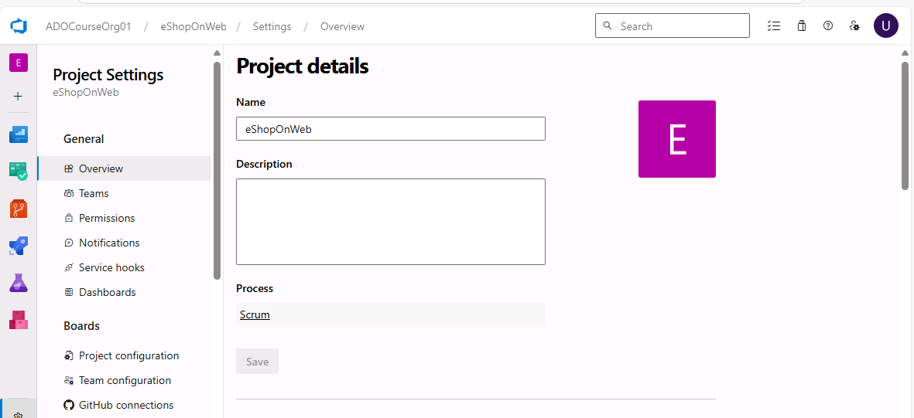
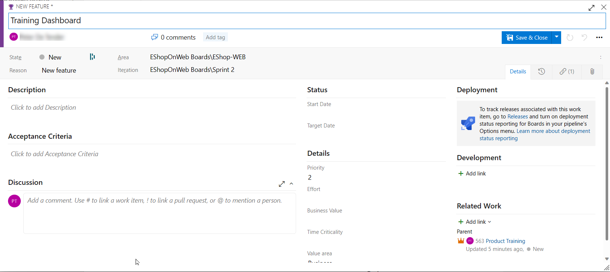
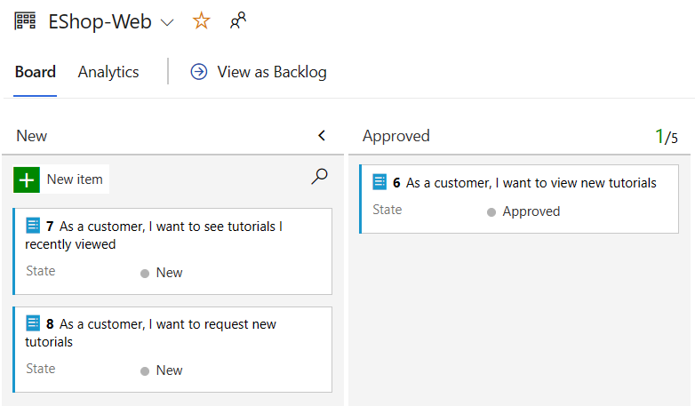
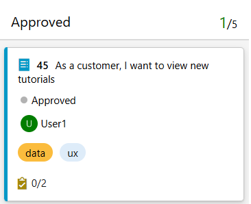
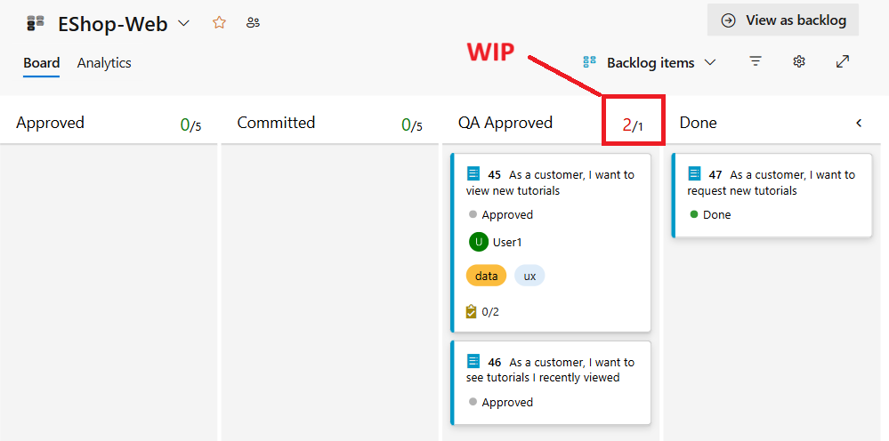
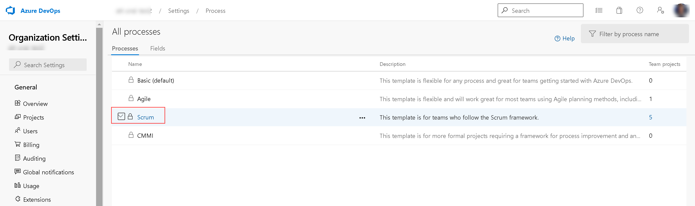
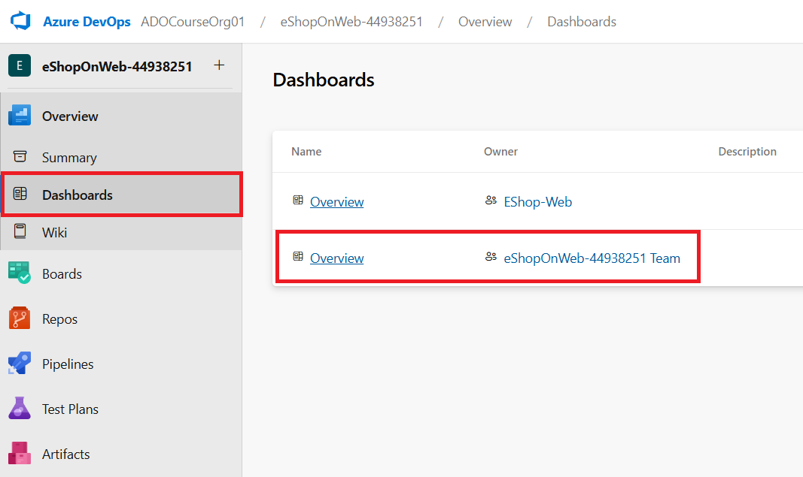

---
lab:
  title: Agiles Planen und Portfoliomanagement mit Azure Boards
  module: 'Module 01: Get started on a DevOps transformation journey'
---

# Agiles Planen und Portfoliomanagement mit Azure Boards

# Lab-Handbuch für Kursteilnehmer

## Labanforderungen

- Für dieses Lab ist **Microsoft Edge** oder ein von [Azure DevOps unterstützter Browser](https://docs.microsoft.com/en-us/azure/devops/server/compatibility?view=azure-devops#web-portal-supported-browsers) erforderlich.

- **Einrichten einer Azure DevOps-Organisation**: Wenn Sie nicht bereits eine Azure DevOps-Organisation haben, die Sie für dieses Lab verwenden können, müssen Sie diese erstellen, indem Sie die unter [Erstellen einer Organisation oder Projektsammlung](https://docs.microsoft.com/en-us/azure/devops/organizations/accounts/create-organization?view=azure-devops) beschriebenen Anweisungen befolgen.

## Übersicht über das Labor

In diesem Lab erfahren Sie mehr über die von Azure Boards bereitgestellten Tools und Prozesse zur Agile-Planung und Portfolioverwaltung, und wie sie Ihnen helfen können, die Arbeit in ihrem gesamten Team schnell zu planen, zu verwalten und zu verfolgen. Sie erkunden den Product Backlog, den Sprint-Backlog und die Task Boards, die den Workflow während einer Iteration nachverfolgen können. Wir sehen uns auch die erweiterten Tools für größere Teams und Organisationen in diesem Release an.

## Ziele

In diesem Lab lernen Sie Folgendes:

- Verwalten von Teams, Bereichen und Iterationen.
- Verwalten von Arbeitselementen
- Verwalten von Sprints und Kapazität.
- Anpassen von Kanban-Boards.
- Definieren von Dashboards.
- Anpassen des Teamprozesses.

## Geschätzte Zeit: 60 Minuten

## Anweisungen

### Übung 0: Konfigurieren der Voraussetzungen für das Lab

> **Hinweis**: Wenn Sie dieses Projekt bereits in früheren Laboren erstellt haben, kann diese Übung übersprungen werden.

In dieser Übung richten Sie die Voraussetzungen für das Lab ein, das aus einem neuen Azure DevOps-Projekt mit einem Repository basierend auf dem [eShopOnWeb](https://github.com/MicrosoftLearning/eShopOnWeb) besteht.

#### Aufgabe 1: (überspringen, falls bereits erledigt) Erstellen und Konfigurieren des Teamprojekts

In dieser Aufgabe erstellen Sie ein **eShopOnWeb** Azure DevOps-Projekt, das von mehreren Labs verwendet werden soll.

1. Öffnen Sie auf Ihrem Lab-Computer in einem Browserfenster Ihre Azure DevOps-Organisation. Klicken Sie auf **Neues Projekt**. Geben Sie dem Projekt den Namen **eShopOnWeb**. Definieren Sie **Privat** als Sichtbarkeit.
2. Klicken Sie auf **Erweitert** und geben Sie **Scrum** als **Arbeitselementprozess** an.
 Klicken Sie auf **Erstellen**.

    

### Übung 1: Verwalten eines Agile-Projekts

In dieser Übung verwenden Sie Azure Boards, um eine Reihe gängiger agiler Planungs- und Portfolioverwaltungsaufgaben auszuführen, einschließlich der Verwaltung von Teams, Bereichen, Iterationen, Arbeitselemente, Sprints und Kapazitäten. Sie tun dies durch Anpassen von Kanban-Boards, Definieren von Dashboards und Anpassen von Teamprozessen.

#### Aufgabe 1: Verwalten von Teams, Bereichen und Iterationen.

In dieser Aufgabe erstellen Sie ein neues Team und konfigurieren dessen Bereich und Iterationen.

Jedes neue Projekt ist mit einem Standardteam konfiguriert, das dem Projektnamen entspricht. Sie haben die Möglichkeit, zusätzliche Teams zu erstellen. Jedem Team kann Zugriff auf eine Suite von Agile-Tools und Teamressourcen gewährt werden. Die Möglichkeit, mehrere Teams zu erstellen, bietet Ihnen die Flexibilität, das richtige Gleichgewicht zwischen Autonomie und Zusammenarbeit im gesamten Unternehmen auszuwählen.

1. Stellen Sie sicher, dass der Webbrowser Ihre Azure DevOps-Organisation mit dem **EShopOnWeb**-Projekt anzeigt, das Sie in der vorherigen Übung generiert haben.

    > **Hinweis**: Alternativ können Sie direkt auf die Projektseite zugreifen, indem Sie zur (<https://dev.azure.com/>`<your-Azure-DevOps-account-name>`/EShopOnWeb)-URL navigieren, wobei der `<your-Azure-DevOps-account-name>`-Platzhalter Ihren Kontonamen darstellt.

2. Klicken Sie auf das Zahnradsymbol mit der Bezeichnung **Projekteinstellungen** in der unteren linken Ecke der Seite, um die Seite **Projekteinstellungen** zu öffnen.

    

3. Wählen Sie im Abschnitt **Allgemein** die Registerkarte **Teams** aus. In diesem Projekt gibt es bereits ein Standardteam, das **EShopOnWeb-Team**, aber Sie erstellen ein neues Team für dieses Lab. Klicken Sie auf **Neues Team**.

    

4. Geben Sie im Bereich **Neues Team erstellen** im Textfeld **Teamname** **EShop-Web** ein. Lassen Sie die anderen Einstellungen mit ihren Standardwerten stehen und klicken Sie auf "**Erstellen**.

    

5. Wählen Sie in der Liste der **Teams** das neu erstellte Team aus, um dessen Details anzuzeigen.

    > **Hinweis**: Standardmäßig verfügt das neue Team nur über Sie als Mitglied. Sie können diese Ansicht verwenden, um solche Funktionen wie Teammitgliedschaft, Benachrichtigungen und Dashboards zu verwalten.

6. Klicken Sie oben auf der **EShop-Web**-Seite auf den Link **Iterationen und Bereichspfade**, um mit der Definition des Zeitplans und des Umfangs des Teams zu beginnen.

    

7. Wählen Sie oben im Bereich **Boards** die Registerkarte **Iterationen** aus, und klicken Sie dann auf **+Iteration(en) auswählen**.

    

8. Wählen Sie **EShopOnWeb\Sprint 1** aus, und klicken Sie auf **Speichern und schließen**. Beachten Sie, dass dieser erste Sprint in der Liste der Iterationen angezeigt wird, aber die Datumsangaben noch nicht festgelegt sind.
9. Wählen Sie **Sprint 1** aus, und klicken Sie auf die **Auslassungspunkte (...)**. Wählen Sie im Kontextmenü  **Bearbeiten** aus.

     

    > **Hinweis**: Geben Sie das „Startdatum“ als ersten Arbeitstag der letzten Woche an, und rechnen Sie 3 volle Arbeitswochen für jeden Sprint. Wenn der 6  März beispielsweise der erste Arbeitstag des Sprints ist, geht dieser bis zum 24. März. Sprint 2 beginnt am 27  März, das ist 3 Wochen ab dem 6. März.

10. Wiederholen Sie den vorherigen Schritt, um **Sprint 2** und **Sprint 3** hinzuzufügen. Man könnte also sagen, dass wir derzeit in der 2. Woche des ersten Sprints sind.

    

11. Wählen Sie im Bereich **Boards** oben im Bereich die Registerkarte **Bereiche** aus. Dort finden Sie einen automatisch generierten Bereich mit dem Namen, der dem Namen des Teams entspricht.
12. Klicken Sie neben dem Eintrag für den **Standardbereich** auf das Auslassungszeichen (...) und wählen Sie in der Dropdownliste **Unterbereiche einschließen** aus.

    

    > **Hinweis**: In der Standardeinstellung aller Teams werden Unterbereichspfade ausgeschlossen. Wir werden sie so ändern, dass sie Unterbereiche umfasst, damit das Team Einblick in alle Arbeitselemente aller Teams erhält. Optional kann sich das Managementteam auch dafür entscheiden, keine Unterbereiche einzuschließen, wodurch Arbeitselemente automatisch aus der Ansicht entfernt werden, sobald sie einem der Teams zugewiesen sind.

#### Aufgabe 2: Verwalten von Arbeitselementen

In dieser Aufgabe durchlaufen Sie allgemeine Verwaltungsaufgaben für Arbeitselemente.

Arbeitsaufgaben spielen in Azure DevOps eine herausragende Rolle. Ob es sich nun um die Beschreibung der zu erledigenden Arbeit, um Hindernisse für die Freigabe, um Testdefinitionen oder um andere wichtige Punkte handelt: Arbeitselemente sind das Herzstück moderner Projekte. In dieser Aufgabe konzentrieren Sie sich auf die Verwendung verschiedener Arbeitselemente, um den Plan zur Erweiterung der Parts Unlimited-Website um einen Bereich für Produktschulungen einzurichten. Es kann zwar etwas schwierig erscheinen, einen so umfangreichen Teil des Unternehmensangebots zu entwickeln, aber mit Azure DevOps und dem Scrum-Prozess ist dies sehr gut zu bewältigen.

> **Hinweis**: Diese Aufgabe soll eine Reihe von Möglichkeiten aufzeigen, wie Sie verschiedene Arten von Arbeitselementen erstellen können, und die Vielfalt der auf der Plattform verfügbaren Features demonstrieren. Daher sollten diese Schritte nicht als verbindliche Anleitung für das Projektmanagement angesehen werden. Die Features sollen so flexibel sein, dass sie sich an Ihre Prozessanforderungen anpassen lassen, also experimentieren Sie ruhig damit.

1. Wählen Sie im vertikalen Navigationsbereich des Azure DevOps-Portals das Symbol **Boards** und dann **Arbeitselemente** aus.

    > **Hinweis**:Es gibt viele Möglichkeiten, Arbeitselemente in Azure DevOps zu erstellen, und wir werden einige davon untersuchen. Manchmal ist es so einfach wie das direkte Abrufen eines Elements von einem Dashboard.

2. Klicken Sie im Fenster **Arbeitselemente** auf **+ Neues Arbeitselement > Epic**.

    

3. Geben Sie im Textfeld **Titel eingeben** den Titel **Produktschulung** ein.
4. Wählen Sie in der oberen linken Ecke den Eintrag **Nicht zugewiesen** aus, und wählen Sie in der Dropdownliste Ihr Benutzerkonto aus, um das neue Arbeitselement selbst zuzuweisen.
5. Wählen Sie neben dem Eintrag **Bereich** den Eintrag **eShopOnWeb** und dann in der Dropdownliste **EShop-WEB** aus. Dadurch wird der **Bereich** auf **eShopOnWeb\EShop-WEB** festgelegt.
6. Wählen Sie neben dem Eintrag **Iteration** den Eintrag **eShopOnWeb** und in der Dropdownliste **Sprint 2** aus. Dadurch wird die **Iteration** auf **eShopOnWeb\Sprint 2** festgelegt.
7. Klicken Sie zum Abschließen der Änderungen auf **Speichern**. **Schließen Sie es nicht**.

    

    > **Hinweis**: Normalerweise würden Sie so viele Informationen wie möglich ausfüllen, aber für die Zwecke dieses Labs ist dies ausreichend.

    > **Hinweis**: Das Formular Arbeitselemente enthält alle relevanten Einstellungen für Arbeitselemente. Dazu gehören Details darüber, wem sie zugewiesen ist, ihr Status in Bezug auf viele Parameter und alle zugehörigen Informationen und der Verarbeitungsverlauf seit ihrer Erstellung. Einer der wichtigsten Bereiche dabei sind **zugehörige Aufgaben**. Wir werden eine der Möglichkeiten erkunden, um diesem Epic ein Feature hinzuzufügen.

8. Wählen Sie im Abschnitt **Verwandte Aufgaben** unten rechts den Eintrag **Link hinzufügen** aus, und wählen Sie in der Dropdownliste **Neues Element** aus.
9. Wählen Sie im Bereich **Link hinzufügen** in der Dropdownliste **Linktyp** die Option **Untergeordnetes Element** aus. Wählen Sie als Nächstes in der Dropdownliste **Arbeitselementtyp** im Textfeld **Titel** die Option **Feature** aus, geben Sie **Schulungsdashboard** ein, und klicken Sie auf **OK**.

    

    > **Hinweis:** Beachten Sie im Bereich **Schulungsdashboard**, dass die Zuordnung, der **Bereich** und die **Iteration** bereits auf die gleichen Werte wie das Epic festgelegt sind, auf dem das Feature basiert. Darüber hinaus wird das Feature automatisch mit dem übergeordneten Element verknüpft, aus dem es erstellt wurde.

10. Klicken Sie im Bereich **Schulungsdashboard** auf **Speichern und Schließen**.

11. Wählen Sie im vertikalen Navigationsbereich des Azure DevOps-Portals in der Liste der **Boards**-Elemente die Option **Boards** aus.
12. Wählen Sie im Bereich **Boards** den Eintrag **EShop-WEB Boards** aus. Dadurch wird das Board für dieses bestimmte Team geöffnet.

    

13. Wählen Sie im Bereich **Boards** in der oberen rechten Ecke den Eintrag **Backlog Items** aus, und wählen Sie in der Dropdownliste **Features** aus.

    > **Hinweis**: Dies erleichtert das Hinzufügen von Aufgaben und anderen Arbeitselementen zu den Features.

14. Zeigen Sie mit dem Mauszeiger auf das Rechteck, das das Feature **Schulungsdashboard** darstellt. Dadurch wird das Auslassungszeichen (...) in der oberen rechten Ecke angezeigt.
15. Klicken Sie auf das Symbol mit den Auslassungspunkten (...) und wählen Sie in der Dropdownliste **Product Backlog Item hinzufügen** aus.

    

16. Geben Sie im Textfeld des neuen Product Backlog Items **Als Kundschaft möchte ich neue Tutorials ansehen** und drücken Sie **Enter**, um den Eintrag zu speichern.

    > **Hinweis**: Dadurch wird ein neues Product Backlog Item (PBI) erstellt, das ein untergeordnetes Element des Features ist und dessen Bereich und Iteration teilt.

17. Wiederholen Sie den vorherigen Schritt, um der Kundschaft zwei weitere PBIs hinzuzufügen, die es der Kundschaft ermöglichen, ihre zuletzt angezeigten Tutorials anzuzeigen und neue Tutorials anzufordern. Diese sollen folgende Namen haben: **Als Kundschaft möchte ich meine kürzlich angesehenenTutorials sehen** und **Als Kundschaft möchte ich neue Tutorials anfordern**.

    

18. Wählen Sie im Bereich **Boards** in der oberen rechten Ecke den Eintrag **Features** aus, und wählen Sie in der Dropdownliste **Backlog Items**aus.

     

    > **Hinweis**: Backlog Items haben einen Status, der definiert, wo sie relativ zur Fertigstellung stehen. Obwohl Sie die Arbeitsaufgabe mithilfe des Formulars öffnen und bearbeiten können, ist es einfacher, Karten auf das Board zu ziehen.

19. Ziehen Sie auf der Registerkarte **Board** im Bereich **EShop-WEB** das erste Arbeitselement namens **Als Kundschaft möchte ich neue Tutorials ansehen** von Status **Neu** auf **Genehmigt**.

    

    > **Hinweis**: Sie können die Karten für Arbeitsaufgabe auch vergrößern, um bequem alle bearbeitbaren Details zu erreichen.

20. Zeigen Sie mit dem Mauszeiger auf das Rechteck der Arbeitsaufgabe, die Sie in **Genehmigt** verschoben haben. Dadurch wird das nach unten zeigende Caretsymbol angezeigt.
21. Klicken Sie auf das nach unten zeigende Caretsymbol, um die Arbeitsaufgabenkarte zu erweitern, wählen Sie den Eintrag **Nicht zugewiesen** aus, und wählen Sie in der Liste der Benutzerkonten Ihr Konto aus, um sich die verschobene PBI selbst zuzuweisen.
22. Ziehen Sie auf der Registerkarte **Board** im Bereich **EShop-WEB** das zweite Arbeitselement namens **Als Kundschaft möchte ich meine kürzlich angesehenenTutorials sehen** von Status **Neu** auf **Ausgeliefert**.
23. Ziehen Sie auf der Registerkarte **Board** im Bereich **EShop-WEB** das dritte Arbeitselement namens **Als Kundschaft möchte ich neue Tutorials anfordern** von Status **Neu** auf **Fertig**.

    

    > **Hinweis**: Das Taskboard ist ein Blick in das Backlog. Sie können auch die tabellarische Ansicht verwenden.

24. Klicken Sie auf der Registerkarte **Board** oben im Bereich **EShop-WEB** auf **Als Backlog anzeigen**, um das tabellarische Formular anzuzeigen.

    

    > **Hinweis**: Sie können das Pluszeichen direkt unter dem Registerkartennamen **Backlog** im Bereich **EShop-WEB** verwenden, um Aufgaben unter diesen Arbeitsaufgaben verschachtelt anzuzeigen.

    > **Hinweis**: Sie können das zweite Pluszeichen direkt links vom ersten Backlogelement verwenden, um eine neue Aufgabe hinzuzufügen.

25. Klicken Sie auf der Registerkarte **Backlog** in der oberen linken Ecke des Bereichs **EShop-WEB** auf das zweite Pluszeichen von oben, das neben der ersten Arbeitsaufgabe. Dadurch wird der Bereich **NEUE AUFGABE** angezeigt.

    

26. Geben Sie oben im Bereich **NEUE AUFGABE** im Textfeld **Titel eingeben** **Seite für aktuellste Tutorials** ein.
27. Geben Sie im Bereich **NEUE AUFGABE** im Textfeld **Verbleibende Arbeit****5** ein.
28. Wählen Sie im Bereich **NEUE AUFGABE** in der Dropdownliste **Aktivität** die Option **Entwicklung** aus.
29. Klicken Sie im Bereich **NEUE AUFGABE** auf **Speichern und Schließen**.

    

30. Wiederholen Sie die letzten fünf Schritte, um eine weitere Aufgabe namens **Datenabfrage für aktuellste Tutorials** hinzuzufügen. Legen Sie  **Verbleibende Arbeit** auf **3** fest und **Aktivität** auf **Design** fest. Klicken Sie nach Abschluss auf **Speichern und Schließen**.

#### Aufgabe 3: Verwalten von Sprints und Kapazität.

In dieser Aufgabe durchlaufen Sie allgemeine Sprint- und Kapazitätsverwaltungsaufgaben.

Teams erstellen das Sprint-Backlog während der Besprechung zur Sprintplanung, die in der Regel am ersten Tag des Sprints stattfindet. Jeder Sprint entspricht einem Zeitintervall, was Ihr Team bei der Arbeit mit Agile-Prozessen und -Tools unterstützt. Während der Planungsbesprechung arbeiten Produktverantwortliche mit Ihrem Team zusammen, um die Storys oder Backlog Items zu identifizieren, die im Sprint abgeschlossen werden sollen.

Planungsbesprechungen bestehen in der Regel aus zwei Teilen. Im ersten Teil identifizieren das Team und der*die Produktbesitzer*in die Backlog Items, für die das Team auf der Grundlage der Erfahrungen mit früheren Sprints davon ausgeht, dass sie im Sprint abgeschlossen werden können. Diese Elemente werden dem Sprintbacklog hinzugefügt. Im zweiten Teil legt Ihr Team fest, wie die einzelnen Elemente entwickelt und getestet werden. Anschließend definieren und schätzen sie die Aufgaben, die zum Abschließen der einzelnen Elemente erforderlich sind. Schließlich verpflichtet sich das Team, einige oder alle Elemente basierend auf diesen Schätzungen zu implementieren.

Nach Fertigstellung des Sprintplans sollten Ihre Sprint-Backlogs alle Informationen enthalten, die Ihr Team benötigt, um die Arbeit innerhalb der vorgesehenen Zeit ohne Zeitdruck am Ende erfolgreich abzuschließen. Bevor Sie den Sprint planen, sollten Sie den Backlog erstellt, priorisiert und geschätzt und die Sprints definiert haben.

1. Wählen Sie im vertikalen Navigationsbereich des Azure DevOps-Portals das ** Boards**-Symbol aus, und wählen Sie in der Liste der **Boards**-Elemente **Sprints** aus.
2. Wählen Sie auf der Registerkarte **Taskboard** der Ansicht **Sprints** auf der Symbolleiste auf der rechten Seite das Symbol **Ansichtsoptionen** (direkt links neben dem Trichtersymbol) aus, und wählen Sie in der Dropdownliste **Optionen anzeigen** den Eintrag **Arbeitsdetails** aus.

    

    > **Hinweis**: Der aktuelle Sprint hat einen ziemlich begrenzten Umfang. Es gibt zwei Aufgaben in der **To-Do**-Phase. An diesem Punkt wurde keine Aufgabe zugewiesen. Beide zeigen einen numerischen Wert rechts neben dem Eintrag **Nicht zugewiesen** an, der die neu berechnete Arbeitsschätzung darstellt.

3. Klicken Sie im Rechteck, das **Seite für aktuellste Tutorials hinzufügen** darstellt, auf den Eintrag **Nicht zugewiesen** , und wählen Sie in der Liste der Benutzerkonten Ihr Konto aus, um die Aufgabe sich selbst zuzuweisen.

4. Wählen Sie die Registerkarte **Kapazität** der Ansicht **Sprint** aus.

    > **Hinweis**: Mit dieser Ansicht können Sie definieren, welche Aktivitäten und Kapazitätsstufe Benutzer*innen übernehmen können.

5. Wählen Sie auf der Registerkarte **Kapazität** der Ansicht **Sprints** direkt unter der Bezeichnung **Aktivität** in der Dropdownliste **Nicht zugewiesen** die Option **Entwicklung** aus, und geben Sie im Textfeld **Kapazität pro Tag** **1** ein.

    > **Hinweis**: Dies stellt 1 Stunde Entwicklungsarbeit pro Tag dar. Beachten Sie, dass Sie zusätzliche Aktivitäten pro Benutzer*in hinzufügen können, wenn diese mehr tun als nur Entwicklung.

    > **Hinweis**: Angenommen, Sie nehmen Urlaub.

6. Klicken Sie auf der Registerkarte **Kapazität** der Ansicht **Sprints** direkt neben dem Eintrag, der Ihr Benutzerkonto darstellt, in der Spalte **Freie Tage** auf den Eintrag **0 Tage**. Dadurch wird ein Bereich angezeigt, in dem Sie Ihre Tage einstellen können.
7. Verwenden Sie im angezeigten Bereich die Kalenderansicht, um Ihren Urlaub auf fünf Arbeitstage während des aktuellen Sprints (innerhalb der nächsten drei Wochen) festzulegen, und klicken Sie nach Abschluss auf **OK**.

    

8. Zurück auf der Registerkarte **Kapazität** der Ansicht **Sprints** klicken Sie auf **Speichern**.
9. Wählen Sie die Registerkarte **Taskboard** der Ansicht **Sprints** aus.

    

    > **Hinweis**: Beachten Sie, dass der Bereich **Arbeitsdetails** aktualisiert wurde, um Ihren verfügbaren Zeitrahmen widerzuspiegeln. Die tatsächliche Zahl, die im Bereich **Arbeitsdetails** angezeigt wird, kann variieren, ihre Gesamt-Sprintkapazität entspricht jedoch der Anzahl der Arbeitstage, die bis zum Ende des Sprints verbleiben, da Sie 1 Stunde pro Tag zugewiesen haben. Notieren Sie sich diesen Wert, da Sie ihn in den kommenden Schritten verwenden werden.

    > **Hinweis**: Ein praktisches Feature der Boards besteht darin, dass Sie wichtige Daten ganz einfach inline aktualisieren können. Es empfiehlt sich, die Schätzung **Verbleibende Arbeit** regelmäßig zu aktualisieren, um die für jede Aufgabe erwartete Zeit widerzuspiegeln. Angenommen, Sie haben die Arbeit für die Seite **Seite für aktuellste Tutorials hinzufügen** überprüft und festgestellt, dass sie tatsächlich länger dauert als ursprünglich erwartet.

10. Legen Sie auf der Registerkarte **Taskboard** der Ansicht **Sprints** im rechteckigen Feld, das  **Seite für aktuellste Tutorials hinzufügen** darstellt, die geschätzte Anzahl von Stunden auf **14** fest, sodass Sie ihre Gesamtkapazität für diesen Sprint, die Sie im vorherigen Schritt identifiziert haben, anpassen.

    

    > **Hinweis**: Dadurch wird die **Entwicklung** und Ihre persönlichen Kapazitäten automatisch auf ihr Maximum erweitert. Da sie groß genug sind, um die zugewiesenen Aufgaben abzudecken, bleiben sie grün. Die Gesamtkapazität des **Teams** wird jedoch aufgrund der zusätzlichen 3 Stunden überschritten, die für die Aufgabe **Datenabfrage für die aktuellsten Tutorials optimieren** erforderlich sind.

    > **Hinweis**: Eine Möglichkeit, dieses Kapazitätsproblem zu beheben, besteht darin, die Aufgabe in eine zukünftige Iteration zu verschieben. Dafür gibt es mehrere Möglichkeiten. Sie können die Aufgabe beispielsweise hier öffnen und im Bereich mit den Aufgabendetails bearbeiten. Ein weiterer Ansatz wäre die Verwendung der **Backlog**-Ansicht, die eine Inlinemenüoption zum Verschieben bereitstellt. Zu diesem Zeitpunkt sollten Sie die Aufgabe jedoch noch nicht verschieben.

11. Wählen Sie auf der Registerkarte **Taskboard** der **Sprints**-Ansicht auf der Symbolleiste auf der rechten Seite das Symbol  **Ansichtsoptionen** (direkt links neben dem Trichtersymbol) aus und dann in der Dropdownliste **Ansichtsoptionen** den Eintrag **Personen**.

    > **Hinweis**: Dadurch wird Ihre Ansicht so angepasst, dass Sie den Fortschritt von Aufgaben nach Person statt nach Backlog-Element überprüfen können.

    > **Hinweis**: Es gibt auch eine Vielzahl von Anpassungen.

12. Klicken Sie auf das Zahnradsymbol **Teameinstellungen konfigurieren** (direkt rechts neben dem Trichtersymbol).
13. Wählen Sie im Bereich **Einstellungen** die Registerkarte **Stile**, klicken Sie auf **+Stilgregel**, geben Sie unter dem Label **Regelname** in das Textfeld **Name** den Text **Entwicklung** ein und wählen Sie in der Dropdown-Liste **Kartenfarbe** das grüne Rechteck.

    > **Hinweis**: Dadurch werden alle Karten grün gefärbt, wenn sie die im Abschnitt **Regelkriterien** direkt darunter festgelegten Regelkriterien erfüllen.

14. Wählen Sie im Abschnitt **Regelkriterien** in der Dropdown-Liste **Feld** den Eintrag **Aktivität**, in der Dropdown-Liste **Operator** den Eintrag **=** und in der Dropdown-Liste **Wert** den Eintrag **Entwicklung**.

    

    > **Hinweis**: Dadurch werden alle Karten, die Aktivitäten vom Typ **Entwicklung** zugeordnet sind, auf grün eingestellt.

15. Wählen Sie im Bereich **Einstellungen** die Registerkarte **Backlogs** aus.

    > **Hinweis**: Mit Einträgen auf dieser Registerkarte können Sie die für die Navigation verfügbaren Ebenen festlegen. Epics sind nicht standardmäßig enthalten, aber Sie könnten dies ändern.

16. Wählen Sie im Bereich **Einstellungen** die Registerkarte **Arbeitstage** aus.

    > **Hinweis**: Einträge auf dieser Registerkarte ermöglichen es Ihnen, die **Arbeitstage** des Teams anzugeben. Dies gilt für Kapazitäts- und Burndownberechnungen.

17. Wählen Sie im Bereich **Einstellungen** die Registerkarte **Arbeiten mit Fehlern** aus.

    > **Hinweis**: Einträge auf dieser Registerkarte ermöglichen es Ihnen, anzugeben, wie Fehler auf dem Board dargestellt werden.

18. Klicken Sie im Bereich **Einstellungen** auf **Speichern und schließen**, um die Formatierungsregel zu speichern.

    > **Hinweis**: Die mit  **Entwicklung** verbundene Aufgabe ist jetzt grün und sehr einfach zu identifizieren.

#### Aufgabe 4: Anpassen von Kanban-Boards.

In dieser Aufgabe durchlaufen Sie den Prozess der Anpassung von Kanban-Boards.

Um die Fähigkeit eines Teams zu verbessern, dauerhaft hochwertige Software bereitzustellen, setzt Kanban vor allem auf zwei Verfahren. Die erste Visualisierung des Workflows erfordert, dass Sie die Workflowphasen Ihres Teams zuordnen und ein Kanban-Board so konfigurieren, dass es übereinstimmt. Das zweite Verfahren, die Begrenzung der derzeit durchgeführten Arbeiten, erfordert die Festlegung von WIP-Grenzwerten (Work in Progress). Anschließend können Sie den Fortschritt auf Ihrem Kanban-Board nachverfolgen und die wichtigsten Metriken überwachen, um die Vorlauf- oder Zykluszeiten zu verringern. Ihr Kanban-Board verwandelt Ihr Backlog in eine interaktive „Hinweistafel“, die den Arbeitsablauf veranschaulicht. Während die Arbeit von der Idee bis zur Fertigstellung voranschreitet, aktualisieren Sie die Elemente auf dem Board. Jede Spalte stellt eine Arbeitsphase dar, und jede Karte repräsentiert eine User Story (blaue Karten) oder einen Fehler (rote Karten) in dieser Arbeitsphase. Jedes Team entwickelt jedoch im Laufe der Zeit seinen eigenen Prozess. Daher ist die Möglichkeit, das Kanban-Board an die Arbeitsweise Ihres Teams anzupassen, entscheidend für die erfolgreiche Bereitstellung

1. Wählen Sie im vertikalen Navigationsbereich des Azure DevOps-Portals in der Liste der **Boards**-Elemente den Eintrag **Boards** aus.
2. Klicken Sie im Bereich **Boards** auf das Symbol **Teameinstellungen konfigurieren** (direkt rechts neben dem Trichtersymbol).

    > **Hinweis**: Das Team legt den Schwerpunkt auf die Arbeit mit Daten. Daher wird allen Aufgaben, die mit dem Zugriff auf oder der Speicherung von Daten verbunden sind, besondere Aufmerksamkeit gewidmet.

3. Wählen Sie im Bereich **Einstellungen** die Registerkarte **Tagfarben** aus, klicken Sie im Textfeld **Tag** auf **+Tag**, geben Sie ** Daten** ein, und lassen Sie die Standardfarbe unverändert.

    

    > **Hinweis**: Wenn ein Backlog-Element oder ein Fehler mit **Daten** markiert ist, wird dieses Tag hervorgehoben.

4. Wählen Sie im Bereich **Einstellungen** die Registerkarte **Anmerkungen** aus.

    > **Hinweis**: Sie können angeben, welche **Anmerkungen** in Karten enthalten sein sollen, damit sie einfacher zu lesen und zu navigieren sind. Wenn eine Anmerkung aktiviert ist, können auf die untergeordneten Arbeitselemente dieses Typs problemlos zugegriffen werden, indem sie auf die Visualisierung in den einzelnen Karte klicken.

5. Wählen Sie im Bereich **Einstellungen** die Registerkarte **Tests** aus.

    > **Hinweis**: Auf der Registerkarte **Tests** können Sie konfigurieren, wie Tests auf den Karten angezeigt werden und sich verhalten sollen.

6. Klicken Sie im Bereich **Einstellungen** auf **Speichern und schließen**, um die Formatierungsregel zu speichern.
7. Klicken Sie auf der Registerkarte **Board** des Bereichs  **EShop-WEB** mit der rechten Maustaste auf die Arbeitsaufgabe, die das Backlog-Element **Als Kund*in möchte neue Tutorials ansehen** darstellt und wählen Sie **Öffnen** aus.
8. Klicken Sie im Bereich **Als Kund*in möchte ich neue Tutorials ansehen** oben rechts neben dem Eintrag  **0 Kommentare ** auf **Tag hinzufügen**.
9. Geben Sie im nachfolgend angezeigten Textfeld **Daten** ein, und drücken Sie die **EINGABETASTE** .
10. Wiederholen Sie den vorherigen Schritt, um das **ux**-Tag hinzuzufügen.
11. Klicken Sie im Bereich **Als Kund*in möchte ich neue Tutorials ansehen** auf **Speichern und schließen**.

    

    > **Hinweis**: Die beiden Tags sind jetzt auf der Karte sichtbar, wobei das Tag **Daten** entsprechend der Konfiguration gelb hervorgehoben ist.

12. Klicken Sie im Bereich **Boards** auf das Symbol **Teameinstellungen konfigurieren** (direkt rechts neben dem Trichtersymbol).
13. Wählen Sie im Bereich **Einstellungen** die Registerkarte **Spalten** aus.

    > **Hinweis**: In diesem Abschnitt können Sie dem Workflow neue Stufen hinzufügen.

14. Klicken Sie auf **+Spalte**, unter dem **Spaltennamen**. Geben Sie im Textfeld **Name** den Text **QA Genehmigt** ein, und geben Sie im Textfeld **WIP-Grenzwert** den Wert **1** ein.

    > **Hinweis**: Der Grenzwert 1 für In Bearbeitung gibt an, dass sich jeweils nur ein Arbeitselement in diesem Status befinden sollte. Sie würden dies normalerweise höher festlegen, aber es gibt nur zwei Arbeitselemente, um das Feature zu veranschaulichen.

15. Ziehen Sie im Bereich **Einstellungen** auf der Registerkarte **Spalten** die neu erstellte Registerkarte zwischen **Geliefert** und **Fertig**.
16. Klicken Sie im Bereich **Einstellungen** auf **Speichern und Schließen**.

    

    > **Hinweis**: Stellen Sie sicher, dass der neue Status jetzt im Workflow angezeigt wird.

17. **Aktualisieren** Sie das **Boards-Portal**, sodass die Spalte **QA Genehmigt** jetzt in der Kanban-Boardansicht sichtbar ist.
18. Ziehen Sie das Arbeitselement **Als Kundschaft möchte ich meine kürzlich angesehenenTutorials sehen** vom Status **Geliefert** in den Status **QA Genehmigt**.
19. Ziehen Sie das Arbeitselement **Als Kundschaft möchte ich neue Tutorials ansehen** aus dem Status **Genehmigt** in den Status **QA Genehmigt**.

    

    > **Hinweis**: Der Status überschreitet jetzt den **WIP**-Grenzwert und wird als Warnung  rot gefärbt.

20. Verschieben Sie das Backlog Item **Als Kundschaft möchte ich meine kürzlich angesehenenTutorials sehen** zurück in **Geliefert**.
21. Klicken Sie im Bereich **Boards** auf das Symbol **Teameinstellungen konfigurieren** (direkt rechts neben dem Trichtersymbol).
22. Kehren Sie im Bereich **Einstellungen** zur Registerkarte **Spalten** zurück, und wählen Sie die Registerkarte **QA Genehmigt** aus.

    > **Hinweis**:Es gibt häufig eine Verzögerung zwischen dem Verschieben der Arbeit in eine Spalte und dem tatsächlichen Arbeitsbeginn. Um dieser Verzögerung zu begegnen und den tatsächlichen Status der laufenden Arbeit anzuzeigen, können Sie geteilte Spalten aktivieren. Nach der Teilung enthält jede Spalte zwei Unterspalten: **In Bearbeitung** und **Fertig**. Mit geteilten Spalten kann Ihr Team ein Pullmodell implementieren. Ohne geteilte Spalten pushen Teams ihre Arbeit, um zu signalisieren, dass sie ihre Arbeitsphase abgeschlossen haben. Das Pushen in die nächste Phase bedeutet jedoch nicht zwangsläufig, dass ein Teammitglied sofort mit der Arbeit an diesem Element beginnt.

23. Aktivieren Sie auf der Registerkarte **QA Genehmigt** das Kontrollkästchen **Spalte teilen in In Bearbeitung und Fertig**, um zwei separate Spalten zu erstellen.

    > **Hinweis**: Wenn Ihr Team den Status der Arbeit aktualisiert, während sie von einer Phase zur nächsten fortschreitet, hilft es ihnen, sich darüber zu einigen, was **Fertig** bedeutet. Indem Sie die Kriterien für die **Definition von Fertig** für jede Kanban-Spalte angeben, können Sie die wesentlichen Aufgaben teilen, die abgeschlossen werden müssen, bevor Sie ein Element in eine nachgelagerte Phase verschieben.

24. Geben Sie auf der Registerkarte **QA Genehmigt** am unteren Rand des Bereichs im Textfeld **Definition von Fertig** Zeichenfolge **\*\*Alle\*\* Tests bestanden** ein.
25. Klicken Sie im Bereich **Einstellungen** auf **Speichern und Schließen**.

    

    > **Hinweis**: Der Status **QA Approved** enthält jetzt die Spalten **In Bearbeitung** und **Fertig**. Sie können auch auf das Informationssymbol (mit Buchstaben **i** in einem Kreis) neben der Spaltenüberschrift klicken, um die **Definition von Fertig** zu lesen.

26. Klicken Sie im Bereich **Boards** auf das Symbol **Teameinstellungen konfigurieren** (direkt rechts neben dem Trichtersymbol).

    > **Hinweis**: Ihr Kanban-Board unterstützt Sie mit dem Verschieben der Arbeit von Neu in Richtung Fertig beim Visualisieren des Workflows. Wenn Sie **Verantowrtlichkeitsbereiche** hinzufügen, können Sie auch den Status von Arbeiten visualisieren, die verschiedene Servicelevelklassen unterstützen. Sie können eine Swimlane erstellen, die jede andere Dimension darstellt, die Ihre Nachverfolgungsanforderungen unterstützt.

27. Wählen Sie im Bereich **Einstellungen** die Registerkarte **Verantwortlichkeitsbereiche** aus.
28. Klicken Sie auf der Registerkarte **Verantwortlichkeitsbereiche** direkt unter dem Wort **Verantwortlichkeitsbereich** auf **+Verantwortlichkeitsbereich**. Geben Sie im Textfeld **Name** den Text **Beschleunigen** ein.
29. Klicken Sie im Bereich **Einstellungen** auf **Speichern und Schließen**.

    

30. Zurück auf der Registerkarte **Board** im Bereich **Boards** ziehen Sie die Aufgabe aus **Geliefert** in die Phase **QA Genehmigt \|In Bearbeitung** des Verantwortlichkeitsbereichs **Beschleunigen**, sodass erkennbar ist, dass sie Priorität hat, sobald QA-Kapazität verfügbar wird.

    > **Hinweis**: Wenn Sie ein komplexeres Board mit vielen weiteren Arbeitsaufgaben überprüfen möchten, wählen Sie auf der Registerkarte **Board** des Bereichs **Board** in der oberen linken Ecke **EShop-WEB** aus, und wählen Sie in der Dropdownliste der Teams das **eShopOnWeb-Team** aus. Dieses Board bietet einen Spielplatz, in dem Sie experimentieren und die Ergebnisse überprüfen können.

#### Aufgabe 5: Anpassen des Teamprozesses.

In dieser Aufgabe erstellen wir einen benutzerdefinierten Scrum-basierten Prozess. Der Prozess enthält ein Backlog-Item-Feld, mit dem eine proprietäre eShopOnWeb-Ticket-ID nachverfolgt werden soll.

In Azure DevOps passen Sie Ihre Arbeitsnachverfolgung über einen Prozess an. Ein Prozess definiert die Bausteine der Arbeitselementnachverfolgung und anderer Untersysteme, auf die Sie über Azure DevOps zugreifen. Wenn Sie ein Teamprojekt erstellen, wählen Sie den Prozess aus, der die gewünschten Bausteine für Ihr Projekt enthält. Azure DevOps unterstützt zwei Prozesstypen. Die ersten Kernprozesse des Systems (Scrum, Agile und CMMI) sind schreibgeschützt, d. h. Sie können sie nicht anpassen. Den zweiten Typ, geerbte Prozesse, erstellen Sie auf der Grundlage von Kernprozessen des Systems, wobei Sie die Möglichkeit haben, deren Einstellungen anzupassen.

Alle Prozesse werden innerhalb derselben Organisation gemeinsam genutzt. Das heißt, ein oder mehrere Teamprojekte können auf einen einzelnen Prozess verweisen. Anstatt ein einzelnes Teamprojekt anzupassen, passen Sie einen Prozess an. Am Prozess vorgenommene Änderungen aktualisieren automatisch alle Teamprojekte, die auf diesen Prozess verweisen. Sobald Sie einen vererbten Prozess erstellt haben, können Sie ihn anpassen, darauf basierende Teamprojekte erstellen und bestehende Teamprojekte migrieren, um darauf zu verweisen. Das Git-Team-Projekt kann erst dann angepasst werden, wenn es in einen vererbten Prozess migriert wurde.

1. Klicken Sie auf der Azure DevOps-Seite auf das Logo **Azure DevOps** in der oberen linken Ecke, um zur Kontostammseite zu navigieren.
2. Klicken Sie in der linken unteren Ecke der Seite auf **Organisationseinstellungen**.
3. Wählen Sie im vertikalen Menü **Organisationseinstellungen** im Abschnitt **Boards** die Option **Prozess**.
4. Wählen Sie im Bereich **Alle Prozesse** rechts neben dem Eintrag **Scrum** die Auslassungspunkte (...) und wählen Sie im Dropdown-Menü **Vererbten Prozess erstellen**.

    

5. Geben Sie im Bereich **Erstellen eines geerbten Prozesses aus Scrum** in das Textfeld **Prozessname (erforderlich)** den Text **Angepasstes Scrum** ein und klicken Sie auf **Prozess erstellen**.
6. Zurück im Bereich **Alle Prozesse** klicken Sie auf den Eintrag **Angepasstes Scrum**.

    > **Hinweis**: Möglicherweise müssen Sie den Browser aktualisieren, damit der neue Prozess sichtbar wird.

7. Wählen Sie im Bereich **Alle Prozesse > Angepasstes Scrum** die Option **Produkt-Backlog-Element**.

    

8. Klicken Sie im Bereich **Alle Prozesse > Angepasstes Scrum > Produkt-Backlog-Element** auf **Neues Feld**.
9. Auf dem **Hinzufügen eines Feldes zu einem Produkt-Backlog-Element**, auf der Registerkarte **Definition**, im Abschnitt **Erstellen eines Feldes**, im Textfeld **Name**, geben Sie **EShop-Ticket-ID** ein.

    

10. Klicken Sie im Bereich **Ein Feld zum Produkt-Backlog-Element hinzufügen** auf **Layout**.
11. Fügen Sie im Bereich **Ein Feld zum Produkt-Backlog-Element hinzufügen** auf der Registerkarte **Layout** im Textfeld **Label** den Eintrag **Ticket-ID** ein, wählen Sie die Option **Neue Gruppe erstellen**, geben Sie im Textfeld **Gruppe** den Eintrag **EShopOnWeb** ein und klicken Sie auf **Feld hinzufügen**.

    

    > **Hinweis**: Nachdem der benutzerdefinierte Prozess nun konfiguriert wurde, wechseln wir zum eShopOnWeb-Projekt, um ihn zu verwenden.

12. Kehren Sie zum Stamm **Alle Prozesse** zurück, indem Sie den Breadcrumb-Pfad am oberen Rand des Bereichs **Alle Prozesse > Angepasstes Scrum > Produkt-Backlog-Element** verwenden.
13. Wählen Sie im Bereich **Alle Prozesse** den Eintrag **Scrum**.

    

    > **Anmerkung**: Unser aktuelles Projekt verwendet **Scrum**.

14. Wählen Sie im Bereich **Alle Prozesse > Scrum** die Registerkarte **Projekte**.
15. Wählen Sie in der Liste der Projekte in der Zeile mit dem Eintrag **eShopOnWeb** die Auslassungspunkte (...) und wählen Sie dann **Prozess ändern**.
16. Wählen Sie im Bereich **Projektprozess ändern** in der Dropdown-Liste **Zielprozess auswählen** den Prozess **Angepasstes Scrum** aus, klicken Sie auf **Speichern** und dann auf **Schließen**.

    

17. Klicken Sie auf das Logo **Azure DevOps** in der oberen linken Ecke, um zur Kontostammseite zurückzukehren.
18. Wählen Sie auf der Registerkarte **Projekte** den Eintrag für das Projekt **eShopOnWeb**.
19. Wählen Sie im vertikalen Menü links auf der Seite **eShopOnWeb** die Option **Boards** und stellen Sie sicher, dass der Bereich **Arbeitselemente** angezeigt wird.
20. Klicken Sie in der Liste der Arbeitselemente auf das erste Backlog-Element.
21. Überprüfen Sie, ob das Feld **Ticket-ID** jetzt unter der Gruppe **eShopOnWeb** vorhanden ist, die während der Prozessanpassung definiert wurde. Sie können dies wie jedes andere Textfeld behandeln.

    

    > **Hinweis**: Sobald das Arbeitselement gespeichert ist, speichert Azure DevOps auch die neuen benutzerdefinierten Informationen, so dass sie für Abfragen und über den Rest von Azure DevOps verfügbar sind.

### Übung 2 (optional): Definieren von Dashboards.

In dieser Aufgabe werden Sie schrittweise durch den Prozess der Erstellung von Dashboards und deren Kernkomponenten geführt.

Dashboards ermöglichen es den Teams, den Status zu visualisieren und den Fortschritt im gesamten Projekt zu überwachen. Auf einen Blick können Sie fundierte Entscheidungen treffen, ohne sich in andere Bereiche Ihrer Team-Projektseite einarbeiten zu müssen. Die Übersichtsseite bietet Zugriff auf ein Standard-Team-Dashboard, das Sie durch Hinzufügen, Entfernen oder Umordnen der Kacheln anpassen können. Jede Kachel entspricht einem Widget, das Zugriff auf eine oder mehrere Funktionen bietet.

1. Wählen Sie im vertikalen Navigationsbereich des Azure DevOps-Portals das Symbol **Übersicht** und in der Liste der Elemente **Übersicht** die Option **Dashboards**.
2. Wählen Sie gegebenenfalls im Bereich **Dashboards** in der oberen linken Ecke im Abschnitt **eShopOnWeb-Team** die Option **eShopOnWeb-Team – Übersicht** und prüfen Sie das vorhandene Dashboard.

    

3. Wählen Sie im Bereich **Dashboards** das Dropdown-Menü neben dem Titel **eShopOnWeb-Team – Übersicht**, und wählen Sie **+ Neues Dashboard**.

    

4. Im Bereich **Erstellen eines Dashboards** geben Sie in das Textfeld **Name** den Text **Produktschulung** ein, wählen in der Dropdown-Liste **Team** das Team **EShop-WEB** aus und klicken auf **Erstellen**.

    

5. Klicken Sie im neuen Dashboard-Bereich auf **Widget hinzufügen**.
6. Geben Sie auf der Seite **Widget hinzufügen** in das Textfeld **Suchen** **sprint** ein, um vorhandene Widgets zu finden, die sich auf Sprints konzentrieren. Wählen Sie in der Ergebnisliste **Sprintübersicht** und klicken Sie auf **Hinzufügen**.
7. Klicken Sie in dem Rechteck, das das neu hinzugefügte Widget darstellt, auf das Zahnradsymbol **Einstellungen** und sehen Sie sich den Bereich **Konfiguration** an.

    > **Hinweis**: Die Anpassungsebene variiert je nach Widget.

8. Klicken Sie im Bereich **Konfiguration** auf **Schließen**, ohne irgendwelche Änderungen vorzunehmen.
9. Zurück im Bereich **Widget hinzufügen**, geben Sie in das Textfeld **Suchen** erneut **sprint** ein, um vorhandene Widgets zu finden, die sich auf Sprints konzentrieren. Wählen Sie in der Ergebnisliste **Sprintkapazität** und klicken Sie auf **Hinzufügen**.
10. Klicken Sie in der Ansicht **Dashboard** am oberen Rand des Bereichs auf **Bearbeitung abgeschlossen**.

    

    > **Hinweis**: Sie können jetzt zwei wichtige Aspekte Ihres aktuellen Sprints in Ihrem benutzerdefinierten Dashboard überprüfen.

    > **Hinweis**: Eine weitere Möglichkeit, Dashboards anzupassen, besteht darin, Diagramme auf der Grundlage von Arbeitselement-Abfragen zu erstellen, die Sie an ein Dashboard weitergeben können.

11. Wählen Sie im vertikalen Navigationsbereich des Azure DevOps-Portals das Symbol **Boards** und wählen Sie in der Liste der **Boards**-Elemente **Abfragen**.
12. Klicken Sie im Bereich **Abfragen** auf **+ Neue Abfrage**.
13. Wählen Sie auf der Registerkarte **Editor** des Fensters **Abfragen > Meine Abfragen** in der Dropdown-Liste **Wert** der Zeile **Arbeitselementtyp** die Option **Aufgabe**.
14. Wählen Sie auf der Registerkarte **Editor** des Bereichs **Abfragen > Meine Abfragen** in der zweiten Zeile in der Spalte **Feld** den Eintrag **Bereichspfad** und in der entsprechenden Dropdown-Liste **Wert** den Eintrag **eShopOnWeb\\EShop-WEB**.
15. Klicken Sie auf **Abfrage speichern**.

    

16. Geben Sie im Bereich **Neue Abfrage** im Textfeld **Name eingeben** den Text **Webaufgaben** ein, wählen Sie in der Dropdown-Liste **Ordner** die Option **Gemeinsame Abfragen** und klicken Sie auf **OK**.
17. Wählen Sie die Registerkarte **Diagramme** und klicken Sie auf **+ Neues Diagramm**.
18. Geben Sie im Bereich **Diagramm konfigurieren** im Textfeld **Name** den Text **Webaufgaben – Nach Zuweisung** ein, wählen Sie in der Dropdown-Liste **Gruppieren nach** die Option **Zugewiesen an** und klicken Sie auf **OK**, um die Änderungen zu speichern.

    

    > **Hinweis**: Sie können dieses Diagramm jetzt zu einem Dashboard hinzufügen.

## Überprüfung

In dieser Übung haben Sie Azure Boards verwendet, um eine Reihe gängiger Aufgaben der agilen Planung und des Portfoliomanagements durchzuführen, einschließlich der Verwaltung von Teams, Bereichen, Iterationen, Arbeitselementen, Sprints und Kapazitäten, der Anpassung von Kanban-Boards, der Definition von Dashboards und der Anpassung von Teamprozessen.
