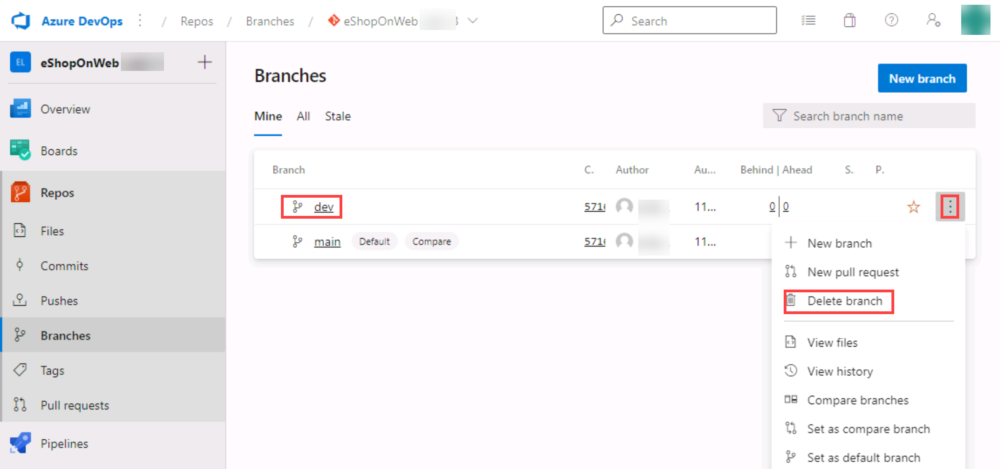

---
lab:
  title: Versionskontrolle mit Git in Azure Repos
  module: 'Module 02: Work with Azure Repos and GitHub'
---

# Versionskontrolle mit Git in Azure Repos

## Lab-Handbuch für Kursteilnehmer

## Labanforderungen

- Für dieses Lab ist **Microsoft Edge** oder ein von [Azure DevOps unterstützter Browser](https://docs.microsoft.com/azure/devops/server/compatibility) erforderlich.

- **Einrichten einer Azure DevOps-Organisation**: Wenn Sie nicht bereits eine Azure DevOps-Organisation haben, die Sie für dieses Lab verwenden können, müssen Sie diese erstellen, indem Sie die unter [Erstellen einer Organisation oder Projektsammlung](https://docs.microsoft.com/azure/devops/organizations/accounts/create-organization) beschriebenen Anweisungen befolgen.

- Falls Sie kein Git 2.29.2 oder höher installiert haben, starten Sie einen Webbrowser, navigieren Sie zur [Downloadseite von Git für Windows](https://gitforwindows.org/), laden sie es herunter und führen Sie die Installation aus.
- Wenn Sie Visual Studio Code noch nicht installiert haben, navigieren Sie im Webbrowserfenster zur [Downloadseite von Visual Studio Code](https://code.visualstudio.com/), laden Sie es herunter und führen Sie die Installation aus.
- Wenn Sie die Visual Studio C#-Erweiterung noch nicht installiert haben, navigieren Sie im Webbrowserfenster zur Installationsseite der [Installationsseite der C#-Erweiterung](https://marketplace.visualstudio.com/items?itemName=ms-dotnettools.csharp) und installieren Sie sie.

## Übersicht über das Labor

Azure DevOps unterstützt zwei Arten von Versionskontrolle: Git und Team Foundation-Versionskontrolle (TFVC). Hier finden Sie eine kurze Übersicht über die beiden Versionskontrollsysteme:

- **Team Foundation-Versionskontrolle (TFVC)**: TFVC ist ein zentralisiertes Versionskontrollsystem. In der Regel verfügen Teammitglieder auf ihren Entwicklungscomputern nur über eine Version jeder Datei. Daten zur Versionsgeschichte einer Datei werden nur auf dem Server gespeichert. Verzweigungen sind pfadbasiert und werden auf dem Server erstellt.

- **Git**: Git ist ein verteiltes Versionskontrollsystem. Git-Repositorys können lokal (auf dem Computer eines Entwicklers) vorhanden sein. Jeder Entwickler verfügt auf seinem Entwicklungscomputer über eine Kopie des Quellrepositorys. Entwickler können für alle Änderungen auf ihrem Entwicklungscomputer Commits ausführen und Versionskontrollvorgänge wie den Aufruf von Versionsgeschichten oder Vergleichen ohne Netzwerkverbindung vornehmen.

Git ist der Standardanbieter für Versionskontrolle für neue Projekte. Sie sollten Git für die Versionskontrolle in Ihren Projekten verwenden, es sei denn, Sie benötigen zentrale Versionskontrollfeatures in TFVC.

In diesem La lernen Sie, ein lokales Git-Repository einzurichten, das problemlos mit einem zentralen Git-Repository in Azure DevOps synchronisiert werden kann. Darüber hinaus erfahren Sie mehr über Git-Branching- und -Mergingunterstützung. Sie verwenden Visual Studio Code, aber die gleichen Prozesse gelten für die Verwendung eines beliebigen Git-kompatiblen Clients.

## Ziele

In diesem Lab lernen Sie Folgendes:

- Klonen eines vorhandenen Repositorys.
- Speichern von Arbeit mit Commits.
- Überprüfen des Verlaufs der Änderungen.
- Arbeiten mit Branches mithilfe von Visual Studio Code.

## Geschätzte Zeit: 60 Minuten

## Anweisungen

### Übung 0: Konfigurieren der Voraussetzungen für das Lab

In dieser Übung richten Sie die Voraussetzungen für das Lab ein, das aus einem neuen Azure DevOps-Projekt mit einem Repository basierend auf dem [eShopOnWeb](https://github.com/MicrosoftLearning/eShopOnWeb) besteht.

#### Aufgabe 1: (überspringen, wenn fertig) Erstellen und Konfigurieren des Teamprojekts

In dieser Aufgabe erstellen Sie ein **eShopOnWeb** Azure DevOps-Projekt, das von mehreren Labs verwendet werden soll.

1. Öffnen Sie auf Ihrem Lab-Computer in einem Browserfenster Ihre Azure DevOps-Organisation. Klicken Sie auf **Neues Projekt**. Geben Sie Ihrem Projekt den Namen **eShopOnWeb**, und wählen Sie **Scrum** in der Dropdownliste **Arbeitselementprozess** aus. Klicken Sie auf **Erstellen**.

    

#### Aufgabe 2: (überspringen, wenn erledigt) Importieren von eShopOnWeb Git Repository

Bei dieser Aufgabe importieren Sie das eShopOnWeb Git-Repository, das von mehreren Labs verwendet wird.

1. Öffnen Sie auf Ihrem Lab-Computer in einem Browserfenster Ihre Azure DevOps-Organisation und das zuvor erstellte **eShopOnWeb**-Projekt. Klicken Sie auf **Repos>Dateien**, **Importieren**. Fügen Sie im Fenster **Git Repository importieren** die folgende URL <https://github.com/MicrosoftLearning/eShopOnWeb.git> ein und klicken Sie auf **Importieren**:

    

1. Das Repository ist wie folgt organisiert:
    - Der Ordner **.ado** enthält Azure DevOps-YAML-Pipelines
    - Der Ordner **.devcontainer** enthält ein Containersetup für die Entwicklung mithilfe von Containern (entweder lokal in VS Code oder über GitHub Codespaces).
    - Der Ordner **infra** enthält eine Bicep&ARM-Infrastruktur als Codevorlagen, die in einigen Labszenarien verwendet werden.
    - Der Ordner **.github** enthält YAML GitHub-Workflow-Definitionen.
    - Der Ordner **src** enthält die .NET 8-Website, die in den Labszenarios verwendet wird.

#### Aufgabe 3: Konfigurieren von Git und Visual Studio Code

In dieser Aufgabe installieren und konfigurieren Sie Git und Visual Studio Code, einschließlich der Konfiguration des Git-Anmeldeinformationshelfers zum sicheren Speichern der Git-Anmeldeinformationen, die für die Kommunikation mit Azure DevOps verwendet werden. Wenn Sie diese Voraussetzungen bereits implementiert haben, können Sie direkt mit der nächsten Aufgabe fortfahren.

1. Öffnen Sie auf dem Lab-Computer **Visual Studio Code**.
1. Wählen Sie in der Visual Studio Code-Schnittstelle im Hauptmenü die Option **Terminal \| Neues Terminal** aus, um den **TERMINAL**-Bereich zu öffnen.
1. Stellen Sie sicher, dass das aktuelle Terminal **PowerShell** ausführt, indem Sie überprüfen, ob in der Dropdownliste in der oberen rechten Ecke des **TERMINAL**-Bereichs **1: powershell** angezeigt wird.

    > **Hinweis**: Um die aktuelle Terminalshell in **PowerShell** zu ändern, klicken Sie auf die Dropdownliste in der oberen rechten Ecke des **TERMINAL**-Bereichs und klicken Sie auf **Standardshell auswählen**. Wählen Sie oben im Visual Studio Code-Fenster Ihre bevorzugte Terminalshell **Windows PowerShell** aus und klicken Sie auf das Pluszeichen auf der rechten Seite der Dropdownliste, um ein neues Terminal mit der ausgewählten Standardshell zu öffnen.

1. Führen Sie im **TERMINAL**-Bereich den folgenden Befehl aus, um das Hilfsprogramm für Anmeldeinformationen zu konfigurieren.

    ```git
    git config --global credential.helper wincred
    ```

1. Führen Sie im **TERMINAL**-Bereich die folgenden Befehle aus, um einen Benutzernamen und eine E-Mail für Git Commits zu konfigurieren (ersetzen Sie die Platzhalter in geschweiften Klammern durch Ihren bevorzugten Benutzernamen und E-Mail, wodurch die Symbole < und > entfernt werden):

    ```git
    git config --global user.name "<John Doe>"
    git config --global user.email <johndoe@example.com>
    ```

### Übung 1: Klonen eines vorhandenen Repositorys

In dieser Übung verwenden Sie Visual Studio Code, um das Git-Repository zu klonen, das Sie als Teil der vorherigen Übung bereitgestellt haben.

#### Übung 1: Klonen eines vorhandenen Repositorys

In dieser Aufgabe durchlaufen Sie den Prozess des Klonens eines Git-Repositorys mithilfe von Visual Studio Code.

1. Wechseln Sie zum Webbrowser, in dem Ihre Azure DevOps-Organisation mit dem **eShopOnWeb**-Projekt angezeigt wird, das Sie in der vorherigen Übung generiert haben.
1. Wählen Sie im vertikalen Navigationsbereich des Azure DevOps-Portals das Symbol **Repos** aus.

1. Klicken Sie in der oberen rechten Ecke des **eShopOnWeb**-Repositorybereichs auf **Klonen**.

    

    > **Hinweis**: Das Abrufen einer lokalen Kopie eines Git-Repositorys wird als *Klonen* bezeichnet. Jedes Standard-Entwicklungstool unterstützt diesen Befehl und kann eine Verbindung mit Azure Repos herstellen, um die neueste Quelle abzurufen, mit der es arbeiten kann.

1. Klicken Sie im Bereich **Repository klonen** bei ausgewählter **HTTPS**-Befehlszeilenoption auf die Schaltfläche **In Zwischenablage kopieren** neben der URL des Repositoryklons.

    > **Hinweis**: Sie können diese URL mit jedem Git-kompatiblen Tool verwenden, um eine Kopie der Codebasis abzurufen.

1. Schließen Sie den Bereich **Repository klonen**.
1. Wechseln Sie auf Ihrem Lab-Computer zu **Visual Studio Code**.
1. Klicken Sie auf die Menüüberschrift **Ansicht** und klicken Sie im Dropdownmenü auf **Befehlspalette**.

    > **Hinweis**: Die Befehlspalette bietet eine einfache und bequeme Möglichkeit, auf eine Vielzahl von Aufgaben zuzugreifen, einschließlich derer, die als Drittanbietererweiterungen implementiert wurden. Alternativ können Sie auch die Tastenkombination **Strg+Umschalt+P** oder **F1** verwenden.

1. Führen Sie in der Befehlspalette den Befehl **Git: Clone** aus.

    

    > **Hinweis**: Um alle relevanten Befehle anzuzeigen, können Sie zunächst **Git** eingeben.

1. Fügen Sie in dem Textfeld **Repository-URL bereitstellen oder Repositoryquelle auswählen** aus, fügen Sie die URL des Repositoryklons ein, die Sie zuvor in dieser Aufgabe kopiert haben, und drücken Sie die Taste **Enter**.
1. Navigieren Sie im Dialogfeld **Ordner auswählen** zum Laufwerk C:, erstellen Sie einen neuen Ordner namens **Git**, wählen Sie ihn aus, und klicken Sie dann auf **Repositoryspeicherort auswählen**.
1. Melden Sie sich an Ihrem Azure-DevOps-Konto an, wenn die Aufforderung angezeigt wird.
1. Klicken Sie nach Abschluss des Klonvorgangs in Visual Studio Code auf **Öffnen**, um das geklonte Repository zu öffnen.

    > **Hinweis**: Sie können Warnungen ignorieren, die Probleme beim Laden des Projekts betreffen. Die Lösung befindet sich möglicherweise nicht im Zustand, der für einen Build geeignet ist, aber wir konzentrieren uns auf die Arbeit mit Git, sodass ein Build des Projekts nicht erforderlich ist.

### Übung 2: Speichern von Arbeit mit Commits

In dieser Übung durchlaufen Sie mehrere Szenarien, in denen Visual Studio Code verwendet wird, um Änderungen zu stagen und per Commit zu übernehmen.

Wenn Sie Änderungen an Ihren Dateien vornehmen, zeichnet Git die Änderungen im lokalen Repository auf. Sie können die Änderungen, die Sie übernehmen möchten, per Staging auswählen. Commits werden immer im Vergleich zu Ihrem lokalen Git-Repository vorgenommen, daher müssen Sie sich keine Gedanken darüber machen, dass der Commit perfekt ist oder bereit dafür, ihn mit anderen zu teilen. Sie können weitere Commits vornehmen, während Sie weiterarbeiten und die Änderungen an andere Personen übertragen, wenn sie bereit sind, freigegeben zu werden.

Git Commits besteht aus den folgenden Komponenten:

- Die Datei(en), die im Commit geändert wurde(n). Git speichert den Inhalt aller Dateiänderungen in Ihrem Repository in den Commits. Dadurch bleibt es schnell und ermöglicht intelligente Zusammenführungen.
- Ein Verweis auf übergeordnete Commits. Git verwaltet Ihren Codeverlauf mithilfe dieser Verweise.
- Eine Nachricht, die einen Commit beschreibt. Sie geben diese Nachricht für Git ein, wenn Sie den Commit erstellen. Diese Nachricht sollte beschreibend, aber auf den Punkt gebracht sein.

#### Aufgabe 1: Übernehmen von Änderungen per Commit

In dieser Aufgabe verwenden Sie Visual Studio Code, um Änderungen durch einen Commit zu übernehmen.

1. Wählen Sie im Visual Studio Code-Fenster oben auf der vertikalen Symbolleiste die Registerkarte **EXPLORER** aus, navigieren Sie zur Datei **/eShopOnWeb/src/Web/Program.cs** und wählen Sie sie aus. Dadurch wird der Inhalt automatisch im Detailbereich angezeigt.
1. Fügen Sie in der ersten Zeile den folgenden Kommentar ein:

    ```csharp
    // My first change
    ```

    > **Hinweis**: Es spielt keine Rolle, was der Kommentar ist, da es nur darum geht, eine Änderung vorzunehmen.

1. Drücken Sie **STRG+S** , um die Änderung zu speichern.
1. Wählen Sie im Visual Studio Code-Fenster die Registerkarte **QUELLCODEVERWALTUNG** aus, um zu überprüfen, ob Git die neueste Änderung an der Datei erkannt hat, die sich im lokalen Klon des Git-Repositorys befindet.
1. Wenn die Registerkarte **QUELLCODEVERWALTUNG** ausgewählt ist, geben Sie in das Textfeld am oberen Rand des Bereichs **Mein Commit** als Commitnachricht ein, und drücken **Strrg+Enter**, um den Commit lokal zu übernehmen.

    

1. Wenn Sie dazu aufgefordert werden sollen, ihre Änderungen automatisch zu stagen und direkt zu committen, klicken Sie auf **Immer**.

    > **Hinweis**: Wir werden das **Staging** später im Lab besprechen.

1. Beachten Sie in der unteren linken Ecke des Visual Studio Code-Fensters rechts neben **Main** das Symbol **Änderungen synchronisieren**, ein Kreis mit zwei vertikalen Pfeilen, die in die entgegengesetzte Richtung zeigen, und die Zahl **1** neben dem Pfeil, der nach oben zeigt. Klicken Sie auf das Symbol, und klicken Sie, wenn Sie dazu aufgefordert werden, auf **OK**, um Commits an den ** origin/main ** zu übertragen bzw. davon abzurufen.

#### Aufgabe 2: Überprüfen von Commits

In dieser Aufgabe verwenden Sie das Azure DevOps-Portal, um Commits zu überprüfen.

1. Wechseln Sie zu dem Webbrowser-Fenster, in dem die Azure DevOps-Schnittstelle angezeigt wird.
1. Wählen Sie im vertikalen Navigationsbereich des Azure DevOps-Portals im Abschnitt **Repos** die Option **Commits** aus.
1. Vergewissern Sie sich, dass Ihr Commit oben in der Liste angezeigt wird.

    

#### Aufgabe 3: Änderungen stagen

In dieser Aufgabe lernen Sie kennen, wie Sie das Stagen von Änderungen mithilfe von Visual Studio Code verwenden. Mit dem Stagen von Änderungen können Sie bestimmte Dateien selektiv zu einem Commit hinzufügen, während sie die in anderen Dateien vorgenommenen Änderungen zurückstellen.

1. Wechseln Sie zurück zum **Visual Studio Code**-Fenster.
1. Aktualisieren Sie die geöffnete **Program.cs**-Klasse , indem Sie den ersten Kommentar wie folgt ändern und die Datei speichern.

    ```csharp
        //My second change
    ```

1. Wechseln Sie im Visual Studio Code-Fenster zurück zur Registerkarte **EXPLORER**, navigieren Sie zur Datei **/eShopOnWeb/src/Web/Constants.cs** und wählen Sie sie aus. Dadurch wird der Inhalt automatisch im Detailbereich angezeigt.
1. Fügen Sie der Datei **Constants.cs** einen Kommentar in der ersten Zeile hinzu, und speichern Sie die Datei.

    ```csharp
    // My third change
    ```

1. Wechseln Sie im Visual Studio Code-Fenster zur Registerkarte **QUELLCODEVERWALTUNG**, zeigen Sie mit dem Mauszeiger auf den Eintrag **Program.cs** und klicken Sie auf das Pluszeichen auf der rechten Seite dieses Eintrags.

    > **Hinweis**: Dadurch wird das Staging nur für die Änderung in der Datei **Program.cs** ausgeführt und der Commit ohne **Constants.cs** vorbereitet.

1. Bei ausgewählter Registerkarte **QUELLCODEVERWALTUNG** geben Sie in das Textfeld am oberen Rand des Bereichs **Kommentare hinzugefügt** als Commitnachricht ein.

    

1. Klicken Sie oben auf der Registerkarte **QUELLCODEVERWALTUNG** auf das Symbol mit den Auslassungspunkten, wählen Sie im Dropdownmenü **Commit** aus und wählen Sie im hierarchischen Menü die Option **Commit gestaget** aus.
1. Klicken Sie in der unteren linken Ecke des Visual Studio Code-Fensters auf die Schaltfläche **Änderungen synchronisieren**, um die Änderungen aus dem Commit mit dem Server zu synchronisieren. Wenn Sie dazu aufgefordert werden, klicken Sie auf **OK**, um Commits an **origin/main** per Push zu übertragen bzw. per Pull davon abzurufen.

    > **Hinweis**: Da nur die gestagete Änderung im Commit übernommen wurde, steht die Synchronisierung der anderen Änderung noch aus.

### Übung 3: Überprüfen des Verlaufs

In dieser Übung verwenden Sie das Azure DevOps-Portal, um den Verlauf von Commits zu überprüfen.

Git verwendet die übergeordneten Referenzinformationen, die in jedem Commit gespeichert sind, um den vollständigen Verlauf Ihrer Entwicklung zu verwalten. Sie können diesen Commit-Verlauf ganz einfach überprüfen, um herauszufinden, wann Dateiänderungen vorgenommen wurden, und Unterschiede zwischen Versionen Ihres Codes mithilfe des Terminals oder einer der vielen verfügbaren Visual Studio Code-Erweiterungen ermitteln. Sie können Änderungen auch über das Azure DevOps-Portal überprüfen.

Git verwendet die Funktion **Branches and Merges** über Pull Request, sodass der Commitverlauf Ihrer Entwicklung nicht unbedingt eine gerade, chronologische Linie bildet. Wenn Sie den Verlauf zum Vergleichen von Versionen verwenden, denken Sie an Dateiänderungen zwischen zwei Commits anstelle von Dateiänderungen zwischen zwei Zeitpunkten. Eine kürzlich vorgenommene Änderung an einer Datei in der Mainbranch stammt möglicherweise aus einem Commit, der vor zwei Wochen in einer Featurebranch erstellt wurde, der gestern zusammengeführt wurde.

#### Aufgabe 1: Vergleichen von Dateien

In dieser Aufgabe durchlaufen Sie den Commitverlauf mithilfe des Azure DevOps-Portals.

1. Wählen Sie bei geöffneter Registerkarte **QUELLCODEVERWALTUNG** des Visual Studio Code-Fensters die Datei **Constants.cs** aus, die die nicht-gestagete Version der Datei darstellt.

    

    > **Hinweis**: Es wird eine Vergleichsansicht geöffnet, in der Sie die von Ihnen vorgenommenen Änderungen leicht auffinden können. In diesem Fall ist es nur der einzige Kommentar.

1. Wechseln Sie zum Webbrowser-Fenster, das den Bereich **Commits** des **Azure DevOps**-Portals anzeigt, um die Quellverzweigungen und Zusammenführungen zu überprüfen. Diese bieten eine bequeme Möglichkeit, um zu sehen, wann und wie Änderungen an der Quelle vorgenommen wurden.
1. Scrollen Sie nach unten zum Eintrag **Mein Commit** (der zuvor gepusht wurde) und fahren Sie mit dem Mauszeiger darüber, um die Auslassungspunkte auf der rechten Seite zu sehen.
1. Klicken Sie auf die Auslassungspunkte, wählen Sie im Dropdownmenü die Option **Dateien durchsuchen** und überprüfen Sie die Ergebnisse.

    

    > **Hinweis**: Diese Ansicht stellt den Zustand des Quellcodes dar, der dem Commit entspricht, und ermöglicht es Ihnen, jede einzelne Quelldatei zu überprüfen und herunterzuladen.

### Übung 4: Arbeiten mit Branches

In dieser Übung werden Sie mit Visual Studio Code und dem Azure DevOps-Portal Szenarien durchspielen, die eine Branchverwaltung beinhalten.

Sie können Ihr Azure DevOps Git-Repos über die Ansicht **Branches** von **Azure Repos** im Azure DevOps-Portal verwalten. Sie können die Ansicht auch so anpassen, dass Sie die Branches verfolgen können, die Ihnen am wichtigsten sind, so dass Sie die Änderungen Ihres Teams immer im Blick haben.

Das Übertragen von Änderungen an eine Branch wirkt sich nicht auf andere Branches aus, und Sie können Branches mit anderen gemeinsam nutzen, ohne die Änderungen in das Hauptprojekt einbringen zu müssen. Sie können auch neue Branches erstellen, um Änderungen für ein Feature oder eine Fehlerbehebung von Ihrer Hauptbranch und anderen Arbeiten zu isolieren. Aufgrund der Einfachheit von Branches ist ein schneller und einfacher Wechsel zwischen Branches möglich. Git erstellt bei der Arbeit mit Branches nicht mehrere Kopien Ihres Quellcodes, sondern verwendet die in den Commits gespeicherten Verlaufsinformationen, um die Dateien einer Branch neu zu erstellen, wenn Sie mit der Arbeit daran beginnen. Ihr Git-Workflow sollte Branches für die Verwaltung von Funktionen und Fehlerbehebungen erstellen und verwenden. Der Rest des Git-Workflows, wie z. B. die Freigabe von Code und die Überprüfung von Code mit Pull Requests, funktioniert über Branches. Die Isolierung der Arbeit in Branches macht es sehr einfach, die Arbeit zu ändern, indem man einfach die aktuelle Branch ändert.

#### Aufgabe 1: Erstellen Sie eine neue Branch in Ihrem lokalen Repository

In dieser Aufgabe erstellen Sie eine Branch mit Hilfe von Visual Studio Code.

1. Wechseln Sie auf Ihrem Lab-Computer zu **Visual Studio Code**.
1. Klicken Sie bei ausgewählter Registerkarte **QUELLCODEVERWALTUNG** in der unteren linken Ecke des Visual Studio Code-Fensters auf **main**.
1. Wählen Sie im Pop-up-Fenster **+ Neue Branch erstellen aus...**.

    

1. Geben Sie in das Textfeld **Branchname** **dev** ein, um die neue Branch anzugeben und drücken Sie **Eingabe**.
1. Wählen Sie im Textfeld **Wählen Sie eine Referenz aus, von der aus Sie die Branch 'dev' erstellen wollen**, wählen Sie **main** als Referenzbranch.

    > **Anmerkung**: An dieser Stelle wird automatisch in die **dev**-Branch gewechselt.

#### Aufgabe 2: Löschen einer Branch

In dieser Aufgabe werden Sie Visual Studio Code verwenden, um mit einer in der vorherigen Aufgabe erstellte Branch zu arbeiten.

Git merkt sich, an welcher Branch Sie arbeiten und stellt sicher, dass Ihre Dateien mit der letzten Übergabe in dieser Branch übereinstimmen, wenn Sie eine Branch auschecken. Branches bieten die Möglichkeit, gleichzeitig mit mehreren Versionen des Quellcodes im gleichen lokalen Git-Repository zu arbeiten. Sie können Visual Studio Code verwenden, um Branches zu veröffentlichen, auszuchecken und zu löschen.

1. Klicken Sie im Fenster **Visual Studio Code** bei ausgewählter Registerkarte **QUELLCODEVERWALTUNG** in der unteren linken Ecke des Visual Studio Code-Fensters auf das Symbol **Änderungen veröffentlichen** (direkt rechts neben dem Label **dev**, das Ihre neu erstellte Branch darstellt).
1. Wechseln Sie zum Webbrowser-Fenster, in dem der Bereich **Commits** des Portals **Azure DevOps** angezeigt wird, und wählen Sie **Branches**.
1. Überprüfen Sie auf der Registerkarte **Meine** des Bereichs **Branches**, dass die Liste der Branches **dev** enthält.
1. Bewegen Sie den Mauszeiger über den Eintrag **dev**, um die Auslassungspunkte auf der rechten Seite zu sehen.
1. Klicken Sie auf die Auslassungspunkte, wählen Sie im Pop-up-Menü **Branche löschen**, und klicken Sie auf **Löschen**, wenn Sie zur Bestätigung aufgefordert werden.

    

1. Wechseln Sie zurück zum Fenster **Visual Studio Code** und klicken Sie bei ausgewählter Registerkarte **QUELLCODEVERWALTUNG** in der unteren linken Ecke des Fensters von Visual Studio Code auf den Eintrag **dev**. Dadurch werden die vorhandenen Branches im oberen Teil des Visual Studio Code-Fensters angezeigt.
1. Überprüfen Sie, ob jetzt zwei **dev**-Branches aufgelistet sind.
1. Wechseln Sie zum Webbrowser, in dem die Registerkarte **Meine** von **Branches** angezeigt wird.
1. Wählen Sie auf der Registerkarte **Mine** des Bereichs **Branches** die Registerkarte **Alle** aus.
1. Geben Sie auf der Registerkarte **Alle** des Bereichs **Branches** in das Textfeld **Branchnamen suchen** **dev** ein.
1. Überprüfen Sie den Abschnitt **Gelöschte Branches**, der den Eintrag für den eben gelöschten Branch enthält.
1. Bewegen Sie den Mauszeiger im Abschnitt **Gelöschte Branches** über den Eintrag **dev**, um die Auslassungspunkte auf der rechten Seite zu sehen.
1. Klicken Sie im Popupmenü auf die Auslassungspunkte und wählen Sie **Branch wiederherstellen** aus.

    

    > **Hinweis**: Sie können diese Funktion verwenden, um einen gelöschten Branch wiederherzustellen, solange Sie seinen genauen Namen kennen.

#### Aufgabe 4: Branchrichtlinien

In dieser Aufgabe werden Sie das Azure DevOps-Portal verwenden, um der Hauptbranch Richtlinien hinzuzufügen und nur Änderungen über Pull Requests zuzulassen, die den definierten Richtlinien entsprechen. Sie möchten sicherstellen, dass Änderungen in einem Branch überprüft werden, bevor sie zusammengeführt werden.

Der Einfachheit halber werden wir direkt mit dem Repo-Editor des Webbrowsers arbeiten (direkt in Origin), anstatt den lokalen Klon in VS Code zu verwenden (empfohlen für reale Szenarien).

1. Wechseln Sie zu dem Webbrowser, der die Registerkarte **Mine** des Bereichs **Branches** im Azure DevOps-Portal anzeigt.
1. Zeigen Sie auf der Registerkarte **Eigene** im Bereich **Verzweigungen** mit dem Mauszeiger auf den Eintrag **Haupt**-Verzweigung, um das Auslassungszeichen auf der rechten Seite anzuzeigen.
1. Klicken Sie auf die Auslassungspunkte, und wählen Sie im Popupmenü **Verzweigungsrichtlinien** aus.

    

1. Aktivieren Sie auf der Registerkarte **Haupt** der Repositoryeinstellungen die Option für **Mindestanzahl der Prüfer erforderlich machen**. Fügen Sie **1** Prüfer hinzu, und aktivieren Sie das Kontrollkästchen **Anforderern erlauben, ihre eigenen Änderungen zu genehmigen** (da Sie der einzige Benutzer in Ihrem Projekt für das Lab sind)
1. Aktivieren Sie auf der Registerkarte **main** der Repository-Einstellungen die Option **Auf verknüpfte Arbeitselemente überprüfen** und behalten Sie dafür die Option **Erforderlich** bei.

    

#### Aufgabe 5: Testen der Branchrichtlinie

In dieser Aufgabe werden Sie das Azure DevOps-Portal verwenden, um die Richtlinie zu testen und Ihren ersten Pull Request zu erstellen.

1. Vergewissern Sie sich, dass im vertikalen Navigationsbereich des Azure DevOps-Portals unter **Repos>Dateien** der Branch **main** ausgewählt ist (Dropdown über dem angezeigten Inhalt).
1. Um sicherzustellen, dass die Richtlinien funktionieren, versuchen Sie, eine Änderung vorzunehmen und sie im Branch **main** zu binden. Navigieren Sie dann zur Datei **/eShopOnWeb/src/Web/Program.cs** und wählen Sie sie aus. Dadurch wird der Inhalt automatisch im Detailbereich angezeigt.
1. Fügen Sie in der ersten Zeile den folgenden Kommentar ein:

    ```csharp
    // Testing main branch policy
    ```

1. Klicken Sie auf **Commit > Commit**. Sie werden eine Warnung sehen: Änderungen am Hauptbranch können nur über einen Pull Request vorgenommen werden.

    

1. Klicken Sie auf **Abbrechen**, um den Commit zu überspringen.

#### Aufgabe 6: Arbeiten mit Pull Requests

In dieser Aufgabe werden Sie das Azure DevOps-Portal verwenden, um einen Pull Request zu erstellen und den Branch **dev** zu verwenden, um eine Änderung im geschützten Branch **main** zusammenzuführen. Ein Azure DevOps-Arbeitselement wird mit den Änderungen verknüpft, um ausstehende Arbeiten über Codeaktivität verfolgen zu können.

1. Wählen Sie im vertikalen Navigationsbereich des Azure DevOps-Portals im Abschnitt **Boards** die Option **Arbeitselemente** aus.
1. Klicken Sie auf **+ Neues Arbeitselement > Produkt-Backlog-Element**. Schreiben Sie in das Titelfeld **Meine erste PR testen** und klicken Sie auf **Speichern**.
1. Gehen Sie nun zurück zum vertikalen Navigationsbereich des Azure DevOps-Portals und stellen Sie sicher, dass unter **Repos>Dateien** der Branch **dev** ausgewählt ist.
1. Navigieren Sie zur Datei **/eShopOnWeb/src/Web/Program.cs** und nehmen Sie die folgende Änderung in der ersten Zeile vor:

    ```csharp
    // Testing my first PR
    ```

1. Klicken Sie auf **Commit > Commit** (Standard-Commit-Nachricht belassen). Diesmal funktioniert die Übergabe und der Branch **dev** hat keine Richtlinien.
1. Eine Nachricht erscheint, die vorschlägt, einen Pull Request zu erstellen (da Ihre Branch **dev** in Bezug auf die Änderungen im Vergleich zu **main** nun voraus ist). Klicken Sie auf **Pull Request erstellen**.

    

1. Belassen Sie die Standardeinstellungen auf der Registerkarte **Neuer Pull Request** und klicken Sie auf **Erstellen**.
1. Der Pull Request zeigt einige fehlgeschlagene/ausstehende Anforderungen an, basierend auf den Richtlinien, die auf unserem Zielbranch **main** angewendet werden.
    - Vorgeschlagene Änderungen sollten mit einem Arbeitselemente verknüpft sein.
    - Mindestens 1 Benutzer*in sollte die Änderungen überprüfen und genehmigen.

1. Klicken Sie in den Optionen auf der rechten Seite auf die Schaltfläche **+** neben **Arbeitselemente**. Verknüpfen Sie das zuvor erstellte Arbeitselement mit dem Pull Request, indem Sie es anklicken. Sie werden sehen, dass eine der Anforderungen ihren Status ändert.

    

1. Öffnen Sie als Nächstes die Registerkarte **Dateien**, um die vorgeschlagenen Änderungen zu überprüfen. In einem umfassenderen Pull Request könnten Sie die Dateien einzeln überprüfen (als überprüft markiert) und Kommentare zu Zeilen öffnen, die möglicherweise nicht klar sind (wenn Sie mit der Maus über die Zeilennummer fahren, können Sie einen Kommentar abgeben).
1. Gehen Sie zurück zur Registerkarte **Übersicht**, und klicken Sie oben rechts auf **Genehmigen**. Alle Anforderungen änder sich auf Grün. Jetzt können Sie auf **Abschließen** klicken.
1. Auf der Registerkarte **Pull Request abschließen** werden mehrere Optionen angeboten, bevor die Zusammenführung abgeschlossen wird:
    - **Zusammenführungstyp**: Es werden 4 Zusammenführungstypen angeboten, die Sie [hier](https://learn.microsoft.com/azure/devops/repos/git/complete-pull-requests?view=azure-devops&tabs=browser#complete-a-pull-request) hier überprüfen oder in den angegebenen Animationen beobachten können. Wählen Sie **Zusammenführen (kein schneller Vorlauf)**.
    - **Nachbearbeitungsoptionen**:
        - Markieren Sie **Zugehöriges Arbeitselement abschließen …**. Das zugehörige PBI wird in den Zustand **Fertig** versetzt.

1. Klicken Sie auf **Zusammenführung abschließen**

#### Aufgabe 7: Anwenden von Tags

Das Produktteam hat beschlossen, dass die aktuelle Version der Website als v1.1.0-beta veröffentlicht werden soll.

1. Wählen Sie im vertikalen Navigationsbereich des Azure DevOps-Portals im Abschnitt **Repos** die Option **Tags** aus.
1. Klicken Sie im Bereich **Tags** auf **Neues Tag**.
1. Geben Sie im Bedienfeld **Tag erstellen** in das Textfeld **Name** den Wert **v1.1.0-beta** ein, lassen Sie in der Dropdown-Liste **Basierend auf** den Eintrag **main** ausgewählt, geben Sie in das Textfeld **Beschreibung** den Wert **Beta-Version v1.1.0** ein und klicken auf **Erstellen**.

    > **Hinweis**: Sie haben das Repository jetzt mit dieser Version markiert (der letzte Commit wird mit der Markierung verknüpft). Sie können Commits aus einer Vielzahl von Gründen markieren und Azure DevOps bietet die Flexibilität, sie zu bearbeiten und zu löschen sowie ihre Berechtigungen zu verwalten.

### Übung 5: Entfernen von Branchrichtlinien

Wenn Sie die verschiedenen Kurslabs in der Reihenfolge durchlaufen, in der sie präsentiert werden, wird die während dieses Labs konfigurierte Branchrichtlinie Übungen in zukünftigen Labs blockieren. Daher möchten wir, dass Sie die konfigurierten Branchrichtlinien entfernen.

1. Navigieren Sie in der **eShopOnWeb**-Projektansicht in Azure DevOps zu **Repos**, und wählen Sie **Branches** aus. Wählen Sie die Registerkarte **Meine** im Bereich **Branches** aus.
1. Zeigen Sie auf der Registerkarte **Meine** des Bereichs **Branches** mit dem Mauszeiger auf den **Mainbranch**-Eintrag, um das Auslassungszeichen (das ...) auf der rechten Seite anzuzeigen.
1. Klicken Sie auf die Auslassungspunkte, und wählen Sie im Popupmenü **Verzweigungsrichtlinien** aus.

    

1. Deaktivieren Sie auf der Registerkarte **Main** der Repositoryeinstellungen die Option für **Mindestanzahl von Prüfern erfordern**.
1. Deaktivieren Sie auf der Registerkarte **Main** der Repositoryeinstellungen die Option für **Auf verknüpfte Arbeitselemente überprüfen**.

    

1. Sie haben jetzt die Branchrichtlinien für den Mainbranch deaktiviert/entfernt.

## Überprüfung

In dieser Übung haben Sie das Azure DevOps-Portal zur Verwaltung von Branches und Repositorys verwendet.
