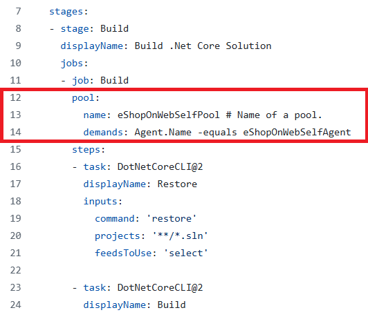

---
lab:
  title: Konfigurieren von Agentenpools und Erkennen von Pipelinearten
  module: 'Module 02: Implement CI with Azure Pipelines and GitHub Actions'
---

# Konfigurieren von Agent-Pools und Informationen zu Pipelinearten

## Labanforderungen

- Für dieses Lab ist **Microsoft Edge** oder ein von [Azure DevOps unterstützter Browser](https://docs.microsoft.com/azure/devops/server/compatibility) erforderlich.

- **Einrichten einer Azure DevOps-Organisation**: Wenn Sie nicht bereits eine Azure DevOps-Organisation haben, die Sie für dieses Lab verwenden können, müssen Sie diese erstellen, indem Sie die unter [Erstellen einer Organisation oder Projektsammlung](https://docs.microsoft.com/azure/devops/organizations/accounts/create-organization) beschriebenen Anweisungen befolgen.

- [Git for Windows](https://gitforwindows.org/): Downloadseite. Diese wird als Teil der Voraussetzungen für diese Übung installiert.

- [Visual Studio Code](https://code.visualstudio.com/). Diese wird als Teil der Voraussetzungen für diese Übung installiert.

## Übersicht über das Labor

YAML-basierte Pipelines bieten Ihnen die Möglichkeit, CI/CD vollständig als Code zu implementieren. Dabei befinden sich die Pipelinedefinitionen im selben Repository wie der Code, der Bestandteil Ihres Azure DevOps-Projekts ist. YAML-basierte Pipelines unterstützen eine Vielzahl von Features, die auch zu klassischen Pipelines gehören, z. B. Pull Requests, Codeüberprüfungen, Verlauf, Verzweigungen und Vorlagen.

Ungeachtet der ausgewählten Pipelineart benötigen Sie einen Agent, um Ihren Code zu erstellen oder Ihre Lösung mithilfe von Azure Pipelines bereitzustellen. Ein Agent hostet Computeressourcen, die jeweils einen Auftrag ausführen. Aufträge können direkt auf dem Hostcomputer des Agents oder in einem Container ausgeführt werden. Sie haben die Möglichkeit, Ihre Aufträge mit von Microsoft gehosteten und verwalteten Agents auszuführen oder einen selbst gehosteten Agent zu implementieren, den Sie selbst einrichten und verwalten.

In diesem Lab erfahren Sie, wie Sie selbstgehostete Agents mit YAML-Pipelines implementieren und verwenden.

## Ziele

In diesem Lab lernen Sie Folgendes:

- Implementieren YAML-basierter Pipelines.
- Implementieren selbstgehosteter Agents.

## Geschätzte Zeit: 30 Minuten

## Anweisungen

### Übung 0: (Überspringen, wenn bereits abgeschlossen) Konfigurieren der Lab-Voraussetzungen

In dieser Übung richten Sie die Voraussetzungen für das Lab ein, das aus einem neuen Azure DevOps-Projekt mit einem Repository basierend auf dem [eShopOnWeb](https://github.com/MicrosoftLearning/eShopOnWeb) besteht.

#### Aufgabe 1: (überspringen, wenn fertig) Erstellen und Konfigurieren des Teamprojekts

In dieser Aufgabe erstellen Sie ein **eShopOnWeb** Azure DevOps-Projekt, das von mehreren Labs verwendet werden soll.

1. Öffnen Sie auf Ihrem Lab-Computer in einem Browserfenster Ihre Azure DevOps-Organisation. Klicken Sie auf **Neues Projekt**. Weisen Sie Ihrem Projekt den Namen **eShopOnWeb** zu, und lassen Sie die anderen Felder auf den Standardwerten. Klicken Sie auf **Erstellen**.

#### Aufgabe 2: (überspringen, wenn erledigt) Importieren von eShopOnWeb Git Repository

Bei dieser Aufgabe importieren Sie das eShopOnWeb Git-Repository, das von mehreren Labs verwendet wird.

1. Öffnen Sie auf Ihrem Lab-Computer in einem Browserfenster Ihre Azure DevOps-Organisation und das zuvor erstellte **eShopOnWeb**-Projekt. Klicken Sie auf **Repos > Dateien** , **Importiere ein Repository**. Klicken Sie auf **Importieren**. Fügen Sie im Fenster **Git Repository importieren** die folgende URL <https://github.com/MicrosoftLearning/eShopOnWeb.git> ein, und klicken Sie auf **Importieren**:

1. Das Repository ist wie folgt organisiert:
    - Der Ordner **.ado** enthält Azure DevOps-YAML-Pipelines.
    - Der Ordner **.devcontainer** enthält ein Containersetup für die Entwicklung mithilfe von Containern (entweder lokal in VS Code oder über GitHub Codespaces).
    - Der Ordner **infra** enthält die Bicep- und ARM-Infrastruktur als Codevorlagen, die in einigen Labszenarios verwendet werden.
    - Der Ordner **.github** enthält YAML-GitHub-Workflowdefinitionen.
    - Der Ordner **src** enthält die .NET 8-Website, die in den Labszenarien verwendet wird.

#### Aufgabe 3: (überspringen, wenn erledigt) Legen Sie den Mainbranch als Standardbranch fest

1. Wechseln Sie zu **Repos > Branches**.
1. Bewegen Sie den Mauszeiger auf den **Main**-Branch und klicken Sie dann rechts neben der Spalte auf die Auslassungspunkte.
1. Klicken Sie auf **Als Mainbranch festlegen**.

### Übung 1: Erstellen von Agents und Konfigurieren von Agentpools

In dieser Übung erstellen Sie einen virtuellen Azure-Computer (Virtual Machine, VM) und verwenden ihn, um einen Agent zu erstellen und Agentpools zu konfigurieren.

#### Aufgabe 1: Erstellen eines virtuellen Azure-Computers und Herstellen einer Verbindung mit diesem

1. Öffnen Sie in Ihrem Browser das Azure-Portal unter `https://portal.azure.com`. Wenn Sie dazu aufgefordert werden, melden Sie sich mithilfe eines Kontos mit der Rolle „Besitzer*in“ in Ihrem Azure-Abonnement an.

1. Geben Sie in das Feld **Ressourcen, Dienste und Dokumente suchen (G+/)** **`Virtual Machines`** ein und wählen Sie es aus der Dropdown-Liste aus.

1. Wählen Sie die Schaltfläche **Erstellen**.

1. Wählen Sie die Option **Virtueller Azure-Computer mit voreingestellter Konfiguration** aus.

    

1. Wählen Sie die **Dev/Test**-Umgebung als Workloadumgebung und **Universell** als Workloadtyp aus.

1. Wählen Sie die Schaltfläche **Mit Erstellen eines virtuellen Computers fortfahren** aus, führen Sie auf der Registerkarte **Grundlagen** die folgenden Aktionen aus, und wählen Sie dann die Option **Verwaltung** aus:

   | Einstellung | Aktion |
   | -- | -- |
   | Dropdownliste **Abonnement** | Wählen Sie Ihr Azure-Abonnement. |
   | Abschnitt **Ressourcengruppe** | Erstellen Sie eine neue Ressourcengruppe namens **rg-eshoponweb-agentpool**. |
   | **Name des virtuellen Computers** -Textfeld | Geben Sie den Namen Ihrer bevorzugten Option ein, beispielsweise **`eshoponweb-vm`**. |
   | Dropdownliste **Region** | Du kannst die nächstgelegene [Azure](https://azure.microsoft.com/explore/global-infrastructure/geographies)-Region wählen.. Zum Beispiel „Ost-USA", „Ostasien", „West-US", usw. |
   | **Verfügbarkeitsoptionen**-Dropdownliste | Wählen Sie die Option **Keine Infrastrukturredundanz erforderlich** aus. |
   | **Sicherheitstyp**-Dropdownliste | Wählen Sie mit der Option **Virtuelle Computer mit vertrauenswürdigem Start** aus. |
   | Dropdownliste **Image** | Wählen Sie **Windows Server 2022 Datacenter aus: Azure-Edition – x64 Gen2**-Image. |
   | **Größe**-Dropdownliste | Wählen Sie die günstigste **Standard**-Größe für Testzwecke aus. |
   | **Benutzername**-Textfeld | Benutzernamen Ihrer Wahl eingeben |
   | **Kennwort**-Textfeld | Kennwort Ihrer Wahl eingeben |
   | **Öffentliche Eingangsports**-Abschnitt | Wählen Sie **Ausgewählte Ports zulassen** aus. |
   | **Eingangsports auswählen**-Dropdownliste | Wählen Sie **RDP (3389)** aus. |

1. Aktivieren Sie auf der Registerkarte **Verwaltung** im Abschnitt **Identität** das Kontrollkästchen **Systemseitig zugewiesene verwaltete Identität aktivieren**, und wählen Sie dann **Überprüfen und Erstellen** aus:

1. Wählen Sie auf der Registerkarte **Überprüfen + erstellen** die Option **Erstellen** aus.

   > **Hinweis:** Warten Sie auf den Abschluss des Bereitstellungsvorgangs. Dieser Vorgang dauert etwa zwei Minuten.

1. Navigieren Sie im Azure-Portal zur Seite, auf der die Konfiguration des neu erstellten virtuellen Azure-Computers angezeigt wird.

1. Klicken Sie auf der Seite „Azure VM“ auf **Verbinden**, wählen Sie im Dropdown-Menü **Verbinden** aus und wählen Sie dann **RDP-Datei herunterladen** aus.

1. Verwenden Sie die heruntergeladene RDP-Datei, um eine Remotedesktopsitzung für das Betriebssystem einzurichten, das auf dem virtuellen Azure-Computer ausgeführt wird.

#### Aufgabe 2: Agent-Pool erstellen

1. Starten Sie in der Remotedesktopsitzung auf dem virtuellen Azure-Computer den Microsoft Edge-Webbrowser.

1. Navigieren Sie im Webbrowser zum Azure DevOps-Portal unter `https://aex.dev.azure.com`, und melden Sie sich an, um auf Ihre Organisation zuzugreifen.

   > **Hinweis**: Wenn Sie zum ersten Mal auf das Azure DevOps-Portal zugreifen, müssen Sie möglicherweise Ihr Profil erstellen.

1. Öffnen Sie das Projekt **eShopOnWeb** , und wählen Sie die Option **Projekteinstellungen** im linken unteren Menü aus.

1. Wählen Sie in **Pipelines > Agentpools** die Schaltfläche **Pool hinzufügen** aus.

1. Wählen Sie den **selbst gehosteten** Pooltyp aus.

1. Geben Sie einen Namen für den Agentpool an, z. B. **eShopOnWebSelfPool**, und fügen Sie eine optionale Beschreibung hinzu.

1. Lassen Sie die Option **Zugriffsberechtigung für alle Pipelines gewähren** unmarkiert.

   

   > **Hinweis**: Die Option Allen Pipelines die Zugriffsberechtigung gewähren wird für Produktionsumgebungen nicht empfohlen. Sie wird nur in diesem Lab verwendet, um die Konfiguration der Pipeline zu vereinfachen.

1. Klicken Sie auf die Schaltfläche **Erstellen**, um den Agentpool zu erstellen.

#### Aufgabe 3: Agent-Installationsdateien herunterladen und extrahieren

1. Wählen Sie im Azure DevOps-Portal den neu erstellten Agentpool und dann die Registerkarte **Agents** aus.

1. Wählen Sie die Schaltfläche **Neuer Agent** und dann die Schaltfläche **Herunterladen** aus dem **Download-Agent** im neuen Popupfenster aus.

   > **Hinweis**: Befolgen Sie die Installationsanweisungen, um den Agenten zu installieren.

1. Starten Sie eine PowerShell-Sitzung, und führen Sie die folgenden Befehle aus, um einen Ordner namens **Agent** zu erstellen.

   ```powershell
   mkdir agent ; cd agent        
   ```

   > **Hinweis**: Stellen Sie sicher, dass Sie sich im Ordner befinden, in dem Sie den Agenten installieren möchten, z. B. C:\agent.

1. Führen Sie den folgenden Befehl aus, um den Inhalt der heruntergeladenen Agent-Installationsdateien zu extrahieren:

   ```powershell
   Add-Type -AssemblyName System.IO.Compression.FileSystem ; [System.IO.Compression.ZipFile]::ExtractToDirectory("$HOME\Downloads\vsts-agent-win-x64-3.245.0.zip", "$PWD")
   ```

   > **Hinweis**: Wenn Sie den Agenten an einen anderen Speicherort heruntergeladen haben (oder die heruntergeladene Version unterschiedlich ist), passen Sie den obigen Befehl entsprechend an.

#### Aufgabe 4: PAT-Token erstellen

> **Hinweis**: Bevor Sie den Agent konfigurieren, müssen Sie ein PAT-Token erstellen (es sei denn, Sie verfügen über ein vorhandenes Token). Gehen Sie zum Erstellen eines PAT-Tokens wie folgt vor:

1. Öffnen Sie in der Remotedesktopsitzung auf dem virtuellen Azure-Computer ein anderes Browserfenster, navigieren Sie zum Azure DevOps-Portal unter `https://aex.dev.azure.com` und greifen Sie auf Ihre Organisation und Ihre Projekte zu.

1. Wählen Sie **Benutzereinstellungen** aus dem rechten oberen Menü (direkt links neben dem Avatarsymbol des Benutzers bzw. der Benutzerin) aus.

1. Wählen Sie das Menüelement **Persönliche Zugriffstoken** aus.

   

1. Wählen Sie die Schaltfläche **Neues Token** aus.

1. Geben Sie einen Namen für das Token an, z. B. ** eShopOnWebToken**.

1. Wählen Sie die Azure DevOps-Organisation aus, für die Sie das Token verwenden möchten.

1. Legen Sie das Ablaufdatum für das Token fest (wird nur zum Konfigurieren des Agents verwendet).

1. Wählen Sie den benutzerdefinierten Bereich aus.

1. Wählen Sie diese Option aus, um alle Bereiche anzuzeigen.

1. Wählen Sie den Bereich **Agentpools (Lesen und Verwalten)** aus.

1. Wählen Sie die Schaltfläche **Erstellen** aus, um das Token zu erstellen.

1. Kopieren Sie den Tokenwert, und speichern Sie ihn an einem sicheren Ort (Sie werden ihn nicht mehr sehen können. Sie können das Token nur erneut generieren).

   

   > [!IMPORTANT]
   > Verwenden Sie die Option mit den geringsten Rechten, **Agentpools (Lesen und Verwalten)**, nur für die Agentkonfiguration. Stellen Sie außerdem sicher, dass Sie das Mindestablaufdatum für das Token festlegen, wenn dies der einzige Zweck des Tokens ist. Sie können ein weiteres Token mit den gleichen Rechten erstellen, wenn Sie den Agent erneut konfigurieren müssen.

#### Aufgabe 5: Konfigurieren des Agents

1. Wechseln Sie in der Remotedesktopsitzung auf einem virtuellen Azure-Computer zurück zum PowerShell-Fenster. Ändern Sie bei Bedarf das aktuelle Verzeichnis in das Verzeichnis, in das Sie die Agent-Installationsdateien weiter oben in dieser Übung extrahiert haben.

1. Rufen Sie den folgenden Befehl auf, um Ihren Agent so zu konfigurieren, dass er unbeaufsichtigt ausgeführt wird:

   ```powershell
   .\config.cmd
   ```

   > **Hinweis**: Wenn Sie den Agenten interaktiv ausführen möchten, verwenden Sie stattdessen `.\run.cmd`.

1. Führen Sie zum Konfigurieren des Agents die folgenden Aktionen aus, wenn Sie dazu aufgefordert werden:

   - Geben Sie die URL der Azure DevOps-Organisation (**Server-URL**) im Format `https://aex.dev.azure.com`{Name Ihrer Organisation} ein.
   - Übernehmen Sie den Standardauthentifizierungstyp (PAT**`PAT`**).
   - Geben Sie den Wert des PAT-Tokens ein, das Sie im vorherigen Schritt erstellt haben.
   - Geben Sie den Namen des Agentenpools **`eShopOnWebSelfPool`** ein, den Sie zuvor in dieser Übung erstellt haben.
   - Geben Sie den Agentennamen ein **`eShopOnWebSelfAgent`**.
   - Übernehmen Sie den standardmäßigen Arbeitsordner des Agents (_work).
   - Geben Sie **Y** ein, um den Agent so zu konfigurieren, dass er als Dienst ausgeführt wird.
   - Geben Sie **Y** ein, um SERVICE_SID_TYPE_UNRESTRICTED für den Agentdienst zu aktivieren.
   - Geben Sie **`NT AUTHORITY\SYSTEM`** ein, um den Sicherheitskontext für den Dienst festzulegen.

   > [!IMPORTANT]
   > Im Allgemeinen sollten Sie beim Konfigurieren des Dienstsicherheitskontexts dem Prinzip der geringsten Rechte folgen.

   - Übernehmen Sie die Standardoption (**N**), damit der Dienst unmittelbar nach Abschluss der Konfiguration gestartet werden kann.

   

   > **Hinweis**: Dieser Prozess dauert ein paar Minuten. Sobald er abgeschlossen ist, wird eine Meldung angezeigt, die angibt, dass der Agent als Dienst ausgeführt wird.

   > [!IMPORTANT] Wenn eine Fehlermeldung angezeigt wird, die angibt, dass der Agent nicht ausgeführt wird, müssen Sie den Dienst möglicherweise manuell starten. Öffnen Sie dazu das **Services**-Applet in der Windows Systemsteuerung, suchen Sie den Dienst namens **Azure DevOps Agent (eShopOnWebSelfAgent)**, und starten Sie ihn.

   > [!IMPORTANT] Wenn Ihr Agent nicht gestartet werden kann, müssen Sie möglicherweise einen anderen Ordner für das Arbeitsverzeichnis des Agenten auswählen. Führen Sie dazu das Agenten-Konfigurationsskript erneut aus, und wählen Sie einen anderen Ordner aus.

1. Überprüfen Sie den Agentstatus, indem Sie zum Webbrowser wechseln, in dem das Azure DevOps-Portal angezeigt wird, zum Agentpool navigieren und auf die Registerkarte **Agents** klicken. Ihnen sollte der neue Agent in der Liste angezeigt werden.

   

   > **Hinweis**: Für weitere Details zu Windows-Agenten siehe: [Selbstgehostete Windows-Agenten](https://learn.microsoft.com/azure/devops/pipelines/agents/windows-agent)

   > [!IMPORTANT]
   > Damit der Agent Azure-Ressourcen aus den Azure DevOps-Pipelines erstellen und bereitstellen kann (dies durchlaufen Sie in den kommenden Labs), müssen Sie Azure CLI innerhalb des Betriebssystems des virtuellen Computers installieren, der den Agent hostet.

1. Starten Sie einen Webbrowser, und navigieren Sie zu der Seite [Installieren der Azure CLI unter Windows](https://learn.microsoft.com/cli/azure/install-azure-cli-windows?tabs=azure-cli#install-or-update).

1. Laden Sie die Azure-Befehlszeilenschnittstelle herunterladen, und installieren Sie sie.

1. (Optional) Wenn Sie möchten, führen Sie den folgenden PowerShell-Befehl aus, um Azure CLI zu installieren:

   ```powershell
   $ProgressPreference = 'SilentlyContinue'; Invoke-WebRequest -Uri https://aka.ms/installazurecliwindows -OutFile .\AzureCLI.msi; Start-Process msiexec.exe -Wait -ArgumentList '/I AzureCLI.msi /quiet'; Remove-Item .\AzureCLI.msi
   ```

   > **Hinweis**: Wenn Sie eine andere Version der Azure CLI verwenden, müssen Sie möglicherweise den obigen Befehl entsprechend anpassen.

1. Navigieren Sie im Webbrowser zu der Seite Microsoft .NET 8.0 SDK Installationsseite unter `https://dotnet.microsoft.com/en-us/download/dotnet/thank-you/sdk-8.0.403-windows-x64-installer`.

   > [!IMPORTANT]
   > Sie müssen das .NET 8.0 SDK (oder höher) auf der Azure-VM installieren, auf der der Agent gehostet wird. Dies ist erforderlich, um die eShopOnWeb-Anwendung in den kommenden Übungen zu erstellen. Alle anderen Tools oder SDKs, die für den Anwendungsbuild erforderlich sind, sollten auch auf dem virtuellen Azure-Computer installiert werden.

1. Laden Sie Microsoft .NET 8.0 SDK herunter und installieren Sie es.

### Übung 2: Erstellen von YAML-basierten Azure-Pipelines.

In dieser Übung erstellen Sie eine Application Lifecycle Build Pipeline unter Verwendung einer YAML-basierten Vorlage.

#### Aufgabe 1: Erstellen einer Azure DevOps YAML-Pipeline

In diesem Vorgang erstellen Sie eine YAML-basierte Pipeline für das **eShopOnWeb**-Projekt.

1. Klicken Sie im Webbrowser, in dem das Azure DevOps-Portal mit dem geöffneten Projekt **eShopOnWeb** angezeigt wird, im vertikalen Navigationsbereich auf der linken Seite auf **Pipelines**.
1. Klicken Sie auf die Schaltfläche **Pipeline erstellen** – wenn Sie noch keine anderen Pipelines erstellt haben – oder auf **Neue Pipeline**, um eine weitere neue Pipeline zu erstellen.

1. Klicken Sie im Bereich **Wo befindet sich Ihr Code?** auf **Azure Repos Git**.
1. Klicken Sie im Bereich **Ein Repository auswählen** auf **eShopOnWeb**.
1. Klicken Sie im Bereich **Konfigurieren Sie Ihre Pipeline** auf **Existierende Azure Pipelines YAML-Datei**.
1. Auf **Wählen Sie eine vorhandene YAML-Datei**, wählen Sie **main** für die Verzweigung und **/.ado/eshoponweb-ci-pr.yml** für den Pfad.
1. Klicken Sie auf **Weiter**.
1. Überprüfen Sie im Bereich **Überprüfen Sie Ihre Pipeline-YAML** die Beispielpipeline. Dies ist eine recht einfache .NET-Anwendungs-Build-Pipeline, die folgenden Aktionen ausführt:

   - Eine einzelne Phase: Build
   - Ein einzelner Auftrag: Build
   - 4 Aufgaben innerhalb des Build-Auftrags:
   - Dotnet Restore
   - Dotnet Build
   - Dotnet Test
   - Dotnet Publish

1. Klicken Sie im Bereich **Überprüfen Sie Ihre Pipeline-YAML** auf das nach unten zeigende Caret-Symbol neben der Schaltfläche **Ausführen** und dann auf **Speichern**.

    > **Hinweis**: Wir erstellen jetzt nur die Pipelinedefinition, ohne sie auszuführen. Sie richten zunächst einen Azure DevOps-Agentpool ein und führen die Pipeline in einer späteren Übung aus.

#### Aufgabe 2: Aktualisieren der YAML-Pipeline mit dem selbst gehosteten Agentenpool

1. Navigieren Sie im Azure DevOps-Portal zum **eShopOnWeb**-Projekt und wählen Sie **Pipelines** im linken Menü aus.
1. Klicken Sie auf die Schaltfläche **Bearbeiten** für die Pipeline, die Sie in der vorherigen Aufgabe erstellt haben.
1. Entfernen Sie im **eShopOnWeb**-Bearbeitungsfenster in der bestehenden YAML-basierten Pipeline die Zeile 13, in der **vmImage: ubuntu-latest** den Ziel-Agentenpool mit folgendem Inhalt bezeichnet, der den neu erstellten selbst gehosteten Agentenpool bezeichnet:

    ```yaml
    pool: 
      name: eShopOnWebSelfPool
      demands: Agent.Name -equals eShopOnWebSelfAgent
    ```

    > **WARNUNG**: Achten Sie beim Kopieren/Einfügen darauf, dass Sie den gleichen Einzug wie oben gezeigt haben.

    

1. Klicken Sie im Bearbeitungsbereich **eShopOnWeb** in der oberen rechten Ecke auf **Überprüfen und Speichern**. Klicken Sie anschließend auf **Speichern**.
1. Klicken Sie im Bearbeitungsbereich **EShopOnWeb** in der oberen rechten Ecke auf **Pipeline ausführen**.

    > **Hinweis**: Die Pipeline wird auf dem selbst gehosteten Agentenpool ausgeführt, den Sie in der vorherigen Übung erstellt haben.
1. Öffnen Sie den Pipelinelauf und überwachen Sie den Auftrag bis zu seinem erfolgreichen Abschluss.

    > **Hinweis**: Wenn Sie eine Berechtigungsaufforderung erhalten, klicken Sie auf **Zulassen**, damit die Pipeline ausgeführt werden kann.

1. Überprüfen Sie nach Abschluss der Pipelineausführung die Ausgabe, und stellen Sie sicher, dass die Pipeline erfolgreich ausgeführt wurde.

## Überprüfung

In dieser Übung haben Sie gelernt, wie Sie selbst gehostete Agents mit YAML-Pipelines implementieren und nutzen können.
