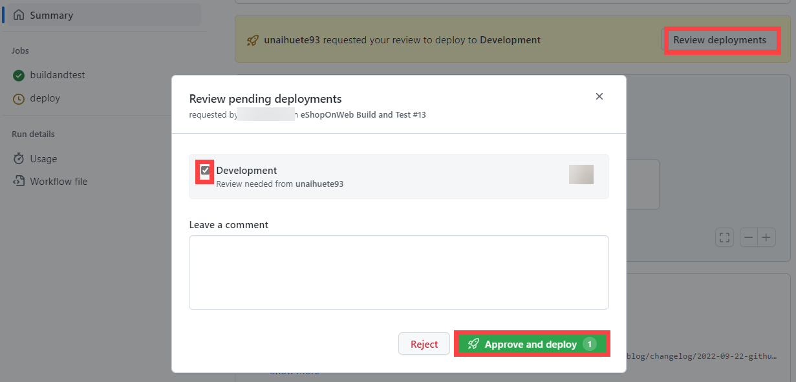

---
lab:
  title: Implementieren von GitHub Actions für CI/CD
  module: 'Module 02: Implement CI with Azure Pipelines and GitHub Actions'
---

# Implementieren von GitHub Actions für CI/CD

## Labanforderungen

- Für dieses Lab ist **Microsoft Edge** oder ein von [Azure DevOps unterstützter Browser](https://docs.microsoft.com/azure/devops/server/compatibility) erforderlich.

- Identifizieren Sie ein vorhandenes Azure-Abonnement, oder erstellen Sie ein neues Abonnement.

- Vergewissern Sie sich, dass Sie über ein Microsoft- oder ein Microsoft Entra-Konto mit der Rolle „Mitwirkender“ oder „Besitzer“ im Azure-Abonnement verfügen. Ausführliche Informationen finden Sie in den Artikeln zum [Auflisten von Azure-Rollenzuweisungen mithilfe des Azure-Portals](https://docs.microsoft.com/azure/role-based-access-control/role-assignments-list-portal) und [Anzeigen und Zuweisen von Administratorrollen in Azure Active Directory](https://docs.microsoft.com/azure/active-directory/roles/manage-roles-portal).

- **Wenn Sie noch keinen GitHub-Account** haben, den Sie für diese Übung verwenden können, folgen Sie den Anweisungen unter [Anmeldung für einen neuen GitHub-Account](https://github.com/join), um einen zu erstellen.

## Übersicht über das Labor

In dieser Übung lernen Sie, wie Sie einen GitHub Action-Workflow implementieren, der eine Azure-Web-App bereitstellt.

## Ziele

In diesem Lab lernen Sie Folgendes:

- Implementieren Sie einen GitHub Actions-Workflow für CI/CD.
- Erläutern der grundlegenden Merkmale von GitHub Actions-Workflows.

## Geschätzte Zeit: 40 Minuten

## Anweisungen

### Übung 1: Importieren Sie eShopOnWeb in Ihr GitHub-Repository

In dieser Übung importieren Sie den Code des bestehenden [eShopOnWeb](https://github.com/MicrosoftLearning/eShopOnWeb)-Repositorys in Ihr eigenes privates GitHub-Repository.

Das Repository ist wie folgt organisiert:
- Der Ordner **.ado** enthält Azure DevOps-YAML-Pipelines.
- Der Ordner **.devcontainer** enthält ein Containersetup für die Entwicklung mithilfe von Containern (entweder lokal in VS Code oder über GitHub Codespaces).
- Der Ordner **infra** enthält eine Bicep&ARM-Infrastruktur als Codevorlagen, die in einigen Labszenarien verwendet werden.
- Der Ordner **.github** enthält YAML GitHub-Workflow-Definitionen.
- Der Ordner **src** enthält die .NET 8-Website, die in den Labszenarien verwendet wird.

#### Aufgabe 1: Erstellen Sie ein öffentliches Repository in GitHub und importieren Sie eShopOnWeb

In dieser Aufgabe erstellen Sie ein leeres öffentliches GitHub-Repository und importieren das bestehende [eShopOnWeb](https://github.com/MicrosoftLearning/eShopOnWeb)-Repository.

1. Starten Sie vom Laborcomputer aus einen Web-Browser, navigieren Sie zur [GitHub-Website](https://github.com/), melden Sie sich mit Ihrem Konto an und klicken Sie auf **Neu**, um ein neues Repository zu erstellen.

    

1. Klicken Sie auf der Seite **Ein neues Repository erstellen** auf den Link **Repository importieren** (unterhalb des Seitentitels).

    > **Hinweis**: Sie können die Import-Website auch direkt aufrufen unter <https://github.com/new/import>

1. Auf der Seite **Importieren Sie Ihr Projekt auf GitHub**:

    | Feld | Wert |
    | --- | --- |
    | Die Klon-URL Ihres alten Repositorys| <https://github.com/MicrosoftLearning/eShopOnWeb> |
    | Besitzer | Ihr Konto-Alias |
    | Repositoryname | eShopOnWeb |
    | Datenschutz | **Public** |

1. Klicken Sie auf **Import starten** und warten Sie, bis Ihr Repository bereit ist.

1. Gehen Sie auf der Repository-Seite zu **Einstellungen**, klicken Sie auf **Aktionen > Allgemein** und wählen Sie die Option **Alle Aktionen und wiederverwendbare Workflows zulassen**. Klicken Sie auf **Speichern**.

    

### Übung 2: Einrichten des GitHub-Repositorys und des Azure-Zugangs

In dieser Übung erstellen Sie ein Azure-Dienstprinzipal, um GitHub-Zugriff auf Ihr Azure-Abonnement über GitHub Aktionen zu autorisieren. Sie werden auch den GitHub-Workflow einrichten, mit dem Sie Ihre Website erstellen, testen und auf Azure bereitstellen können.

#### Aufgabe 1: Erstellen eines Azure-Dienstprinzipals und Speichern als GitHub-Geheimnis

In dieser Aufgabe erstellen Sie den Azure-Dienstprinzipal, der von GitHub verwendet wird, um die gewünschten Ressourcen bereitzustellen. Alternativ können Sie auch [OpenID Connect in Azure](https://docs.github.com/actions/deployment/security-hardening-your-deployments/configuring-openid-connect-in-azure) als geheimnislosen Authentifizierungsmechanismus verwenden.

1. Öffnen Sie auf Ihrem Laborcomputer in einem Browserfenster das Azure-Portal (<https://portal.azure.com/>).
1. Suchen Sie im Portal nach **Ressourcengruppen** und klicken Sie darauf.
1. Klicken Sie auf **+ Erstellen**, um eine neue Ressourcengruppe für die Übung zu erstellen.
1. Geben Sie auf der Registerkarte **Erstellen einer Ressourcengruppe** der Ressourcengruppe **rg-eshoponweb-NAME** (Name für einen eindeutigen Alias ersetzen) den folgenden Namen. Klicken Sie auf **Überprüfen + Erstellen > Erstellen**.
1. Öffnen Sie im Azure-Portal die **Cloud Shell** (neben der Suchleiste).

    > **Hinweis**: Wenn Sie die Cloud Shell zum ersten Mal öffnen, müssen Sie den [beständigen Speicher](https://learn.microsoft.com/azure/cloud-shell/persisting-shell-storage) konfigurieren

1. Stellen Sie sicher, dass das Terminal im **Bash**-Modus läuft und führen Sie den folgenden Befehl aus, wobei Sie **SUBSCRIPTION-ID** und **RESOURCE-GROUP** durch Ihre eigenen Bezeichnungen ersetzen (beide finden Sie auf der **Übersicht**-Seite der Ressourcengruppe):

    `az ad sp create-for-rbac --name GH-Action-eshoponweb --role contributor --scopes /subscriptions/SUBSCRIPTION-ID/resourceGroups/RESOURCE-GROUP --sdk-auth`

    > **Hinweis**: Achten Sie darauf, dass dies in einer einzigen Zeile getippt oder eingefügt wird!

    > **Hinweis**: Mit diesem Befehl wird ein Dienstprinzipal mit Contributor-Zugriff auf die zuvor erstellte Ressourcengruppe erstellt. Auf diese Weise stellen wir sicher, dass GitHub-Aktionen nur die Berechtigungen haben, die für die Interaktion mit dieser Ressourcengruppe erforderlich sind (nicht für den Rest des Abonnements)

1. Der Befehl gibt ein JSON-Objekt aus, das Sie später als GitHub-Geheimnis für den Workflow verwenden werden. Kopieren Sie das JSON-Objekt. Das JSON-Objekt enthält die Identifikatoren, die zur Authentifizierung gegenüber Azure im Namen einer Microsoft Entra-Identität (Dienstprinzipal) verwendet werden.

    ```JSON
        {
            "clientId": "<GUID>",
            "clientSecret": "<GUID>",
            "subscriptionId": "<GUID>",
            "tenantId": "<GUID>",
            (...)
        }
    ```

1. (Überspringen, falls bereits registriert) Sie müssen auch den folgenden Befehl ausführen, um den Ressourcenanbieter für den **Azure App Service** zu registrieren, den Sie später bereitstellen werden:

   ```bash
   az provider register --namespace Microsoft.Web
   ```

1. Gehen Sie in einem Browserfenster zurück zu Ihrem **eShopOnWeb** GitHub-Repository.
1. Gehen Sie auf der Repository-Seite zu **Einstellungen**, klicken Sie auf **Geheimnisse und Variablen > Aktionen**. Klicken Sie auf **Neues Repository-Geheimnis**
    - Name : **AZURE_CREDENTIALS**
    - Geheimnis: **Fügen Sie das zuvor kopierte JSON-Objekt ein** (GitHub kann mehrere Geheimnisse unter demselben Namen speichern, die von der [azure/login](https://github.com/Azure/login) Aktion verwendet werden)

1. Klicken Sie auf **Geheimnis hinzufügen**. Jetzt können GitHub-Aktionen den Dienstprinzipal unter Verwendung des Repository-Geheimnisses referenzieren.

#### Aufgabe 2: Ändern und Ausführen des GitHub-Workflows

In dieser Aufgabe werden Sie den gegebenen GitHub-Workflow ändern und ihn ausführen, um die Lösung in Ihrem eigenen Abonnement bereitzustellen.

1. Gehen Sie in einem Browserfenster zurück zu Ihrem **eShopOnWeb** GitHub-Repository.
1. Gehen Sie auf der Repository-Seite zu **Code** und öffnen Sie die folgende Datei: **eShopOnWeb/.github/workflows/eshoponweb-cicd.yml**. Dieser Workflow definiert den CI/CD-Prozess für den angegebenen .NET 8-Websitecode.
1. Entfernen Sie den Kommentar im Abschnitt **on** (löschen Sie „#“). Der Workflow wird bei jedem Push in den Mainbranch ausgelöst und kann auch manuell ausgelöst werden („workflow_dispatch“).
1. Nehmen Sie im Abschnitt **env** die folgenden Änderungen vor:
    - Ersetzen Sie **NAME** in der Variablen **RESOURCE-GROUP**. Es sollte die gleiche Ressourcengruppe sein, die in den vorherigen Schritten erstellt wurde.
    - (Optional) Sie können Ihre nächstgelegene [Azure-Region](https://azure.microsoft.com/explore/global-infrastructure/geographies) für **LOCATION** auswählen. Zum Beispiel "Ost-USA", "Ostasien", "West-US", usw.
    - Ersetzen Sie **YOUR-SUBS-ID** in **SUBSCRIPTION-ID**.
    - Ersetzen Sie **NAME** in **WEBAPP-NAME** durch einen eindeutigen Alias. Es wird verwendet, um eine weltweit einzigartige Website mit Azure App Service zu erstellen.
1. Lesen Sie den Workflow sorgfältig durch, die Kommentare dienen dem besseren Verständnis.

1. Klicken Sie auf **Start Commit** und **Commit Changes** und belassen Sie die Standardeinstellungen (Änderung der Hauptverzweigung). Der Workflow wird automatisch ausgeführt.

#### Aufgabe 3: Überprüfen der Ausführung von GitHub-Workflows

In dieser Aufgabe überprüfen Sie die Ausführung des GitHub-Workflows:

1. Gehen Sie in einem Browserfenster zurück zu Ihrem **eShopOnWeb** GitHub-Repository.
1. Gehen Sie auf der Repository-Seite zu **Aktionen**, dort sehen Sie die Workflow-Einrichtung vor der Ausführung. Klicken Sie darauf.

    

1. Warten Sie, bis der Workflow abgeschlossen ist. In der **Zusammenfassung** sehen Sie die beiden Workflow-Jobs, den Status und die bei der Ausführung erhaltenen Artefakte. Sie können jeden Auftrag anklicken, um die Protokolle einzusehen.

    

1. Wechseln Sie in einem Browserfenster zurück zum Azure-Portal (<https://portal.azure.com/>). Öffnen Sie die zuvor erstellte Ressourcengruppe. Sie sehen, dass die GitHub-Aktion mithilfe einer Bicep-Vorlage einen Azure-App ServicePlan + App Service erstellt hat. Sie können die veröffentlichte Website sehen, indem Sie den App Service öffnen und auf **Durchsuchen** klicken.

    

#### (OPTIONAL) Aufgabe 4: Hinzufügen einer manuellen Genehmigung mithilfe von GitHub-Umgebungen vor der Bereitstellung

In dieser Aufgabe verwenden Sie GitHub-Umgebungen, um eine manuelle Genehmigung anzufordern, bevor Sie die für den Bereitstellungsauftrag ihres Workflows definierten Aktionen ausführen.

1. Gehen Sie auf der Repository-Seite zu **Code** und öffnen Sie die folgende Datei: **eShopOnWeb/.github/workflows/eshoponweb-cicd.yml**.
1. Im Auftragsabschnitt **Bereitstellen** finden Sie einen Verweis auf eine **Umgebung**, die als **Development** bezeichnet wird. Von GitHub verwendete [Umgebungen](https://docs.github.com/en/actions/deployment/targeting-different-environments/using-environments-for-deployment) fügen Schutzregeln (und Secrets) für Ihre Ziele hinzu.

1. Wechseln Sie auf der Repositoryseite zu **Einstellungen**, öffnen Sie **Umgebungen**, und klicken Sie auf **Neue Umgebung**.
1. Geben Sie ihr den Namen **Entwicklung** und klicken Sie auf **Umgebung konfigurieren**.

    > **Hinweis**: Wenn eine Umgebung namens **Entwicklung** bereits in der Liste **Umgebungen** vorhanden ist, öffnen Sie die Konfiguration, indem Sie auf den Umgebungsnamen klicken.  

1. Aktivieren Sie auf der Registerkarte **Entwicklung konfigurieren** die Option **Erforderliche Prüfer** und Ihr GitHub-Konto als Prüfer. Klicken Sie auf **Schutzregeln speichern**.
1. Jetzt können Sie die Schutzregel testen. Wechseln Sie auf der Repositoryseite zu **Aktionen**, klicken Sie auf den Workflow **eShopOnWeb erstellen und testen** und klicken Sie auf **Workflow ausführen > Workflow ausführen**, um ihn manuell auszuführen.

    

1. Klicken Sie auf die gestartete Ausführung des Workflows und warten Sie, bis der **Buildandtest**-Auftrag abgeschlossen ist. Beim Erreichen des **Bereitstellungsauftrags** wird eine Überprüfungsanforderung angezeigt.

1. Klicken Sie auf **Bereitstellungen überprüfen**, überprüfen Sie die **Entwicklung** und klicken Sie auf **Genehmigen und Bereitstellen**.

    

1. Workflow folgt der Ausführung des **Bereitstellungsauftrags** und wird abgeschlossen.

> [!IMPORTANT]
> Denken Sie daran, die im Azure-Portal erstellten Ressourcen zu löschen, um unnötige Gebühren zu vermeiden.

## Überprüfung

In diesem Lab haben Sie einen GitHub Action-Workflow implementiert, der eine Azure-Web-App bereitstellt.
