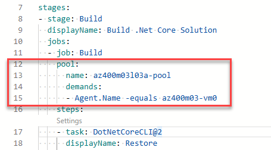

---
lab:
  title: Konfigurieren von Agentenpools und Verstehen von Pipelinestilen
  module: 'Module 03: Implement CI with Azure Pipelines and GitHub Actions'
---

# Konfigurieren von Agentenpools und Verstehen von Pipelinestilen

## Lab-Handbuch für Kursteilnehmer

## Labanforderungen

- Für dieses Lab ist **Microsoft Edge** oder ein von [Azure DevOps unterstützter Browser](https://docs.microsoft.com/azure/devops/server/compatibility) erforderlich.

- **Einrichten einer Azure DevOps-Organisation**: Wenn Sie nicht bereits eine Azure DevOps-Organisation haben, die Sie für dieses Lab verwenden können, müssen Sie diese erstellen, indem Sie die unter [Erstellen einer Organisation oder Projektsammlung](https://docs.microsoft.com/azure/devops/organizations/accounts/create-organization) beschriebenen Anweisungen befolgen.

- [Git for Windows](https://gitforwindows.org/): Downloadseite. Diese wird als Teil der Voraussetzungen für diese Übung installiert.

- [Visual Studio Code](https://code.visualstudio.com/). Diese wird als Teil der Voraussetzungen für diese Übung installiert.

## Übersicht über das Labor

YAML-basierte Pipelines bieten Ihnen die Möglichkeit, CI/CD vollständig als Code zu implementieren. Dabei befinden sich die Pipelinedefinitionen im selben Repository wie der Code, der Bestandteil Ihres Azure DevOps-Projekts ist. YAML-basierte Pipelines unterstützen eine Vielzahl von Features, die auch zu klassischen Pipelines gehören, z. B. Pull Requests, Codeüberprüfungen, Verlauf, Verzweigungen und Vorlagen.

Ungeachtet der ausgewählten Pipelineart benötigen Sie einen Agent, um Ihren Code zu erstellen oder Ihre Lösung mithilfe von Azure Pipelines bereitzustellen. Ein Agent hostet Computeressourcen, die jeweils einen Auftrag ausführen. Aufträge können direkt auf dem Hostcomputer des Agents oder in einem Container ausgeführt werden. Sie haben die Möglichkeit, Ihre Aufträge mit von Microsoft gehosteten und verwalteten Agents auszuführen oder einen selbst gehosteten Agent zu implementieren, den Sie selbst einrichten und verwalten.

In diesem Lab erfahren Sie, wie Sie selbstgehostete Agents mit YAML-Pipelines implementieren und verwenden.

## Ziele

In diesem Lab lernen Sie Folgendes:

- Implementieren YAML-basierter Pipelines.
- Implementieren selbstgehosteter Agents.

## Geschätzte Dauer: 45 Minuten

## Anweisungen

### Übung 0: Konfigurieren der Voraussetzungen für das Lab

In dieser Übung richten Sie die Voraussetzungen für das Lab ein, das aus einem neuen Azure DevOps-Projekt mit einem Repository basierend auf dem [eShopOnWeb](https://github.com/MicrosoftLearning/eShopOnWeb) besteht.

#### Aufgabe 1: (überspringen, wenn fertig) Erstellen und Konfigurieren des Teamprojekts

In dieser Aufgabe erstellen Sie ein **eShopOnWeb** Azure DevOps-Projekt, das von mehreren Labs verwendet werden soll.

1. Öffnen Sie auf Ihrem Lab-Computer in einem Browserfenster Ihre Azure DevOps-Organisation. Klicken Sie auf **Neues Projekt**. Weisen Sie Ihrem Projekt den Namen **eShopOnWeb** zu, und lassen Sie die anderen Felder auf den Standardwerten. Klicken Sie auf **Erstellen**.

#### Aufgabe 2: (überspringen, wenn erledigt) Importieren von eShopOnWeb Git Repository

Bei dieser Aufgabe importieren Sie das eShopOnWeb Git-Repository, das von mehreren Labs verwendet wird.

1. Öffnen Sie auf Ihrem Lab-Computer in einem Browserfenster Ihre Azure DevOps-Organisation und das zuvor erstellte **eShopOnWeb**-Projekt. Klicken Sie auf **Repos>Dateien**, **Repository importieren**. Klicken Sie auf **Importieren**. Fügen Sie im Fenster **Git Repository importieren** die folgende URL <https://github.com/MicrosoftLearning/eShopOnWeb.git> ein, und klicken Sie auf **Importieren**:

1. Das Repository ist wie folgt organisiert:
    - Der Ordner **.ado** enthält Azure DevOps-YAML-Pipelines.
    - Der Ordner **.devcontainer** enthält ein Containersetup für die Entwicklung mithilfe von Containern (entweder lokal in VS Code oder über GitHub Codespaces).
    - Der Ordner **infra** enthält die Bicep & ARM-Infrastruktur als Codevorlagen, die in einigen Labszenarien verwendet werden.
    - Der Ordner **.github** enthält YAML-GitHub-Workflowdefinitionen.
    - Der Ordner **src** enthält die .NET 8-Website, die in den Labszenarien verwendet wird.

### Übung 1: Erstellen von YAML-basierten Azure Pipelines.

In dieser Übung erstellen Sie eine Application Lifecycle Build Pipeline unter Verwendung einer YAML-basierten Vorlage.

#### Aufgabe 1: Erstellen einer Azure DevOps YAML-Pipeline

In dieser Aufgabe werden Sie eine vorlagenbasierte Azure DevOps YAML-Pipeline erstellen.

1. Klicken Sie im Webbrowser, in dem das Azure DevOps-Portal mit dem geöffneten Projekt **eShopOnWeb** angezeigt wird, im vertikalen Navigationsbereich auf der linken Seite auf **Pipelines**.
1. Klicken Sie auf die Schaltfläche **Pipeline erstellen** – wenn Sie noch keine anderen Pipelines erstellt haben – oder auf **Neue Pipeline**, um eine weitere neue Pipeline zu erstellen.

1. Klicken Sie im Bereich **Wo befindet sich Ihr Code?** auf **Azure Repos Git**.
1. Klicken Sie im Bereich **Ein Repository auswählen** auf **eShopOnWeb**.
1. Klicken Sie im Bereich **Konfigurieren Sie Ihre Pipeline** auf **Existierende Azure Pipelines YAML-Datei**.
1. Auf **Wählen Sie eine vorhandene YAML-Datei**, wählen Sie **main** für die Verzweigung und **/.ado/eshoponweb-ci-pr.yml** für den Pfad.
1. Klicken Sie auf **Weiter**.
1. Überprüfen Sie im Bereich **Überprüfen Sie Ihre Pipeline-YAML** die Beispielpipeline. Dies ist eine recht einfache .NET-Anwendungs-Build-Pipeline, die folgenden Aktionen ausführt:

   - Eine einzelne Phase: Build
   - Ein einzelner Auftrag: Build
   - 3 Aufgaben innerhalb des Buildauftrags:
   - Dotnet Restore
   - Dotnet Build
   - Dotnet Publish

1. Klicken Sie im Bereich **Überprüfen Sie Ihre Pipeline-YAML** auf das nach unten zeigende Caret-Symbol neben der Schaltfläche **Ausführen** und dann auf **Speichern**.

    > Hinweis: Wir erstellen jetzt nur die Pipelinedefinition, ohne sie auszuführen. Sie richten zunächst einen Azure DevOps-Agentpool ein und führen die Pipeline in einer späteren Übung aus. 

### Übung 2: Verwalten von Azure DevOps-Agentpools.

In dieser Übung implementieren Sie einen selbst gehosteten Azure DevOps-Agent.

#### Aufgabe 1: Konfigurieren Sie einen selbst gehosteten Azure DevOps-Agent.

In dieser Aufgabe konfigurieren Sie Ihre virtuelle Maschine im Labor als Azure DevOps-Self-Hosting-Agent und verwenden sie zur Ausführung einer Build-Pipeline.

1. Starten Sie in der Lab Virtual Machine (Lab VM) oder auf Ihrem eigenen Computer einen Webbrowser, navigieren Sie zum [Azure DevOps-Portal](https://dev.azure.com) und melden Sie sich mit dem Microsoft-Konto an, das mit Ihrer Azure DevOps-Organisation verbunden ist.

  > **Hinweis**: Der virtuelle Lab-Computer sollte alle erforderlichen Softwarevoraussetzungen installiert haben. Wenn Sie die Installation auf Ihrem eigenen Computer durchführen, müssen Sie .NET 8.0.x-SDKs oder höher installieren, die zum Erstellen des Demoprojekts erforderlich sind. Siehe [Download .NET](https://dotnet.microsoft.com/download/dotnet).

1. Klicken Sie im Azure DevOps-Portal in der oberen rechten Ecke der Azure DevOps-Seite auf das Symbol **Benutzereinstellungen**. Je nachdem, ob Sie die Vorschaufunktionen aktiviert haben oder nicht, sollten Sie entweder ein Element **Sicherheit** oder **Persönliche Zugriffstoken** im Menü sehen. Wenn Sie **Sicherheit** sehen, klicken Sie darauf und wählen Sie dann **Persönliche Zugriffstoken**. Klicken Sie im Bereich **Personal Access Tokens** auf **+ New Token**.
1. Klicken Sie im Bereich **Neues persönlichen Zugriffstoken erstellen** auf den Link **Alle Bereiche anzeigen** und geben Sie die folgenden Einstellungen an. Klicken Sie dann auf **Erstellen** (bei alle anderen Standardwerte lassen):

    | Einstellung | Wert |
    | --- | --- |
    | Name | **eShopOnWeb** |
    | Anwendungsbereich (benutzerdefiniert) | **Agent Pools** (Option „Weitere Bereiche anzeigen“ unten, falls erforderlich)|
    | Berechtigungen | **Lesen und Verwalten** |

1. Kopieren Sie im Bereich **Erfolg** den Wert des persönlichen Zugriffstokens in die Zwischenablage.

    > **Anmerkung**: Stellen Sie sicher, dass Sie das Token kopieren. Sie können ihn nicht mehr abrufen, nachdem Sie diesen Bereich geschlossen haben.

1. Klicken Sie im Bereich **Erfolg** auf **Schließen**.
1. Klicken Sie im Bereich **Personal Access Token** des Azure DevOps-Portals auf das Symbol **Azure DevOps** in der oberen linken Ecke und dann auf das Label **Organization settings** in der unteren linken Ecke.
1. Klicken Sie auf der linken Seite des Bereichs **Übersicht** im vertikalen Menü im Abschnitt **Pipelines** auf **Agent-Pools**.
1. Klicken Sie im Bereich **Agent-Pools** in der oberen rechten Ecke auf **Pool hinzufügen**.
1. Wählen Sie im Bereich **Agentenpool hinzufügen** in der Dropdown-Liste **Pooltyp** die Option **Selbst gehostet**, geben Sie in das Textfeld **Name** den Wert **az400m03l03a-pool** ein und klicken Sie auf **Erstellen**.
1. Klicken Sie im Bereich **Agentenpools** auf den Eintrag für den neu erstellten **az400m03l03a-pool**.
1. Klicken Sie auf der Registerkarte **Jobs** des Fensters **az400m03l03a-pool** auf die Schaltfläche **Neuer Agent**.
1. Vergewissern Sie sich im Bereich **Abrufen des Agenten**, dass die Registerkarten **Windows** und **x64** ausgewählt sind, und klicken Sie auf **Herunterladen**, um das Zip-Archiv mit den Agent-Binärdateien in den lokalen Ordner **Downloads** in Ihrem Benutzerprofil herunterzuladen.

    > **Hinweis**: Wenn Sie an dieser Stelle eine Fehlermeldung erhalten, die Sie darauf hinweist, dass die aktuellen Systemeinstellungen das Herunterladen der Datei verhindern, klicken Sie im Browser-Fenster in der oberen rechten Ecke auf das Zahnradsymbol, das die Kopfzeile des Menüs **Einstellungen** bezeichnet. Im Dropdown-Menü, wählen Sie **Internetoptionen** aus, klicken Sie im Dialogfeld **Internetoptionen** auf **Erweitert**, auf der Registerkarte **Erweitert** auf **Zurücksetzen**, im Dialogfeld **Browser-Einstellungen zurücksetzen** erneut auf **Zurücksetzen**, klicken Sie auf **Schließen**, und versuchen Sie den Download erneut.

1. Starten Sie Windows PowerShell als Administrator*in und führen Sie in der **Administrator: Windows PowerShell**-Konsole die folgenden Zeilen aus, um das Verzeichnis **C:\\agent** zu erstellen und den Inhalt des heruntergeladenen Archivs in dieses zu extrahieren.

    ```powershell
    cd \
    mkdir agent ; cd agent
    $TARGET = Get-ChildItem "$Home\Downloads\vsts-agent-win-x64-*.zip"
    Add-Type -AssemblyName System.IO.Compression.FileSystem
    [System.IO.Compression.ZipFile]::ExtractToDirectory($TARGET, "$PWD")
    ```

1. Führen Sie in der gleichen Konsole**Administrator: Windows PowerShell** Folgendes aus, um den Agenten zu konfigurieren:

    ```powershell
    .\config.cmd
    ```

1. Wenn Sie dazu aufgefordert werden, geben Sie die Werte der folgenden Einstellungen an:

    | Einstellung | Wert |
    | ------- | ----- |
    | Server-URL eingeben | die URL Ihrer Azure DevOps-Organisation im Format **<https://dev.azure.com/>`<organization_name>`**, wobei `<organization_name>` den Namen Ihrer Azure DevOps-Organisation darstellt |
    | Authentifizierungsart eingeben (für PAT die Eingabetaste drücken) | **EINGABETASTE** |
    | Persönliches Zugriffstoken eingeben | Das Zugriffstoken, das Sie zuvor in dieser Aufgabe aufgezeichnet haben |
    | Geben Sie den Agent-Pool ein (drücken Sie die Eingabetaste für die Standardeinstellung) | **az400m03l03a-pool** |
    | Name des Agent eingeben | **az400m03-vm0** |
    | Arbeitsordner eingeben (für _work die Eingabetaste drücken) | **EINGABETASTE** |
    | **(Nur wenn angezeigt)** Führen Sie für jede Aufgabe eines Schritts das Entpacken durch. (drücken Sie die Eingabetaste für N) | **WARNUNG**: nur **Eingabe** drücken, wenn die Meldung angezeigt wird|
    | Agent als Dienst ausführen? (J/N) (drücken Sie die Eingabetaste für N) | **Y** |
    | Eingeben der Aktivierung von SERVICE_SID_TYPE_UNRESTRICTED (J/N) (drücken Sie die Eingabetaste für N) | **Y** |
    | Geben Sie das für den Dienst zu verwendende Benutzerkonto ein (drücken Sie die Eingabetaste für NT AUTHORITY\NETWORK SERVICE) | **EINGABETASTE** |
    | Geben Sie an, ob der Dienst nicht sofort nach Abschluss der Konfiguration gestartet werden soll. (J/N) (drücken Sie die Eingabetaste für N) | **EINGABETASTE** |

    > **Hinweis**: Sie können den selbstgehosteten Agent entweder als Dienst oder als interaktiven Prozess ausführen. Sie sollten mit dem interaktiven Modus beginnen, da dies die Überprüfung der Agent-Funktionalität vereinfacht. Für den produktiven Einsatz sollten Sie in Erwägung ziehen, den Agent entweder als Dienst oder als interaktiven Prozess mit aktivierter automatischer Anmeldung laufen zu lassen, da in beiden Fällen der Status des Agent erhalten bleibt und sichergestellt wird, dass der Agent bei einem Neustart des Betriebssystems automatisch startet.

1. Wechseln Sie zu dem Browserfenster, in dem das Azure DevOps-Portal angezeigt wird, und schließen Sie das Fenster **Agent abrufen**.
1. Zurück auf der Registerkarte **Agents** des Fensterbereichs **az400m03l03a-pool** stellen Sie fest, dass der neu konfigurierte Agent mit dem Status **Online** aufgeführt ist.
1. Klicken Sie in dem Webbrowser-Fenster, in dem das Azure DevOps-Portal angezeigt wird, in der oberen linken Ecke auf die Bezeichnung **Azure DevOps**.
1. Klicken Sie in der Liste der Projekte auf die Kachel, die Ihr Projekt **EShopOnWeb** darstellt.
1. Klicken Sie im Bereich **eShopOnWeb** im vertikalen Navigationsbereich auf der linken Seite im Abschnitt **Pipelines** auf **Pipelines**.
1. Wählen Sie auf der Registerkarte **Zuletzt verwendet** im Bereich **Pipelines** den Eintrag **eShopOnWeb** aus, und wählen Sie im Bereich **eShopOnWeb** die Option **Bearbeiten** aus.
1. Ersetzen Sie im Bearbeitungsbereich **eShopOnWeb** in der vorhandenen YAML-basierten Pipeline Zeile 13, die Folgendes besagt: `vmImage: windows-latest` Angabe des Ziel-Agentpools mit dem folgenden Inhalt, Angabe des neu erstellten selbst gehosteten Agentpools:

    ```yaml
    name: az400m03l03a-pool
    demands:
    - Agent.Name -equals az400m03-vm0
    ```

    > **WARNUNG**: Seien Sie vorsichtig beim Kopieren/Einfügen, stellen Sie sicher, dass Sie die gleiche Einrückung wie oben gezeigt haben.

    

1. Klicken Sie im Bearbeitungsbereich **EShopOnWeb** in der oberen rechten Ecke auf **Speichern und Ausführen**. Dadurch wird der Build automatisch auf der Grundlage dieser Pipeline ausgelöst.
1. Klicken Sie im Azure DevOps-Portal im vertikalen Navigationsbereich auf der linken Seite im Abschnitt **Pipelines** auf **Pipelines**. Je nach Ihrem Lab-Setup werden Sie möglicherweise von der Pipeline zur Eingabe von Berechtigungen aufgefordert. Klicken Sie auf **Zulassen**, um die Ausführung der Pipeline zuzulassen. 
1. Klicken Sie auf der Registerkarte **Zuletzt verwendet** des Bereichs **Pipelines** auf den Eintrag **eShopOnWeb**. Wählen Sie auf der Registerkarte **Ausführungen** im Bereich **eShopOnWeb** die letzte Ausführung aus. Scrollen Sie im Bereich **Zusammenfassung** der Ausführung nach unten. Klicken Sie im Abschnitt **Aufträge** auf **Phase 1**, und überwachen Sie den Auftrag bis zum erfolgreichen Abschluss.

### Übung 3: Entfernen der im Lab verwendeten Ressourcen

1. Stoppen und entfernen Sie den Agent-Dienst, indem Sie `.\config.cmd remove` über die Eingabeaufforderung ausführen.
1. Löschen Sie den Agent-Pool.
1. Widerrufen Sie das PAT-Token.
1. Machen Sie die Änderungen in der Datei **eshoponweb-ci-pr.yml** rückgängig, indem Sie von „Repos/.ado/eshoponweb-ci-pr.yml“ zu ihr navigieren, **Bearbeiten** auswählen und die Zeilen 13-15 (den Agentpoolausschnitt) entfernen und die `vmImage: windows-latest` wieder in den ursprünglichen Zustand zurück ändern. (Dies liegt daran, dass Sie dieselbe Beispielpipelinedatei in einer zukünftigen Labübung verwenden werden.)


## Überprüfung

In dieser Übung haben Sie gelernt, wie Sie selbst gehostete Agents mit YAML-Pipelines implementieren und nutzen können.
