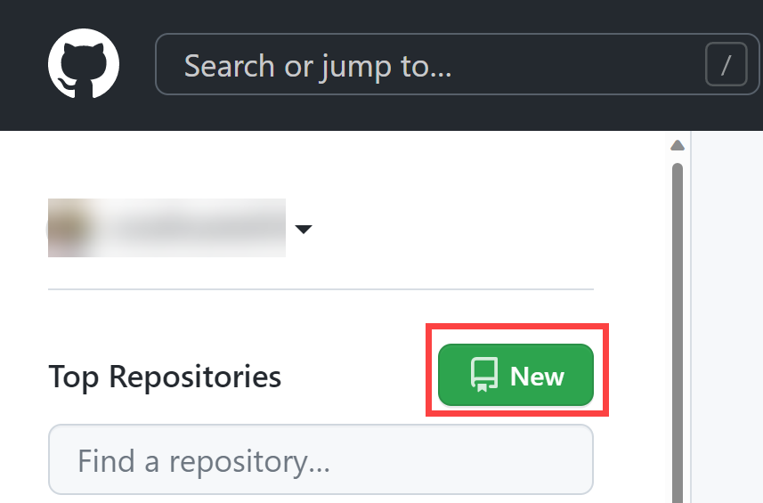

---
lab:
  title: Implementieren von GitHub Actions für CI/CD
  module: 'Module 03: Implement CI with Azure Pipelines and GitHub Actions'
---

# Implementieren von GitHub Actions für CI/CD

## Lab-Handbuch für Kursteilnehmer

## Labanforderungen

- Für dieses Lab ist **Microsoft Edge** oder ein [von Azure DevOps unterstützter Browser](https://docs.microsoft.com/azure/devops/server/compatibility) erforderlich.

- Identifizieren Sie ein vorhandenes Azure-Abonnement, oder erstellen Sie ein neues Abonnement.

- Vergewissern Sie sich, dass Sie über ein Microsoft- oder ein Microsoft Entra-Konto mit der Rolle „Mitwirkender“ oder „Besitzer“ im Azure-Abonnement verfügen. Ausführliche Informationen finden Sie in den Artikeln zum [Auflisten von Azure-Rollenzuweisungen mithilfe des Azure-Portals](https://docs.microsoft.com/azure/role-based-access-control/role-assignments-list-portal) und [Anzeigen und Zuweisen von Administratorrollen in Azure Active Directory](https://docs.microsoft.com/azure/active-directory/roles/manage-roles-portal).

- Wenn Sie noch kein GitHub-Konto besitzen, das Sie für dieses Lab verwenden können, befolgen Sie die Anweisungen unter Registrieren für ein neues GitHub-Konto, um ein Konto zu erstellen.

## Übersicht über das Labor

In diesem Lab erfahren Sie, wie Sie einen GitHub Actions-Workflow implementieren, der eine Azure-Web-App bereitstellt.

## Ziele

In diesem Lab lernen Sie Folgendes:

- Implementieren Sie einen GitHub Actions-Workflow für CI/CD.
- Erläutern der grundlegenden Merkmale von GitHub Actions-Workflows.

## Geschätzte Zeit: 40 Minuten

## Anweisungen

### Übung 0: Importieren von eShopOnWeb in Ihr GitHub-Repository

In dieser Übung importieren Sie den vorhandenen [eShopOnWeb-Repositorycode](https://github.com/MicrosoftLearning/eShopOnWeb) in Ihr eigenes privates GitHub-Repository.

Das Repository ist wie folgt organisiert:
    - Der Ordner „.ado“ enthält Azure DevOps-YAML-Pipelines.
    - Der Ordner „.devcontainer“ enthält ein Containersetup für die Entwicklung mithilfe von Containern (entweder lokal in VS Code oder über GitHub Codespaces).
    - **Azure-Ordner** enthält Bicep&ARM-Infrastruktur als Codevorlagen, die in einigen Lab-Szenarien verwendet werden.
    - **GITHUB-Ordnercontainer-YAML-GitHub-Workflowdefinitionen** .
    - Der Ordner „src“ enthält die .NET 6-Website, die in den Labszenarien verwendet wird.

#### Aufgabe 1: Erstellen einer öffentliches Repository in GitHub und Importieren von eShopOnWeb

In dieser Aufgabe erstellen Sie ein leeres öffentliches GitHub-Repository und importieren das vorhandene [eShopOnWeb-Repository](https://github.com/MicrosoftLearning/eShopOnWeb) .

1. Starten Sie auf dem Laborcomputer einen Webbrowser, navigieren Sie zur [GitHub-Website](https://github.com/), melden Sie sich mit Ihrem Konto an, und klicken Sie auf **"Neu** ", um ein neues Repository zu erstellen.

    

2. Klicken Sie auf der Seite „Repository importieren“ auf den Link „Repository importieren“ (unter dem Seitentitel).

    > HINWEIS: Sie können die Importwebsite auch direkt unter https://github.com/new/import

3. Wie Sie Ihr Projekt in GitHub importieren

    | Feld | Wert |
    | --- | --- |
    | Your old repository's clone URL| https://github.com/MicrosoftLearning/eShopOnWeb |
    | Besitzer | az account alias |
    | Repositoryname | eShopOnWeb |
    | Datenschutz | **Public** |

4. Klicken Sie auf „Importieren“, und warten Sie, bis Ihr Repository bereit ist.

5. Wechseln Sie auf der Repositoryseite zu **Einstellungen**, klicken Sie auf **"Aktionen" > "Allgemein**", und wählen Sie die Option "**Alle Aktionen und wiederverwendbaren Workflows** zulassen" aus. Klicken Sie auf **Speichern**.

    

### Übung 1: Einrichten Ihres GitHub-Repositorys und des Azure-Zugriffs

In dieser Übung erstellen Sie einen Azure-Dienstprinzipal, um GitHub-Zugriff auf Ihr Azure-Abonnement über GitHub Actions zu autorisieren. Außerdem richten Sie den GitHub-Workflow ein, der Ihre Website in Azure erstellt, testt und bereitstellt.

#### Aufgabe 1: Erstellen eines Azure-Dienstprinzipals und Speichern als GitHub-Geheimnis

In dieser Aufgabe erstellen Sie den Azure-Dienstprinzipal, der von GitHub verwendet wird, um die gewünschten Ressourcen bereitzustellen. Alternativ können Sie auch OpenID Connect in Azure[ als geheimen Authentifizierungsmechanismus verwenden](https://docs.github.com/actions/deployment/security-hardening-your-deployments/configuring-openid-connect-in-azure).

1. Öffnen Sie auf Ihrem Mac das Azure-Portal in einem Browserfenster.
2. Suchen Sie im Portal nach **Ressourcengruppen** , und klicken Sie darauf.
3. Klicken Sie auf **+Erstellen** , um eine neue Ressourcengruppe für die Übung zu erstellen.
4. Geben Sie auf der **Registerkarte "Ressourcengruppe** erstellen" ihrer Ressourcengruppe den folgenden Namen: **rg-az400-eshoponweb-NAME** (name für einen eindeutigen Alias ersetzen). Klicken Sie auf **Überprüfen + erstellen**.
5. Öffnen Sie die Cloud Shell-Befehlszeile über das Symbol  in der Symbolleiste des Azure-Portals.

    > HINWEIS: Wenn Sie die Cloud Shell zum ersten Mal öffnen, müssen Sie den [beständigen Speicher konfigurieren.](https://learn.microsoft.com/azure/cloud-shell/persisting-shell-storage)

6. Stellen Sie sicher, dass das Terminal im **Bash-Modus** ausgeführt wird, und führen Sie den folgenden Befehl aus, und ersetzen **Sie SUBSCRIPTION-ID** und **RESOURCE-GROUP** durch Ihre eigenen Bezeichner (beide finden Sie auf der **Seite "Übersicht"** der Ressourcengruppe):

    `az ad sp create-for-rbac --name GH-Action-eshoponweb --role contributor --scopes /subscriptions/SUBSCRIPTION-ID/resourceGroups/RESOURCE-GROUP --sdk-auth`

    > HINWEIS: Stellen Sie sicher, dass dies als einzelne Zeile eingegeben oder eingefügt wird!
    > HINWEIS: Mit diesem Befehl wird ein Dienstprinzipal mit Mitwirkenderzugriff auf die zuvor erstellte Ressourcengruppe erstellt. Auf diese Weise stellen wir sicher, dass GitHub-Aktionen nur über die erforderlichen Berechtigungen verfügen, um nur mit dieser Ressourcengruppe zu interagieren (nicht mit dem Rest des Abonnements)

7. Der Befehl gibt ein JSON-Objekt aus, Sie verwenden es später als GitHub-Geheimnis für den Workflow. Kopieren Sie den JSON-Code. Der JSON-Code enthält die Bezeichner, die für die Authentifizierung bei Azure im Namen einer Microsoft Entra-Identität (Dienstprinzipal) verwendet werden.

    ```JSON
        {
            "clientId": "<GUID>",
            "clientSecret": "<GUID>",
            "subscriptionId": "<GUID>",
            "tenantId": "<GUID>",
            (...)
        }
    ```
8. Sie müssen auch den folgenden Befehl ausführen, um den Ressourcenanbieter für den Azure-App Dienst** zu registrieren, den **Sie später bereitstellen werden:
   ```bash
   az provider register --namespace Microsoft.Web
   ``` 
10. Wechseln Sie in einem Browserfenster zurück zu Ihrem **eShopOnWeb** GitHub-Repository.
11. Wechseln Sie auf der Repositoryseite zu **Einstellungen**, klicken Sie auf **Geheime Schlüssel und Variablen > Aktionen**. Klicke auf **Neues Repositorygeheimnis**.
    - AZURE_CREDENTIALS
    - Geheim: **Fügen Sie das zuvor kopierte JSON-Objekt** ein (GitHub kann mehrere geheime Schlüssel unter demselben Namen beibehalten, die von  [azure/login-Aktion](https://github.com/Azure/login) verwendet werden)

12. Klicke auf **Geheimnis hinzufügen**. Jetzt können GitHub-Aktionen mithilfe des geheimen Repositoryschlüssels auf den Dienstprinzipal verweisen.

#### Aufgabe 2: Ändern und Ausführen des GitHub-Workflows

In dieser Aufgabe ändern Sie den angegebenen GitHub-Workflow und führen ihn aus, um die Lösung in Ihrem eigenen Abonnement bereitzustellen.

1. Wechseln Sie in einem Browserfenster zurück zu Ihrem **eShopOnWeb** GitHub-Repository.
2. Wechseln Sie auf der Repositoryseite zu **Code** , und öffnen Sie die folgende Datei: **eShopOnWeb/.github/workflows/eshoponweb-cicd.yml**. Dieser Workflow definiert den CI/CD-Prozess für den angegebenen .NET 7-Websitecode.
3. Heben Sie die Kommentarkommentierung des **** Abschnitts auf (löschen Sie "#"). Der Workflow löst mit jedem Push an den Standard Branch aus und bietet auch manuelles Auslösen ("workflow_dispatch").
4. Nehmen Sie im Abschnitt  die folgenden Änderungen vor:
    - Ersetzen Sie **NAME** in **DER VARIABLEN RESOURCE-GROUP** . Es sollte die Ressourcengruppe eingetragen sein, die Sie bei einem vorherigen Test erstellt haben.
    - (Optional) Sie können Ihre nächstgelegene [Azure-Region](https://azure.microsoft.com/explore/global-infrastructure/geographies) für **STANDORT** auswählen. Beispielsweise Europa, Westen, Asien, Osten oder USA, Osten
    - Ersetzen Sie subscription-id durch Ihre Abonnement-ID.
    - Ersetzen Sie **NAME** in **WEBAPP-NAME** durch einen eindeutigen Alias. Es wird verwendet, um eine global eindeutige Website mit Azure-App Service zu erstellen.
5. Lesen Sie den Workflow sorgfältig, Kommentare werden bereitgestellt, um dies zu verstehen.

6. Klicken Sie auf **'Commit starten**', und **übernehmen** Sie änderungen, und übernehmen Sie die Standardeinstellungen (ändern sie den Standard Branch). Der Workflow wird automatisch ausgeführt.

#### Aufgabe 3: Überprüfen der Ausführung von GitHub-Workflows

In dieser Aufgabe überprüfen Sie die Ausführung des GitHub-Workflows:

1. Wechseln Sie in einem Browserfenster zurück zu Ihrem **eShopOnWeb** GitHub-Repository.
2. Wechseln Sie auf der Repositoryseite zu **"Aktionen**", bevor Sie das Workflowsetup ausführen. Klicken Sie darauf.

    

3. Warten Sie, bis die Workflowausführung abgeschlossen ist. In der **Zusammenfassung** können Sie die beiden Workflowaufträge sehen, der Status und Artefakte, die von der Ausführung erhalten bleiben. Sie können auf jeden Auftrag klicken, um Protokolle zu überprüfen.

    

4. Kehren Sie in einem separaten Fenster zum Azure-Portal zurück. Öffnen Sie die zuvor erstellte Ressourcengruppe. Sie sehen, dass die GitHub-Aktion mithilfe einer Bicep-Vorlage einen Azure-App ServicePlan + App Service erstellt hat. Sie können die veröffentlichte Website sehen, die den App-Dienst öffnet und auf "Durchsuchen"** klickt**.

    

#### (OPTIONAL) Aufgabe 4: Hinzufügen einer manuellen Genehmigung vor der Bereitstellung mithilfe von GitHub-Umgebungen

In dieser Aufgabe verwenden Sie GitHub-Umgebungen, um eine manuelle Genehmigung zu bitten, bevor Sie die für den Bereitstellungsauftrag ihres Workflows definierten Aktionen ausführen.

1. Wechseln Sie auf der Repositoryseite zu **Code** , und öffnen Sie die folgende Datei: **eShopOnWeb/.github/workflows/eshoponweb-cicd.yml**.
2. **Im Abschnitt "Bereitstellen von** Auftrag" finden Sie einen Verweis auf eine **Umgebung** namens **"Entwicklung"**. Von GitHub verwendete [Umgebungen](https://docs.github.com/en/actions/deployment/targeting-different-environments/using-environments-for-deployment) fügen Schutzregeln (und geheime Schlüssel) für Ihre Ziele hinzu.

3. Wechseln Sie auf der Repositoryseite zu **Einstellungen**, öffnen Sie **"Umgebungen**", und klicken Sie auf "**Neue Umgebung"**.
4. Geben Sie ihr **den Namen der Entwicklung** , und klicken Sie auf " **Umgebung** konfigurieren".

    > HINWEIS: Wenn eine Umgebung namens **"Entwicklung** " bereits in der **Liste "Umgebungen** " vorhanden ist, öffnen Sie die Konfiguration, indem Sie auf den Umgebungsnamen klicken.  
    
5. Aktivieren Sie auf der **Registerkarte "Entwicklung** konfigurieren" die Option " **Erforderliche Prüfer"** und Ihr GitHub-Konto als Prüfer. Klicke auf **Schutzregeln speichern**.
6. Jetzt können Sie die Schutzregel testen. Wechseln Sie auf der Repositoryseite zu **"Aktionen**", klicken Sie auf **"eShopOnWeb Build" und "Testworkflow****", und klicken Sie auf "** Workflow ausführen"> Workflow ausführen, um manuell auszuführen.

    

7. Klicken Sie auf die gestartete Ausführung des Workflows, und warten Sie, bis **der Buildandtest-Auftrag** abgeschlossen ist. Beim Erreichen des Bereitstellungsauftrags** wird eine Überprüfungsanforderung **angezeigt.

8. Klicken Sie auf "Bereitstellungen** überprüfen", überprüfen Sie **die Entwicklung**, und klicken Sie auf **"Genehmigen und Bereitstellen"**.**

    

9. Workflow folgt der **Ausführung des Bereitstellungsauftrags** und endet.

### Übung 2: Entfernen der Azure-Lab-Ressourcen.

In dieser Übung verwenden Sie Azure Cloud Shell, um die in dieser Übung bereitgestellten Azure-Ressourcen zu entfernen, um unnötige Gebühren zu beseitigen.

1. Öffnen Sie im Azure-Portal im **Cloud Shell**-Bereich die **Bash**-Sitzung.
2. Listen Sie alle Ressourcengruppen auf, die während der Labs in diesem Modul erstellt wurden, indem Sie den folgenden Befehl ausführen:

    ```sh
    az group list --query "[?starts_with(name,'rg-az400-eshoponweb')].name" --output tsv
    ```

3. Löschen Sie alle Ressourcengruppen, die Sie während der praktischen Übungen in diesem Modul erstellt haben, indem Sie den folgenden Befehl ausführen:

    ```sh
    az group list --query "[?starts_with(name,'rg-az400-eshoponweb')].[name]" --output tsv | xargs -L1 bash -c 'az group delete --name $0 --no-wait --yes'
    ```

    >**Hinweis**: Der Befehl wird (dem --nowait-Parameter entsprechend) asynchron ausgeführt. Dies bedeutet, dass Sie zwar einen weiteren Azure CLI-Befehl in derselben Bash-Sitzung direkt im Anschluss ausführen können, es jedoch einige Minuten dauert, bis die Ressourcengruppen tatsächlich entfernt werden.

## Überprüfung

In diesem Lab erfahren Sie, wie Sie einen GitHub Actions-Workflow implementieren, der eine Azure-Web-App bereitstellt.
