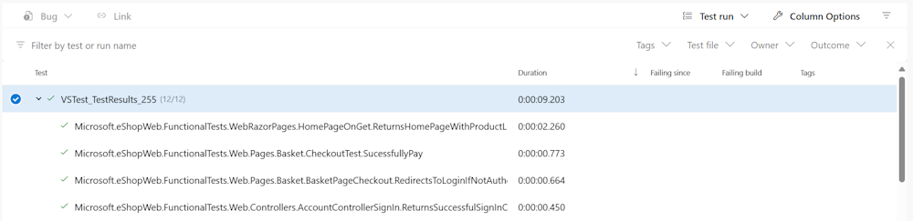

---
lab:
  title: Einrichten und Ausführen von Funktionstests
  module: 'Module 03: Design and implement a release strategy'
---

# Einrichten und Ausführen von Funktionstests

## Labanforderungen

- Für dieses Lab ist **Microsoft Edge** oder ein von [Azure DevOps unterstützter Browser](https://docs.microsoft.com/azure/devops/server/compatibility) erforderlich.

- **Einrichten einer Azure DevOps-Organisation**: Wenn Sie nicht bereits eine Azure DevOps-Organisation haben, die Sie für dieses Lab verwenden können, müssen Sie diese erstellen, indem Sie die unter [Erstellen einer Organisation oder Projektsammlung](https://learn.microsoft.com/dotnet/architecture/modern-web-apps-azure/test-asp-net-core-mvc-apps) beschriebenen Anweisungen befolgen.

## Übersicht über das Labor

Software von beliebiger Komplexität kann aufgrund von Änderungen auf unerwartete Weisen fehlschlagen. Daher ist es erforderlich, Anwendungen auf Änderungen zu testen, mit Ausnahme von unbedeutenden (bzw. weniger wichtigen) Anwendungen. Manuelle Tests sind die langsamste, unzuverlässigste und aufwendigste Möglichkeit zum Testen von Software.

Es gibt viele Arten von automatisierten Tests für Softwareanwendungen. Der einfachste, spezifischste Test ist der Komponententest. Integrationstests und Funktionstests sind etwas allgemeiner. Andere Arten von Tests werden in dieser Übung nicht behandelt, z. B. UI-Tests, Lasttests, Stresstests und Smoke-Tests.

*Wenn Sie mehr über die verschiedenen Arten des Testens wissen wollen, empfehlen wir Ihnen diesen Artikel zu lesen: [Testen von ASP.NET Core MVC-Apps](https://learn.microsoft.com/dotnet/architecture/modern-web-apps-azure/test-asp-net-core-mvc-apps).*

## Ziele

Nachdem Sie diese Übung abgeschlossen haben, können Sie eine CI-Pipeline für eine .Net-Anwendung konfigurieren, die Folgendes umfasst:

- Komponententests
- Integrationstests
- Funktionstests

## Geschätzte Zeit: 20 Minuten

## Anweisungen

### Übung 0: (Überspringen, wenn bereits abgeschlossen) Konfigurieren der Lab-Voraussetzungen

In dieser Übung richten Sie die Voraussetzungen für das Lab ein, das aus einem neuen Azure DevOps-Projekt mit einem Repository basierend auf dem [eShopOnWeb](https://github.com/MicrosoftLearning/eShopOnWeb) besteht.

#### Aufgabe 1: (überspringen, wenn fertig) Erstellen und Konfigurieren des Teamprojekts

In dieser Aufgabe erstellen Sie ein **eShopOnWeb** Azure DevOps-Projekt, das von mehreren Labs verwendet werden soll.

1. Öffnen Sie auf Ihrem Lab-Computer in einem Browserfenster Ihre Azure DevOps-Organisation. Klicken Sie auf **Neues Projekt**. Weisen Sie Ihrem Projekt den Namen **eShopOnWeb** zu, und lassen Sie die anderen Felder auf den Standardwerten. Klicken Sie auf **Erstellen**.

#### Aufgabe 2: (Überspringen, wenn erledigt) Importieren Sie das eShopOnWeb Git-Repository

Bei dieser Aufgabe importieren Sie das eShopOnWeb Git-Repository, das von mehreren Labs verwendet wird.

1. Öffnen Sie auf Ihrem Lab-Computer in einem Browserfenster Ihre Azure DevOps-Organisation und das zuvor erstellte **eShopOnWeb**-Projekt. Klicken Sie auf **Repos > Dateien** , **Importiere ein Repository**. Klicken Sie auf **Importieren**. Fügen Sie im Fenster **Git Repository importieren** die folgende URL <https://github.com/MicrosoftLearning/eShopOnWeb.git> ein, und klicken Sie auf **Importieren**:

1. Das Repository ist wie folgt organisiert:
    - Der Ordner **.ado** enthält Azure DevOps-YAML-Pipelines.
    - Der Ordner **.devcontainer** enthält ein Containersetup für die Entwicklung mithilfe von Containern (entweder lokal in VS Code oder über GitHub Codespaces).
    - Der Ordner **infra** enthält die Bicep- und ARM-Infrastruktur als Codevorlagen, die in einigen Labszenarios verwendet werden.
    - Der Ordner **.github** enthält YAML-GitHub-Workflowdefinitionen.
    - Der Ordner **src** enthält die .NET 6-Website, die in den Labszenarien verwendet wird.

#### Aufgabe 3: (überspringen, wenn erledigt) Legen Sie den Mainbranch als Standardbranch fest

1. Wechseln Sie zu **Repos > Branches**.
1. Bewegen Sie den Mauszeiger auf den **Main**-Branch und klicken Sie dann rechts neben der Spalte auf die Auslassungspunkte.
1. Klicken Sie auf **Als Mainbranch festlegen**.

### Übung 1: Einrichten von Tests in der CI-Pipeline

In dieser Übung richten Sie Tests in der CI-Pipeline ein.

#### Aufgabe 1: (Überspringen, falls erledigt) Importieren der YAML-Builddefinition für CI

In dieser Aufgabe fügen Sie die YAML-Builddefinition hinzu, die zum Implementieren der Continuous Integration verwendet wird.

Beginnen wir mit dem Importieren der CI-Pipeline mit dem Namen [eshoponweb-ci.yml](https://github.com/MicrosoftLearning/eShopOnWeb/blob/main/.ado/eshoponweb-ci.yml).

1. Navigieren Sie zu **Pipelines > Pipelines**.
1. Klicken Sie auf die Schaltfläche **Neue Pipeline**.
1. Wählen Sie **Azure Repos Git** (YAML) aus.
1. Wählen Sie das Repository **eShopOnWeb** aus.
1. Wählen Sie die Option **Vorhandene Azure Pipelines-YAML-Datei** aus.
1. Wählen Sie die **Haupt**-Verzweigung und die Datei **/.ado/eshoponweb-ci.yml** aus, und klicken Sie dann auf **Weiter**.

    Die CI-Definition umfasst die folgenden Aufgaben:
    - **DotNet Restore**: Mit NuGetPackage Restore können Sie alle Abhängigkeiten Ihres Projekts installieren, ohne sie in der Quellcodeverwaltung speichern zu müssen.
    - **DotNet Build**: Erstellt ein Projekt und alle seine Abhängigkeiten
    - **DotNet Test**: .NET-Testtreiber, der verwendet wird, um Komponententests auszuführen.
    - **DotNet Publish**: Veröffentlicht die Anwendung und ihre Abhängigkeiten in einem Ordner für die Bereitstellung auf einem Hostsystem. In diesem Fall ist das **Build.ArtifactStagingDirectory**.
    - **Artefakt veröffentlichen – Website**: Veröffentlichen Sie das App-Artefakt (erstellt im vorherigen Schritt), und stellen Sie es als Pipelineartefakt zur Verfügung.
    - **Artefakt veröffentlichen – Bicep**: Veröffentlichen Sie das Infrastrukturartefakt (Bicep-Datei), und stellen Sie es als Pipelineartefakt zur Verfügung.
1. Klicken Sie auf die Schaltfläche **Speichern** (nicht **Speichern und ausführen**), um die Pipelinedefinition zu speichern.

#### Aufgabe 2: Hinzufügen von Tests zur CI-Pipeline

In dieser Aufgabe fügen Sie die Integrations- und Funktionstests zur CI-Pipeline hinzu.

Sie können feststellen, dass der Vorgang „Komponententests“ bereits Teil der Pipeline ist.

- **Komponententests** testen einen einzelnen Teil der Logik Ihrer Anwendung. Man kann diesen Test genauer beschreiben, indem man aufführt, was er nicht umfasst. Ein Komponententest überprüft nicht, wie Ihr Code mit Abhängigkeiten oder Infrastruktur interagiert. Dafür gibt es Integrationstests.

1. Nun müssen Sie die Aufgabe „Integrationstests“ nach der Aufgabe „Komponententests“ hinzufügen:

    ```YAML
    - task: DotNetCoreCLI@2
      displayName: Integration Tests
      inputs:
        command: 'test'
        projects: 'tests/IntegrationTests/*.csproj'
    ```

    > **Integrationstests** testen, wie Ihr Code mit Abhängigkeiten oder Infrastruktur funktioniert. Obwohl es eine gute Idee ist, Code zu kapseln, der mit Infrastruktur interagiert (z.B. Datenbanken und Dateisysteme), wird ein Teil des Codes übrig bleiben, den Sie wahrscheinlich testen möchten. Darüber hinaus sollten Sie sicherstellen, dass die Schichten Ihres Codes wie erwartet interagieren, wenn die Abhängigkeiten Ihrer Anwendung vollständig aufgelöst werden. Für diese Funktion sind Integrationstests verantwortlich.

1. Anschließend müssen Sie die Aufgabe „Funktionstests“ nach der Aufgabe „Integrationstests“ hinzufügen:

    ```YAML
    - task: DotNetCoreCLI@2
      displayName: Functional Tests
      inputs:
        command: 'test'
        projects: 'tests/FunctionalTests/*.csproj'
    ```

    > **Funktionstests** werden aus der Perspektive des Benutzenden geschrieben, um die Richtigkeit des Systems basierend auf den Anforderungen sicherzustellen. Im Gegensatz zu Integrationstests, die aus der Perspektive der Entwickler*innen geschrieben werden, um zu überprüfen, ob einige Systemkomponenten korrekt zusammenarbeiten.

1. Klicken Sie auf **Speichern**, im Bereich **Speichern**, klicken Sie erneut auf **Speichern**, um die Änderungen direkt in die Hauptverzweigung zu übertragen.

#### Aufgabe 3: Überprüfen der Testzusammenfassung

1. Klicken Sie auf **Ausführen** und dann auf der Registerkarte **Pipeline ausführen**erneut auf **Ausführen**.

1. Warten Sie, bis die Pipeline gestartet wird, und bis sie die Buildphase erfolgreich abgeschlossen hat.

1. Nach der Fertigstellung wird die Registerkarte **Test** als Teil der Pipelineausführung angezeigt. Klicken Sie darauf, um die Zusammenfassung zu überprüfen. Es sieht wie unten dargestellt aus:

    

1. Weitere Details finden Sie unten auf der Seite in der Tabelle mit einer Liste der verschiedenen Ausführungstests.

    > **Hinweis**: Wenn die Tabelle leer ist, müssen Sie die Filter zurücksetzen, um alle Details über die durchgeführten Tests zu erhalten.

    

## Überprüfung

In diesem Lab haben Sie erfahren, wie Sie verschiedene Testtypen mit Azure Pipelines und .NET einrichten und ausführen.
