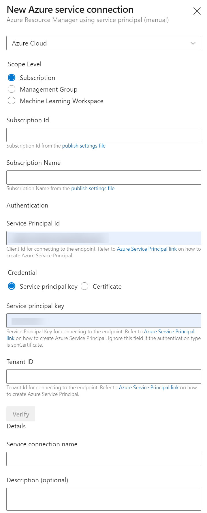

---
lab:
  title: Integrieren von Azure Key Vault in Azure DevOps
  module: 'Module 04: Implement a secure continuous deployment using Azure Pipelines'
---

# Integrieren von Azure Key Vault in Azure DevOps

## Lab-Handbuch für Kursteilnehmer

## Labanforderungen

- Für dieses Lab ist **Microsoft Edge** oder ein von [Azure DevOps unterstützter Browser](https://learn.microsoft.com/azure/devops/server/compatibility) erforderlich.

- **Einrichten einer Azure DevOps-Organisation**: Wenn Sie nicht bereits eine Azure DevOps-Organisation haben, die Sie für dieses Lab verwenden können, müssen Sie diese erstellen, indem Sie die unter [Erstellen einer Organisation oder Projektsammlung](https://learn.microsoft.com/azure/devops/organizations/accounts/create-organization) beschriebenen Anweisungen befolgen.
- Identifizieren Sie ein vorhandenes Azure-Abonnement, oder erstellen Sie ein neues Abonnement.

## Übersicht über das Labor

Azure Key Vault bietet eine sichere Speicherung und Verwaltung von vertraulichen Daten, wie z. B. Schlüsseln, Passwörtern und Zertifikaten. Azure Key Vault unterstützt sowohl Hardware-Sicherheitsmodule als auch eine Reihe von Verschlüsselungsalgorithmen und Schlüssellängen. Durch die Verwendung von Azure Key Vault können Sie die Möglichkeit der Offenlegung sensibler Daten über den Quellcode minimieren, was ein häufiger Fehler von Entwicklern ist. Der Zugriff auf Azure Key Vault erfordert eine ordnungsgemäße Authentifizierung und Autorisierung und unterstützt fein abgestufte Berechtigungen für den Inhalt.

In dieser Übung sehen Sie, wie Sie Azure Key Vault mit Azure Pipelines integrieren können, indem Sie die folgenden Schritte durchführen:

- Erstellen Sie einen Azure Key Vault, um ein ACR-Kennwort als Geheimnis zu speichern.
- Erstellen Sie einen Azure-Dienstprinzipal, um den Zugriff auf die Geheimnisse von Azure Key Vault zu ermöglichen.
- Konfigurieren Sie die Berechtigungen, damit der Dienstprinzipal das Geheimnis lesen kann.
- Konfigurieren Sie die Pipeline, um das Kennwort aus dem Azure Key Vault abzurufen und an nachfolgende Aufgaben weiterzugeben.

## Ziele

In diesem Lab lernen Sie Folgendes:

- Erstellen Sie einen Microsoft Entra-Dienstprinzipal.
- Erstellen Sie eine Azure Key Vault-Instanz.

## Geschätzte Zeit: 40 Minuten

## Anweisungen

### Übung 0: Konfigurieren der Voraussetzungen für das Lab

In dieser Übung richten Sie die Voraussetzungen für das Lab ein, das aus einem neuen Azure DevOps-Projekt mit einem Repository basierend auf dem [eShopOnWeb](https://github.com/MicrosoftLearning/eShopOnWeb) besteht.

#### Aufgabe 1: (überspringen, wenn fertig) Erstellen und Konfigurieren des Teamprojekts

In dieser Aufgabe erstellen Sie ein **eShopOnWeb** Azure DevOps-Projekt, das von mehreren Labs verwendet werden soll.

1. Öffnen Sie auf Ihrem Lab-Computer in einem Browserfenster Ihre Azure DevOps-Organisation. Klicken Sie auf **Neues Projekt**. Weisen Sie Ihrem Projekt den Namen **eShopOnWeb** zu, und lassen Sie die anderen Felder auf den Standardwerten. Klicken Sie auf **Erstellen**.

    

#### Aufgabe 2: (überspringen, wenn erledigt) Importieren von eShopOnWeb Git Repository

Bei dieser Aufgabe importieren Sie das eShopOnWeb Git-Repository, das von mehreren Labs verwendet wird.

1. Öffnen Sie auf Ihrem Lab-Computer in einem Browserfenster Ihre Azure DevOps-Organisation und das zuvor erstellte **eShopOnWeb**-Projekt. Klicken Sie auf **Repos>Dateien**, **Importieren**. Fügen Sie im Fenster **Git Repository importieren** die folgende URL https://github.com/MicrosoftLearning/eShopOnWeb.git ein und klicken Sie auf **Importieren**:

    

1. Das Repository ist wie folgt organisiert:
    - Der Ordner **.ado** enthält Azure DevOps-YAML-Pipelines.
    - Der Ordner **.devcontainer** enthält ein Containersetup für die Entwicklung mithilfe von Containern (entweder lokal in VS Code oder über GitHub Codespaces).
    - Der Ordner **infra** enthält eine Bicep&ARM-Infrastruktur als Codevorlagen, die in einigen Labszenarien verwendet werden.
    - Der Ordner **.github** enthält YAML GitHub-Workflow-Definitionen.
    - Der Ordner **src** enthält die .NET 8-Website, die in den Labszenarien verwendet wird.

### Übung 1: Einrichten einer CI-Pipeline zur Erstellung des eShopOnWeb-Containers

Einrichten der CI YAML-Pipeline für:

- Erstellen einer Azure Container Registry zur Aufbewahrung der Container-Images
- Verwendung von Docker Compose zum Erstellen und Verteilen von **eshoppublicapi** und **eshopwebmvc** Container Images. Es wird nur der Container**eshopwebmvc**eingesetzt.

#### Aufgabe 1: (überspringen, wenn erledigt) Erstellen eines Dienstprinzipals

In dieser Aufgabe erstellen Sie mithilfe der Azure CLI ein Dienstprinzipal, der es Azure DevOps ermöglicht:

- Ressourcen in Ihrem Azure-Abonnement bereitstellen.
- Sie haben Lesezugriff auf die später erstellten Key Vault-Geheimnisse.

> **Hinweis**: Wenn Sie bereits über ein Dienstprinzipal verfügen, können Sie direkt mit der nächsten Aufgabe fortfahren.

Sie benötigen ein Dienstprinzipal, um Azure-Ressourcen über Azure Pipelines bereitzustellen. Da Sie Geheimnisse in einer Pipeline abrufen werden, müssen Sie dem Dienst bei der Erstellung des Azure Key Vault eine Berechtigung erteilen.

Ein Dienstprinzipal wird automatisch von Azure Pipelines erstellt, wenn Sie eine Verbindung zu einem Azure-Abonnement innerhalb einer Pipeline-Definition herstellen oder wenn Sie eine neue Dienstverbindung über die Projekteinstellungsseite erstellen (automatische Option). Sie können den Dienstprinzipal auch manuell über das Portal oder mithilfe von Azure CLI erstellen und ihn projektübergreifend wiederverwenden.

1. Starten Sie auf Ihrem Labcomputer einen Webbrowser, navigieren Sie zum [**Azure-Portal**](https://portal.azure.com), und melden Sie sich an. Verwenden Sie hierzu die Anmeldeinformationen eines Benutzerkontos, das in dem Abonnement, das Sie in diesem Lab verwenden, und das in dem in dem Microsoft Entra-Mandanten, der dem Abonnement zugeordnet ist, über die Rolle „Globaler Administrator“ verfügt.
1. Klicken Sie im Azure-Portal auf das Symbol **Cloud Shell**, das sich direkt rechts neben dem Textfeld für die Suche im oberen Bereich der Seite befindet.
1. Wählen Sie bei Aufforderung zur Auswahl von **Bash** oder **PowerShell** die Option **Bash** aus.

   >**Hinweis**: Wenn Sie **Cloud Shell** zum ersten Mal starten und die Meldung **Für Sie wurde kein Speicher bereitgestellt** angezeigt wird, wählen Sie das in diesem Lab verwendete Abonnement aus, und klicken Sie dann auf **Speicher erstellen**.

1. Führen Sie an der Eingabeaufforderung **Bash** im Bereich **Cloud Shell** die folgenden Befehle aus, um die Werte der Attribute „Azure-Abonnement-ID“ und „Abonnementname“ abzurufen:

    ```bash
    az account show --query id --output tsv
    az account show --query name --output tsv
    ```

    > **Hinweis**: Kopieren Sie beide Werte in eine Textdatei. Sie werden sie später in diesem Lab benötigen.

1. Führen Sie an der Eingabeaufforderung **Bash**im Bereich **Cloud Shell** den folgenden Befehl aus, um ein Dienstprinzipal zu erstellen (ersetzen Sie **myServicePrincipalName** durch eine beliebige eindeutige Zeichenfolge aus Buchstaben und Ziffern) und **mySubscriptionID** durch Ihre Azure subscriptionId :

    ```bash
    az ad sp create-for-rbac --name myServicePrincipalName \
                         --role contributor \
                         --scopes /subscriptions/mySubscriptionID
    ```

    > **Hinweis**: Der Befehl generiert eine JSON-Ausgabe. Kopieren Sie die Ausgabe in eine Textdatei. Sie benötigen diese später in diesem Lab.

1. Starten Sie als Nächstes auf dem Laborcomputer einen Webbrowser, navigieren Sie zum Azure DevOps **eShopOnWeb**-Projekt. Klicken Sie auf **Project Einstellungen>Dienstverbindungen (unter Pipelines)** und **Neue Dienstverbindung**.

    

    > **Hinweis:** Wenn auf der Seite zuvor keine Dienstverbindungen erstellt wurden, befindet sich die Schaltfläche zum Erstellen der Dienstverbindung in der Mitte der Seite und weist die Bezeichnung **Dienstverbindung erstellen** auf

1. Wählen Sie im Bildschirm **Neue Dienstverbindung** die Option **Azure Resource Manager** und anschließend **Weiter** aus (Sie müssen möglicherweise scrollen).

1. Wählen Sie dann **Dienstprinzipal (manuell)** aus, und klicken Sie auf **Weiter**.

1. Füllen Sie die leeren Felder mit den Informationen aus, die während der vorherigen Schritte gesammelt wurden:
    - Abonnement-ID und -Name.
    - Dienstprinzipal-ID (appId), Dienstprinzipalschlüssel (Kennwort) und Mandanten-ID (Mandant).
    - Geben Sie in **Name der Dienstverbindung** **azure subs** ein. Auf diesen Namen wird in YAML-Pipelines verwiesen, wenn eine Azure DevOps-Dienstverbindung erforderlich ist, um mit Ihrem Azure-Abonnement zu kommunizieren.

    

1. Klicken Sie auf **Überprüfen und speichern**.

#### Aufgabe 2: Einrichten und Ausführen der CI-Pipeline

In dieser Aufgabe importieren Sie eine bestehende CI YAML-Pipeline-Definition, ändern sie und führen sie aus. Es wird eine neue Azure Container Registry (ACR) erstellt und die eShopOnWeb Container-Images erstellt/veröffentlicht.

1. Starten Sie auf dem Laborcomputer einen Webbrowser und navigieren Sie zum Azure DevOps **eShopOnWeb**-Projekt. Gehen Sie zu **Pipelines>Pipelines** und klicken Sie auf **Pipeline erstellen** (oder **Neue Pipeline**).

1. Im Fenster **Wo befindet Sich Ihr Code?** wählen Sie **Azure Repos Git (YAML)** aus. Wählen Sie dann das **eShopOnWeb-Repository** aus.

1. Wählen Sie auf der Registerkarte **Konfigurieren** die Option **Vorhandene Azure Pipelines YAML-Datei** aus. Verzweigung auswählen: **Haupt**, geben Sie den Pfad **/.ado/eshoponweb-ci-dockercompose.yml** an, und klicken Sie auf **Weiter**.

    

1. Passen Sie in der YAML-Pipelinedefinition Ihren Ressourcengruppennamen an, indem Sie **NAME** in **AZ400-EWebShop-NAME** durch einen eindeutigen Wert ersetzen und **YOUR-SUBSCRIPTION-ID** durch Ihre eigene Azure subscriptionId ersetzen.

1. Klicken Sie auf **Speichern und Ausführen**, und warten Sie, bis die Pipeline erfolgreich ausgeführt wird.

    > **Wichtig**: Wenn Sie die Meldung „Diese Pipeline benötigt eine Berechtigung für den Zugriff auf Ressourcen, bevor dieser Lauf mit Docker Compose to ACI fortgesetzt werden kann“ sehen, klicken Sie auf „Anzeigen“, „Genehmigen“ und „Zulassen“. Dies ist erforderlich, damit die Pipeline die Ressource erstellen kann.

    > **Hinweis**: Es kann einige Minuten dauern, bis der Build abgeschlossen ist. Die Buildpipeline besteht aus den folgenden Aufgaben:
    - **AzureResourceManagerTemplateDeployment** verwendet **bicep** zur Bereitstellung einer Azure Container Registry.
    - **PowerShell** nimmt die Bicep-Ausgabe (acr login server) und erstellt eine Pipeline-Variable.
    - **DockerCompose** erstellt und überträgt die Container-Images für eShopOnWeb in die Azure Container Registry.

1. Ihre Pipeline bekommt einen Namen basierend auf dem Projektnamen. Lassen Sie sie uns **umbenennen**, um die Pipeline besser zu identifizieren. Wechseln Sie zu **Pipelines>Pipelines** , und klicken Sie auf die kürzlich erstellte Pipeline. Klicken Sie auf die Auslasspunkte und die Option **Umbenennen/Entfernen**. Nennen Sie es **eshoponweb-ci-dockercompose** und klicken Sie auf **Speichern**.

1. Sobald die Ausführung abgeschlossen ist, öffnen Sie im Azure Portal die zuvor definierte Ressourcengruppe und Sie sollten eine Azure Container Registry (ACR) mit den erstellten Container-Images **eshoppublicapi** und **eshopwebmvc** finden. Sie werden **eshopwebmvc** nur in der Bereitstellungsphase verwenden.

    

1. Klicken Sie auf **Zugriffsschlüssel**, aktivieren Sie **Administratorbenutzer**, falls noch nicht geschehen, und kopieren Sie den Wert von **password**. In der folgenden Aufgabe speichern wir ihn im Azure Key Vault als Geheimnis.

    

#### Aufgabe 2: Erstellen eines Azure Key Vault

In dieser Aufgabe erstellen Sie einen Azure Key Vault über das Azure-Portal.

In diesem Übungsszenario wird eine Azure Container Instance (ACI) verwendet, die ein in Azure Container Registry (ACR) gespeichertes Container-Image abruft und ausführt. Wir beabsichtigen, das Kennwort für den ACR als Geheimnis im Key Vault zu speichern.

1. Geben Sie im Azure-Portal in das Textfeld **Ressourcen, Dienste und Dokumente suchen** **Key Vault** ein und drücken Sie die **Eingabetaste**.
1. Wählen Sie das Blatt **Key Vault** aus und klicken Sie auf **Erstellen>Key Vault**.
1. Geben Sie auf der Registerkarte **Grundlagen** des Blattes **Key Vault erstellen** die folgenden Einstellungen an und klicken Sie auf **Weiter**:

    | Einstellung | Wert |
    | --- | --- |
    | Subscription | Der Name des Azure-Abonnements, das Sie in diesem Lab verwenden. |
    | Resource group | Der Name einer neuen Ressourcengruppe **AZ400-EWebShop-NAME** |
    | Name des Schlüsseltresors | Beliebiger eindeutiger gültiger Name, z. B. **ewebshop-kv-NAME** (NAME ersetzen) |
    | Region | Eine Azure-Region in der Nähe des Standorts Ihrer Lab-Umgebung |
    | Tarif | **Standard** |
    | Aufbewahrungsdauer für gelöschte Tresore in Tagen | **7** |
    | Bereinigungsschutz | **Bereinigungsschutz deaktivieren** |

1. Wählen Sie auf der Registerkarte **Zugangskonfiguration** des Blades **Key Vault erstellen** die Option **Tresorzugriffsrichtlinie** und klicken Sie dann im Abschnitt **Zugangsrichtlinien** auf **+ Erstellen**, um eine neue Richtlinie einzurichten.

    > **Hinweis**: Sie müssen den Zugriff auf Ihre Key Vaults sichern, indem Sie nur autorisierte Anwendungen und Benutzer*innen zulassen. Um auf die Daten aus dem Vault zuzugreifen, müssen Sie dem zuvor erstellten Dienstprinzipal, den Sie für die Authentifizierung in der Pipeline verwenden werden, Leseberechtigungen (Get/List) erteilen.

    1. Überprüfen Sie auf dem Blatt **Berechtigung** unter **Geheime Berechtigungen** die Berechtigungen **Abrufen** und **Auflisten**. Klicken Sie auf **Weiter**.
    2. Suchen Sie auf dem Blatt **Principal** nach dem **zuvor erstellten Dienstprinzipal**, entweder über die angegebene Id oder den Namen, und wählen Sie es aus der Liste aus. Klicken Sie auf **Weiter**, **Weiter**, **Erstellen** (Zugangsrichtlinie).
    3. Klicken Sie auf dem Blatt **Überprüfen + Erstellen** auf **Erstellen**

1. Zurück auf dem Blatt **Key Vault erstellen** klicken Sie auf **Überprüfen + Erstellen > Erstellen**

    > **Hinweis**: Warten Sie, bis der Azure Key Vault bereitgestellt wurde. Das sollte weniger als eine Minute dauern.

1. Klicken Sie auf dem Blatt **Ihre Bereitstellung ist abgeschlossen** auf **Zur Ressource**.
1. Klicken Sie auf dem Blatt Azure Key Vault (ewebshop-kv-NAME) im vertikalen Menü auf der linken Seite des Blatts im Abschnitt **Objekte** auf **Geheimnisse**.
1. Klicken Sie auf dem Blatt **Geheimnisse** auf **Erzeugen/Importieren**.
1. Geben Sie auf dem Blatt **Geheimnis erstellen** die folgenden Einstellungen an und klicken Sie auf **Erstellen** (belassen Sie die anderen bei ihren Standardwerten):

    | Einstellung | Wert |
    | --- | --- |
    | Uploadoptionen | **Manuell** |
    | Name | **acr-secret** |
    | Wert | ACR-Zugriffskennwort, das in der vorherigen Aufgabe kopiert wurde |

#### Aufgabe 3: Erstellen einer mit Azure Key Vault verbundenen Variablengruppe

In dieser Aufgabe erstellen Sie eine Variable Gruppe in Azure DevOps, die den ACR-Kennwortschlüssel mithilfe der Dienstverbindung (Dienstprinzipal) aus dem Key Vault abruft.

1. Starten Sie auf Ihrem Lab-Computer einen Webbrowser und navigieren Sie zu dem Azure DevOps-Projekt **eShopOnWeb**.

1. Wählen Sie im vertikalen Navigationsbereich des Azure DevOps-Portals **Pipelines>Library** aus. Klicken Sie auf **+ Variablengruppe**.

1. Geben Sie auf dem Blatt **Neue Variablengruppe** die folgenden Einstellungen an:

    | Einstellung | Wert |
    | --- | --- |
    | Variablengruppenname | **eshopweb-vg** |
    | Verknüpfung von Geheimnissen aus einem Azure Key Vault | **enable** |
    | Azure-Abonnement | **Verfügbare Azure-Dienstverbindung > Azure subs** |
    | Name des Schlüsseltresors | Der Name Ihres Schlüsseltresors|

1. Klicken Sie unter **Variablen** auf **+ Hinzufügen** und wählen Sie das Geheimnis **acr-secret** aus. Klicken Sie auf **OK**.
1. Klicken Sie auf **Speichern**.

    

#### Aufgabe 4: Einrichten der CD-Pipeline zum Bereitstellen von Containern in Azure Container Instance (ACI)

In dieser Aufgabe importieren Sie eine CD-Pipeline, passen sie an und führen sie aus, um das zuvor in einer Azure-Containerinstanz erstellte Containerimage bereitzustellen.

1. Starten Sie auf dem Laborcomputer einen Webbrowser und navigieren Sie zum Azure DevOps **eShopOnWeb**-Projekt. Gehen Sie zu **Pipelines>Pipelines** und klicken Sie auf **Neue Pipeline**.

1. Im Fenster **Wo befindet Sich Ihr Code?** wählen Sie **Azure Repos Git (YAML)** aus. Wählen Sie dann das **eShopOnWeb-Repository** aus.

1. Wählen Sie auf der Registerkarte **Konfigurieren** die Option **Vorhandene Azure Pipelines YAML-Datei** aus. Verzweigung auswählen: **Haupt**, geben Sie den Pfad **/.ado/eshoponweb-cd-aci.yml** an, und klicken Sie auf **Weiter**.

1. Passen Sie in der YAML-Pipelinedefinition Folgendes an:

    - Ersetzen Sie **IHRE-ABONNEMENT-ID** durch Ihre Azure-Abonnement-ID.
    - **az400eshop-NAME** ersetzen Sie NAME, um ihn global eindeutig zu machen.
    - **Ihr-ACR.azurecr.io** und **ACR-USERNAME** mit Ihrem ACR-Login-Server (beide benötigen den ACR-Namen, kann auf der ACR>Zugangsschlüssel überprüft werden).
    - **AZ400-EWebShop-NAME** mit dem zuvor im Labor definierten Namen der Ressourcengruppe.

1. Klicken Sie auf **Speichern und Ausführen**.
1. Öffnen Sie die Pipeline und warten Sie, bis sie erfolgreich ausgeführt wird.

    > **Wichtig**: Wenn Sie die Meldung „Diese Pipeline benötigt eine Berechtigung für den Zugriff auf Ressourcen, bevor dieser Lauf mit Docker Compose to ACI fortgesetzt werden kann“ sehen, klicken Sie auf „Anzeigen“, „Genehmigen“ und „Zulassen“. Dies ist erforderlich, damit die Pipeline die Ressource erstellen kann.

    > **Hinweis**: Die Bereitstellung kann einige Minuten dauern. Die CD-Definition besteht aus den folgenden Aufgaben:
    - **Ressourcen**: es ist darauf vorbereitet, automatisch nach Abschluss der CI-Pipeline ausgelöst zu werden. Außerdem wird das Repository für die Bicep-Datei heruntergeladen.
    - **Variablen (für die Bereitstellungsphase)** stellt eine Verbindung zur Variablengruppe her, um das Azure Key Vault-Geheimnis zu verwenden **acr-secret**.
    - **AzureResourceManagerTemplateDeployment** stellt die Azure Container Instance (ACI) unter Verwendung der Bicep-Vorlage bereit und stellt die ACR-Anmeldeparameter bereit, damit ACI das zuvor erstellte Container-Image von Azure Container Registry (ACR) herunterladen kann.

1. Ihre Pipeline bekommt einen Namen basierend auf dem Projektnamen. Lassen Sie sie uns **umbenennen**, um die Pipeline besser zu identifizieren. Wechseln Sie zu **Pipelines>Pipelines** , und klicken Sie auf die kürzlich erstellte Pipeline. Klicken Sie auf die Auslassungspunkte und die Option **Umbenennen/Entfernen**. Nennen Sie es **eshoponweb-cd-aci** und klicken Sie auf **Speichern**.

### Übung 2: Entfernen Sie die Azure-Laborressourcen

In dieser Übung entfernen Sie die in diesem Lab bereitgestellten Azure-Ressourcen, um unerwartete Gebühren zu vermeiden.

>**Hinweis**: Denken Sie daran, alle neu erstellten Azure-Ressourcen zu entfernen, die Sie nicht mehr verwenden. Durch das Entfernen nicht verwendeter Ressourcen wird sichergestellt, dass keine unerwarteten Gebühren anfallen.

#### Aufgabe 1: Entfernen der Azure Lab-Ressourcen

In dieser Aufgabe verwenden Sie Azure Cloud Shell, um die in diesem Lab bereitgestellten Azure-Ressourcen zu entfernen, um unnötige Gebühren zu vermeiden.

1. Öffnen Sie im Azure-Portal die erstellte Ressourcengruppe und klicken Sie auf **Ressourcengruppe löschen**.

## Überprüfung

In dieser Übung haben Sie Azure Key Vault mit einer Azure DevOps-Pipeline integriert, indem Sie die folgenden Schritte durchgeführt haben:

- Es wurde ein Azure-Dienstprinzipal erstellt, um den Zugriff auf ein Azure Key Vault-Geheimnis zu ermöglichen und die Bereitstellung in Azure von Azure DevOps aus zu authentifizieren.
- Es wurden zwei YAML-Pipelines ausgeführt, die aus einem Git-Repository importiert wurden.
- Konfigurierte eine Pipeline, um das Kennwort aus Azure Key Vault mithilfe einer Variablengruppe abzurufen und für nachfolgende Aufgaben zu verwenden.
