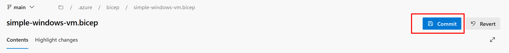
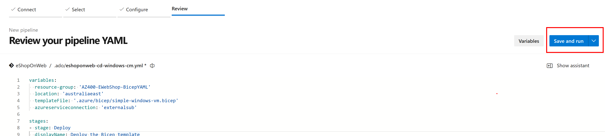
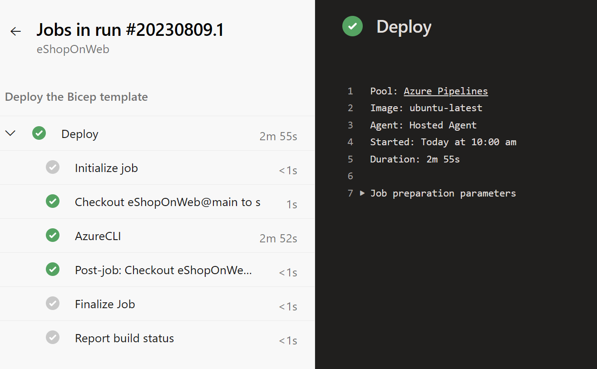

---
lab:
  title: Bereitstellungen mit Azure Bicep-Vorlagen
  module: 'Module 05: Manage infrastructure as code using Azure and DSC'
---

# Bereitstellungen mit Azure Bicep-Vorlagen

## Labanforderungen

- Für dieses Lab ist **Microsoft Edge** oder ein von [Azure DevOps unterstützter Browser](https://docs.microsoft.com/azure/devops/server/compatibility) erforderlich.

- **Einrichten einer Azure DevOps-Organisation**: Wenn Sie nicht bereits eine Azure DevOps-Organisation haben, die Sie für dieses Lab verwenden können, müssen Sie diese erstellen, indem Sie die unter [Erstellen einer Organisation oder Projektsammlung](https://docs.microsoft.com/azure/devops/organizations/accounts/create-organization) beschriebenen Anweisungen befolgen.

- Identifizieren Sie ein vorhandenes Azure-Abonnement, oder erstellen Sie ein neues Abonnement.

- Stellen Sie sicher, dass Sie über ein Microsoft- oder Microsoft Entra-Konto mit der Rolle „Besitzer“ im Azure-Abonnement und der Rolle „Globaler Administrator“ im Microsoft Entra-Mandanten verfügen, der dem Azure-Abonnement zugeordnet ist. Ausführliche Informationen finden Sie in den Artikeln zum [Auflisten von Azure-Rollenzuweisungen mithilfe des Azure-Portals](https://docs.microsoft.com/azure/role-based-access-control/role-assignments-list-portal) und [Anzeigen und Zuweisen von Administratorrollen in Azure Active Directory](https://docs.microsoft.com/azure/active-directory/roles/manage-roles-portal).

## Übersicht über das Labor

In diesem Lab erstellen Sie eine Azure Bicep-Vorlage und modularisieren sie mithilfe des Azure Bicep Modules-Konzepts. Anschließend ändern Sie die Hauptbereitstellungsvorlage, um das Modul zu verwenden, und stellen schließlich alle Ressourcen in Azure bereit.

## Ziele

In diesem Lab lernen Sie Folgendes:

- Grundlegendes zur Struktur einer Azure Bicep-Vorlage.
- Erstellen eines wiederverwendbaren Bicep-Moduls.
- Ändern der Hauptvorlage, um das Modul zu verwenden.
- Alle Ressourcen mithilfe von Azure YAML-Pipelines in Azure bereitstellen.

## Geschätzte Dauer: 45 Minuten

## Anweisungen

### Übung 0: (Überspringen, wenn bereits abgeschlossen) Konfigurieren der Lab-Voraussetzungen

In dieser Übung richten Sie die Voraussetzungen für das Lab ein, das aus einem neuen Azure DevOps-Projekt mit einem Repository basierend auf dem [eShopOnWeb](https://github.com/MicrosoftLearning/eShopOnWeb) besteht.

#### Aufgabe 1: (überspringen, wenn fertig) Erstellen und Konfigurieren des Teamprojekts

In dieser Aufgabe erstellen Sie ein **eShopOnWeb** Azure DevOps-Projekt, das von mehreren Labs verwendet werden soll.

1. Öffnen Sie auf Ihrem Lab-Computer in einem Browserfenster Ihre Azure DevOps-Organisation. Klicken Sie auf **Neues Projekt**. Weisen Sie Ihrem Projekt den Namen **eShopOnWeb** zu, und lassen Sie die anderen Felder auf den Standardwerten. Klicken Sie auf **Erstellen**.

    

#### Aufgabe 2: (überspringen, wenn erledigt) Importieren von eShopOnWeb Git Repository

Bei dieser Aufgabe importieren Sie das eShopOnWeb Git-Repository, das von mehreren Labs verwendet wird.

1. Öffnen Sie auf Ihrem Lab-Computer in einem Browserfenster Ihre Azure DevOps-Organisation und das zuvor erstellte **eShopOnWeb**-Projekt. Klicken Sie auf **Repos > Dateien** , **Importiere ein Repository**. Klicken Sie auf **Importieren**. Fügen Sie im Fenster **Git Repository importieren** die folgende URL <https://github.com/MicrosoftLearning/eShopOnWeb.git> ein, und klicken Sie auf **Importieren**:

    

1. Das Repository ist wie folgt organisiert:
    - Der Ordner **.ado** enthält Azure DevOps-YAML-Pipelines.
    - Der Ordner **.devcontainer** enthält ein Containersetup für die Entwicklung mithilfe von Containern (entweder lokal in VS Code oder über GitHub Codespaces).
    - Der Ordner **infra** enthält eine Bicep&ARM-Infrastruktur als Codevorlagen, die in einigen Labszenarien verwendet werden.
    - Der Ordner **.github** enthält YAML GitHub-Workflow-Definitionen.
    - Der Ordner **src** enthält die .NET 8-Website, die in den Labszenarios verwendet wird.

#### Aufgabe 3: (überspringen, wenn erledigt) Legen Sie den Mainbranch als Standardbranch fest

1. Wechseln Sie zu **Repos > Branches**.
1. Bewegen Sie den Mauszeiger auf den **Main**-Branch und klicken Sie dann rechts neben der Spalte auf die Auslassungspunkte.
1. Klicken Sie auf **Als Mainbranch festlegen**.

### Übung 1: Verstehen einer Azure Bicep-Vorlage und Vereinfachen der Vorlage mithilfe eines wiederverwendbaren Moduls

In dieser Übung überprüfen Sie eine Azure Bicep-Vorlage und vereinfachen sie mithilfe eines wiederverwendbaren Moduls.

#### Aufgabe 1: Erstellen von Azure Bicep-Vorlagen

In dieser Aufgabe verwenden Sie Visual Studio Code, um eine Azure Bicep-Vorlage zu erstellen.

1. Navigieren Sie auf der Registerkarte Browser zu Ihrem Azure DevOps-Projekt, und navigieren Sie zu **Repos** und **Dateien**. Öffnen Sie den Ordner `infra` und suchen Sie die Datei `simple-windows-vm.bicep`.

   

1. Überprüfen Sie die Vorlage, um ein besseres Verständnis der Struktur zu erhalten. Es gibt Parameter mit Typen, Standardwerten und Validierung, einige Variablen und eine ganze Reihe von Ressourcen mit diesen Typen:

   - Microsoft.Storage/storageAccounts
   - Microsoft.Network/publicIPAddresses
   - Microsoft.Network/virtualNetworks
   - Microsoft.Network/networkInterfaces
   - Microsoft.Compute/virtualMachines

1. Achten Sie auf die Einfachheit der Ressourcendefinitionen und auf die Möglichkeit, in der gesamten Vorlage implizit auf symbolische Namen anstatt auf explizite `dependsOn` zu verweisen.

#### Aufgabe 2: Erstellen eines Bicep-Moduls für Speicherressourcen

In dieser Aufgabe erstellen Sie ein Speichervorlagenmodul **storage.bicep**, das nur ein Speicherkonto erstellt und von der Hauptvorlage importiert wird. Das Speichervorlagenmodul muss einen Wert zurück an die Hauptvorlage **main.bicep** übergeben, und dieser Wert wird im Ausgabeelement des Speichervorlagenmoduls definiert.

1. Zunächst muss die Speicherressource aus der Hauptvorlage entfernt werden. Klicken Sie in der oberen rechten Ecke Ihres Browserfensters auf die Schaltfläche **Bearbeiten**:

   

1. Löschen Sie nun die Speicherressource:

   ```bicep
   resource storageAccount 'Microsoft.Storage/storageAccounts@2022-05-01' = {
     name: storageAccountName
     location: location
     sku: {
       name: 'Standard_LRS'
     }
     kind: 'Storage'
   }
   ```

1. Committen Sie die Datei, auch wenn Sie damit noch nicht ganz fertig sind.

   

1. Zeigen Sie als Nächstes mit der Maus auf den `Infra` Ordner, und klicken Sie auf das Auslassungssymbol, und wählen Sie **dann Neu** und **Datei** aus. Geben Sie „**`storage.bicep`**“ für den Namen ein und klicken Sie auf „**Erstellen**“.

   

1. Kopieren Sie nun den folgenden Codeausschnitt in die Datei und committen Sie Ihre Änderungen:

   ```bicep
   @description('Location for all resources.')
   param location string = resourceGroup().location

   @description('Name for the storage account.')
   param storageAccountName string

   resource storageAccount 'Microsoft.Storage/storageAccounts@2022-05-01' = {
     name: storageAccountName
     location: location
     sku: {
       name: 'Standard_LRS'
     }
     kind: 'Storage'
   }

   output storageURI string = storageAccount.properties.primaryEndpoints.blob
   ```

#### Aufgabe 3: Ändern der Hauptvorlage, sodass sie das Vorlagenmodul verwendet

In dieser Aufgabe ändern Sie die Hauptvorlage so, dass sie auf das Vorlagenmodul verweist, das Sie in der vorherigen Aufgabe erstellt haben.

1. Navigieren Sie zurück zur Datei `simple-windows-vm.bicep` und klicken Sie noch einmal auf die Schaltfläche **Bearbeiten**.

1. Fügen Sie anschließend den folgenden Code nach den Variablen ein:

   ```bicep
   module storageModule './storage.bicep' = {
     name: 'linkedTemplate'
     params: {
       location: location
       storageAccountName: storageAccountName
     }
   }
   ```

1. Außerdem muss der Verweis auf den Blob-URI des Speicherkontos in der Ressource der virtuellen Maschine so geändert werden, dass stattdessen die Ausgabe des Moduls verwendet wird. Suchen Sie die VM-Ressource und ersetzen Sie den Abschnitt „diagnosticsProfile“ durch Folgendes:

   ```bicep
   diagnosticsProfile: {
     bootDiagnostics: {
       enabled: true
       storageUri: storageModule.outputs.storageURI
     }
   }
   ```

1. Überprüfen Sie die folgenden Details in der Hauptvorlage:

   - Ein Modul in der Hauptvorlage wird zur Verknüpfung mit einer anderen Vorlage verwendet.
   - Das Modul hat den symbolischen Namen `storageModule`. Dieser Name wird zum Konfigurieren der Abhängigkeiten verwendet.
   - Bei der Verwendung von Vorlagenmodulen können Sie nur den **Inkrementellen** Bereitstellungsmodus verwenden.
   - Ein relativer Pfad wird für Ihr Vorlagenmodul verwendet.
   - Verwenden Sie Parameter, um Werte von der Hauptvorlage an die Vorlagenmodule zu übergeben.

1. Commiten der Vorlage.

### Übung 2: Bereitstellen der Vorlagen in Azure mithilfe von YAML-Pipelines

In diesem Lab verwenden Sie eine Azure DevOps-YAML-Pipeline, um Ihre Vorlage in Ihrer Azure-Umgebung bereitzustellen.

#### Aufgabe 1: Bereitstellen von Ressourcen in Azure durch YAML-Pipelines

1. Navigieren Sie zurück zum Bereich **Pipelines** im **Pipelinehub**.
1. Klicken Sie im Fenster **Erste Pipeline erstellen** auf **Pipeline erstellen**.

    > **Hinweis**: Wir verwenden den Assistenten, um eine neue YAML-Pipelinedefinition basierend auf unserem Projekt zu erstellen.

1. Klicken Sie im Bereich **Wo befindet sich Ihr Code?** auf die Option **Azure Repos Git (YAML)**.
1. Klicken Sie im Bereich **Ein Repository auswählen** auf **eShopOnWeb**.
1. Scrollen Sie auf dem Bildschirm **Pipeline konfigurieren** nach unten und wählen Sie die Option **Vorhandene Azure Pipelines-YAML-Datei** aus.
1. Geben Sie im Blatt **Auswählen einer vorhandenen YAML-Datei** die folgenden Parameter an:
   - Branch: **main**
   - Pfad: **.ado/eshoponweb-cd-windows-cm.yml**
1. Klicken Sie auf **Weiter**, um die Einstellungen zu speichern.
1. Wählen Sie im Abschnitt Variablen einen Namen für Ihre Ressourcengruppe aus, legen Sie den gewünschten Speicherort fest, und ersetzen Sie den Wert der Dienstverbindung durch eine Ihrer vorhandenen Dienstverbindungen, die Sie zuvor erstellt haben.
1. Klicken Sie in der oberen rechten Ecke auf die Schaltfläche **Speichern und ausführen**. Wenn der Commit-Dialog angezeigt wird, klicken Sie erneut auf **Speichern**.

   

1. Warten Sie, bis die Bereitstellung abgeschlossen ist, und überprüfen Sie die Ergebnisse.
   

   > [!IMPORTANT]
   > Denken Sie daran, die im Azure-Portal erstellten Ressourcen zu löschen, um unnötige Kosten zu vermeiden.

## Überprüfung

In dieser Übung haben Sie erfahren, wie Sie eine Azure Bicep-Vorlage erstellen, mithilfe eines Vorlagenmoduls modularisieren, die Hauptbereitstellungsvorlage so ändern, dass sie das Modul und aktualisierte Abhängigkeiten verwendet, und schließlich die Vorlagen mithilfe von YAML-Pipelines in Azure bereitstellen.
