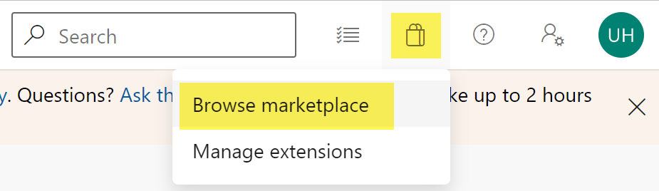
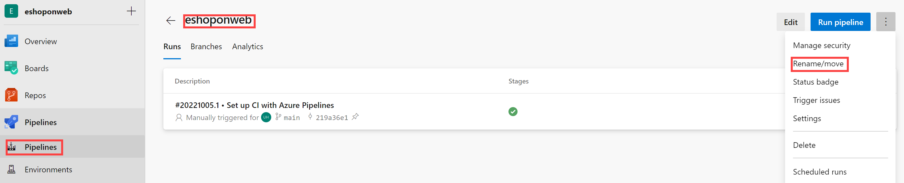

---
lab:
  title: 'Lab: Implementieren von Sicherheit und Compliance in einer Azure DevOps-Pipeline'
  module: 'Module 07: Implement security and validate code bases for compliance'
---

# Lab: Implementieren von Sicherheit und Compliance in einer Azure DevOps-Pipeline

## Lab-Handbuch für Kursteilnehmer

## Labanforderungen

- Für dieses Lab ist **Microsoft Edge** oder ein [von Azure DevOps unterstützter Browser](https://learn.microsoft.com/azure/devops/server/compatibility) erforderlich.

- **Einrichten einer Azure DevOps-Organisation**: Wenn Sie nicht bereits eine Azure DevOps-Organisation haben, die Sie für dieses Lab verwenden können, müssen Sie diese erstellen, indem Sie die unter [Erstellen einer Organisation oder Projektsammlung](https://learn.microsoft.com/azure/devops/organizations/accounts/create-organization) beschriebenen Anweisungen befolgen.

## Übersicht über das Labor

In diesem Lab verwenden Sie **Mend Bolt (früher WhiteSource) mit Azure DevOps**, um anfällige Open-Source-Komponenten, veraltete Bibliotheken und Probleme mit der Lizenzeinhaltung in Ihrem Code automatisch zu erkennen. Sie verwenden WebGoat, eine absichtlich unsichere, von OWASP verwaltete Webanwendung, um allgemeine Sicherheitsprobleme der Webanwendung zu veranschaulichen.

[Mend](https://www.mend.io/) ist führend im Bereich der kontinuierlichen Open-Source-Software-Sicherheits- und Complianceverwaltung. WhiteSource lässt sich unabhängig von Ihren Programmiersprachen, Buildtools oder Entwicklungsumgebungen in Ihren Buildprozess integrieren. Es arbeitet automatisch, kontinuierlich und unauffällig im Hintergrund und überprüft die Sicherheit, Lizenzierung und Qualität Ihrer Open-Source-Komponenten anhand der von WhiteSource ständig aktualisierten Datenbank mit Open-Source-Repositorys.

Mend stellt Mend Bolt bereit, eine einfache Open-Source-Sicherheits- und Verwaltungslösung, die speziell für die Integration von Azure DevOps entwickelt wurde. Mend Bolt wird für größere Entwicklungsteams empfohlen, die ihre Open-Source-Verwaltung während des gesamten Lebenszyklus der Softwareentwicklung (von den Repositorys bis hin zu Phasen nach der Bereitstellung) und in allen Projekten und Produkten automatisieren möchten.

Die Azure DevOps-Integration in Mend Bolt ermöglicht Ihnen Folgendes:

- Erkennen und Behandeln anfälliger Open-Source-Komponenten.
- Generieren umfassender Open-Source-Bestandsberichte pro Projekt oder Build.
- Erzwingen der Open-Source-Lizenzkompatibilität, einschließlich der Lizenzen von Abhängigkeiten.
- Identifizieren veralteter Open-Source-Bibliotheken mit Aktualisierungsempfehlungen.

## Ziele

In diesem Lab lernen Sie Folgendes:

- Aktivieren Sie Mend Bolt.
- Ausführen einer Buildpipeline und Überprüfen des Mend-Sicherheits- und Complianceberichts.

## Geschätzte Dauer: 45 Minuten

## Anweisungen

### Übung 0: Konfigurieren der Voraussetzungen für das Lab.

In dieser Übung richten Sie die Voraussetzungen für das Labor ein, das aus einem neuen Azure DevOps-Projekt mit einem Repository basierend auf dem [eShopOnWeb](https://github.com/MicrosoftLearning/eShopOnWeb) besteht.

#### Aufgabe 1: (überspringen, wenn fertig) Erstellen und Konfigurieren des Teamprojekts

In dieser Aufgabe erstellen Sie ein **eShopOnWeb** Azure DevOps-Projekt, das von mehreren Laboren verwendet werden soll.

1. Öffnen Sie auf Ihrem Laborcomputer in einem Browserfenster Ihre Azure DevOps-Organisation. Klicken auf „Neues Projekt“ Weisen Sie Ihrem Projekt den Namen **"eShopOnWeb** " zu, und lassen Sie die anderen Felder standardmäßig. Klicken Sie auf **Erstellen**.

    

#### Aufgabe 2: (überspringen, wenn erledigt) Importieren von eShopOnWeb Git Repository

Bei dieser Aufgabe importieren Sie das eShopOnWeb Git-Repository, das von mehreren Labs verwendet wird.

1. Öffnen Sie auf Ihrem Laborcomputer in einem Browserfenster Ihre Azure DevOps-Organisation und das zuvor erstellte **eShopOnWeb-Projekt** . Klicken Sie auf **Repos>Files** , **Import**. Fügen Sie im **Fenster "Git Repository** importieren" die folgende URL https://github.com/MicrosoftLearning/eShopOnWeb.git  ein, und klicken Sie auf " **Importieren**":

    

2. Das Repository ist wie folgt organisiert:
    - Der Ordner „.ado“ enthält Azure DevOps-YAML-Pipelines.
    - Der Ordner „.devcontainer“ enthält ein Containersetup für die Entwicklung mithilfe von Containern (entweder lokal in VS Code oder über GitHub Codespaces).
    - **Azure-Ordner** enthält Bicep&ARM-Infrastruktur als Codevorlagen, die in einigen Lab-Szenarien verwendet werden.
    - **GITHUB-Ordnercontainer-YAML-GitHub-Workflowdefinitionen** .
    - Der Ordner „src“ enthält die .NET 6-Website, die in den Labszenarien verwendet wird.

### Übung 1: Implementieren von Sicherheit und Compliance in einer Azure DevOps-Pipeline mithilfe von Mend Bolt

Nutzen Sie in dieser Übung Mend Bolt, um den Projektcode auf Sicherheitsrisiken und Lizenzierungscomplianceprobleme zu überprüfen und den resultierenden Bericht anzuzeigen.

#### Aufgabe 1: Aktivieren der Mend Bolt-Erweiterung

In dieser Aufgabe aktivieren Sie WhiteSource Bolt im neu generierten Azure Devops-Projekt.

1. Klicken Sie auf Ihrem Laborcomputer im Webbrowserfenster, in dem das Azure DevOps-Portal mit geöffnetem **eShopOnWeb-Projekt** angezeigt wird, auf das Marketplace-Symbol > **Browse Marketplace**.

    

2. Suchen Sie auf dem MarketPlace nach **Mend Bolt (ehemals WhiteSource),** und öffnen Sie es. Mend Bolt ist die kostenlose Version des zuvor bekannten WhiteSource-Tools, das alle Ihre Projekte überprüft und Open Source-Komponenten, deren Lizenz und bekannte Sicherheitsrisiken erkennt.

    > Warnung: Stellen Sie sicher, dass Sie die Mend **Bolt-Option** (die **kostenlose** ) auswählen!

3. Klicken Sie auf der **Seite Mend Bolt (ehemals WhiteSource)** auf** "** Kostenlos abrufen".

    

4. Wählen Sie auf der nächsten Seite die gewünschte Azure DevOps-Organisation und **-Installation aus**. **Fahren Sie nach der Installation mit der Organisation** fort.

5. Navigieren Sie in Azure DevOps zu **"Organisation" Einstellungen** und wählen Sie **"Mend**" unter "Erweiterungen **" aus**. Geben Sie Ihre geschäftliche E-Mail (**Ihr Labor persönliches Konto**, z. B. anstelleAZ400learner@outlook.com), student@microsoft.com Firmenname und andere Details an, und klicken Sie auf die **Schaltfläche "Konto** erstellen", um mit der kostenlosen Version zu beginnen.

    

#### Aufgabe 2: Erstellen und Auslösen eines Builds

In dieser Aufgabe erstellen und lösen Sie eine CI-Buildpipeline innerhalb des Azure DevOps-Projekts aus. Sie verwenden **die Mend Bolt-Erweiterung** , um anfällige OSS-Komponenten zu identifizieren, die in diesem Code vorhanden sind.

1. Navigieren Sie auf Ihrem Laborcomputer aus dem **eShopOnWeb** Azure DevOps-Projekt in der vertikalen Menüleiste auf der linken Seite zum **Abschnitt "Pipelines>Pipelines**", klicken Sie auf "Pipeline** erstellen" (oder **"** Neue Pipeline").**

2. Wählen Sie **im **Fenster "Wo befindet Sich Ihr Code?** " Azure Repos Git (YAML)** aus, und wählen Sie das **eShopOnWeb-Repository** aus.

3. Wählen Sie auf der Registerkarte **Konfigurieren** die Option aus, um eine **Vorhandene Azure Pipelines YAML-Datei** zu verwenden. Geben Sie den folgenden Pfad **/.ado/eshoponweb-ci-mend.yml** an, und klicken Sie auf **'Weiter'**.

    

4. Überprüfen Sie die Pipeline, und klicken Sie auf **"Ausführen"**. Die Ausführung dauert nur wenige Minuten.
    > Der Erstellungsvorgang nimmt einige Minuten in Anspruch. Die Buildpipeline besteht aus den folgenden Aufgaben:
    - **DotnetCLI-Aufgabe** zum Wiederherstellen, Erstellen, Testen und Veröffentlichen des Dotnet-Projekts.
    - **Whitesource-Aufgabe** (behält weiterhin den alten Namen bei), um die Mend-Toolanalyse von OSS-Bibliotheken auszuführen.
    - **Veröffentlichen Sie Artefakte** , die die Agents, die diese Pipeline ausführen, das veröffentlichte Webprojekt hoch.

5. Während die Pipeline ausgeführt wird, können Sie **sie umbenennen** , um sie einfacher zu identifizieren (da das Projekt für mehrere Labore verwendet werden kann). Wechseln Sie zum **Abschnitt "Pipelines/Pipelines** " im Azure DevOps-Projekt, klicken Sie auf den Namen der ausgeführten Pipeline (er erhält einen Standardnamen), und suchen Sie im **Symbol mit den Auslassungszeichen nach "Umbenennen/Verschieben** ". Benennen Sie sie in **"eshoponweb-ci-mend" um**, und klicken Sie auf "Speichern"****.

    

6. Nachdem die Pipelineausführung abgeschlossen ist, können Sie die Ergebnisse überprüfen. Öffnen Sie die neueste Ausführung für  **eshoponweb-ci-mend** Pipeline. Auf der Registerkarte "Zusammenfassung" werden die Protokolle der Ausführung zusammen mit verwandten Details angezeigt, z. B. verwendeter Repositoryversion(Commit), Triggertyp, veröffentlichte Artefakte, Testabdeckung usw.

7. Auf der **Registerkarte Mend Bolt** können Sie die OSS-Sicherheitsanalyse überprüfen. Es zeigt Ihnen Details zu dem verwendeten Bestand, zu gefundenen Sicherheitsrisiken (und zur Lösung) und einen interessanten Bericht zu bibliotheksbezogenen Lizenzen. Nehmen Sie sich etwas Zeit, um den Bericht zu überprüfen.

    

## Überprüfung

In diesem Lab verwenden Sie **Mend Bolt mit Azure DevOps**, um anfällige Open-Source-Komponenten, veraltete Bibliotheken und Lizenzcomplianceprobleme in Ihrem Code automatisch zu erkennen.
