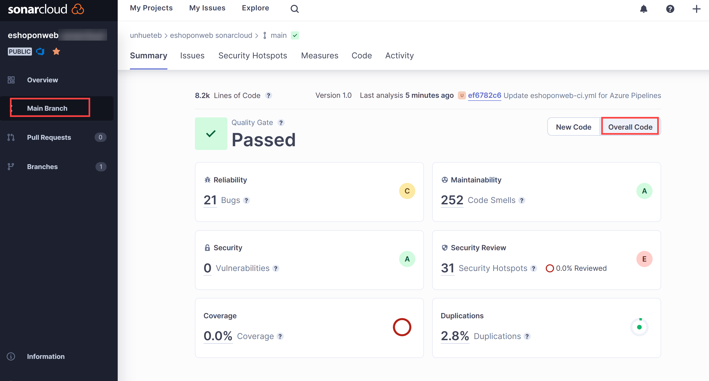
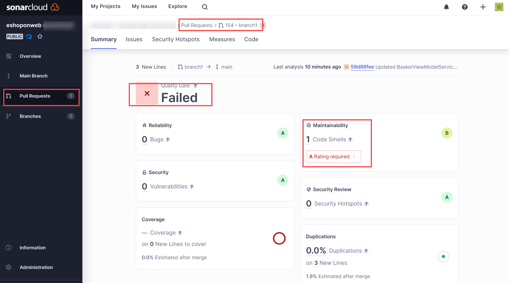
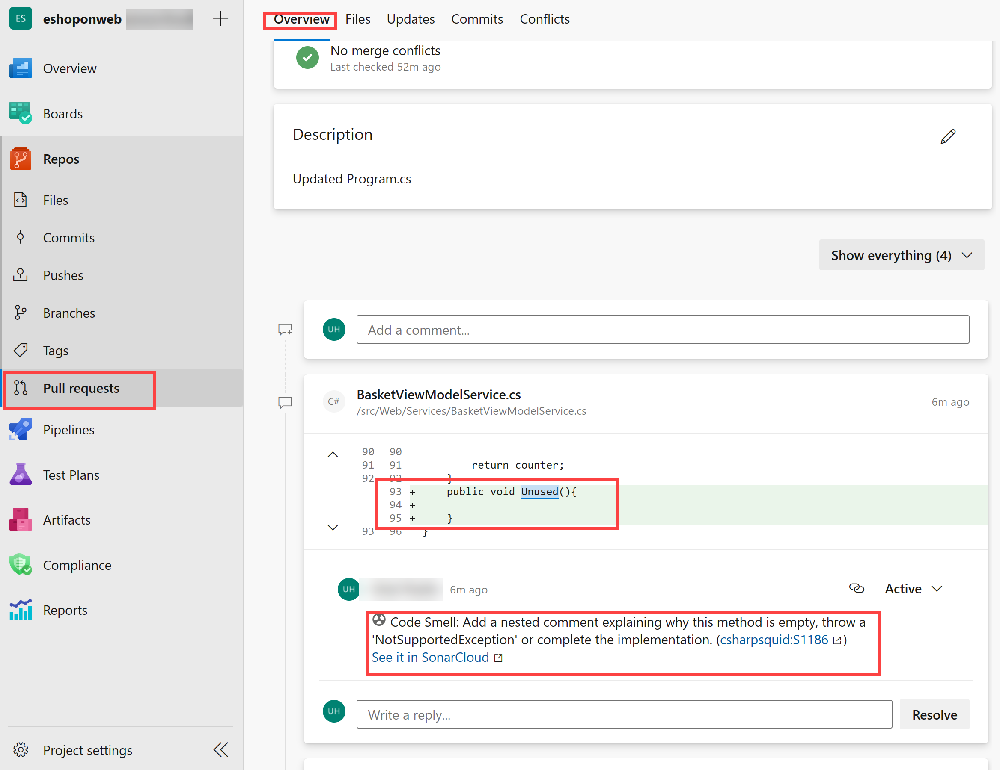

---
lab:
  title: Verwalten technischer Schulden mit Azure DevOps und SonarCloud
  module: 'Module 07: Implement security and validate code bases for compliance'
---

# Verwalten technischer Schulden mit Azure DevOps und SonarCloud

## Lab-Handbuch für Kursteilnehmer

## Labanforderungen

- Für dieses Lab ist **Microsoft Edge** oder ein von [Azure DevOps unterstützter Browser](https://docs.microsoft.com/azure/devops/server/compatibility) erforderlich.

- **Einrichten einer Azure DevOps-Organisation**: Wenn Sie nicht bereits eine Azure DevOps-Organisation haben, die Sie für dieses Lab verwenden können, müssen Sie diese erstellen, indem Sie die unter [Erstellen einer Organisation oder Projektsammlung](https://docs.microsoft.com/azure/devops/organizations/accounts/create-organization) beschriebenen Anweisungen befolgen.

## Übersicht über das Labor

Im Zusammenhang mit Azure DevOps stellt der Begriff **technische Schulden** suboptimale Mittel zum Erreichen taktischer Ziele dar, die sich negativ auf die Fähigkeit auswirken, strategische Ziele in der Softwareentwicklung und -bereitstellung zu erreichen. Technische Schulden wirken sich auf die Produktivität aus, weil Code schwer zu verstehen, fehleranfällig, zeitaufwendig zu ändern und schwer zu überprüfen ist. Ohne ordnungsgemäße Aufsicht und Verwaltung können technische Schulden sich im Laufe der Zeit aufstauen und langfristig erheblich auf die Gesamtqualität der Software und die Produktivität von Entwicklungsteams auswirken.

[SonarCloud](https://sonarcloud.io/){:target="\_blank"} ist ein cloudbasierter Codequalitäts- und Sicherheitsdienst. Zu den wichtigsten Funktionen von SonarCloud gehören:

- Unterstützung für 23 Programmier- und Skriptsprachen einschließlich Java, JS, C#, C++, Objective-C, TypeScript, Python, ABAP, PLSQL und T-SQL.
- Es gibt Tausende von Regeln, um schwer zu findende Fehler und Qualitätsprobleme basierend auf leistungsstarken statischen Codeanalysen nachzuverfolgen.
- Cloudbasierte Integrationen in beliebte CI-Dienste einschließlich Travis, Azure DevOps, BitBucket und AppVeyor.
- Gründliche Codeanalyse für die Untersuchung aller Quelldateien in Branches und Pull Requests, die dazu beiträgt, ein grünes Quality Gate zu erreichen und den Build aufzuwerten.
- Geschwindigkeit und Skalierbarkeit.

In diesem Lab erfahren Sie, wie Sie Azure DevOps in SonarCloud integrieren.

> **Hinweis**: Bevor Sie dieses Lab ausführen, stellen Sie sicher, dass Sie Azure Pipelines ausführen können. Aufgrund der Änderung der öffentlichen Projekte im Februar 2021 muss der Zugang zu Pipelines angefordert werden: <https://devblogs.microsoft.com/devops/change-in-azure-pipelines-grant-for-public-projects/>

## Ziele

In diesem Lab lernen Sie Folgendes:

- Richten Sie ein Azure DevOps-Projekt und einen CI-Build ein, um sie in SonarCloud zu integrieren.
- Analysieren Sie SonarCloud-Berichte.
- Integrieren Sie statische Analysen in den Pull-Request-Prozess von Azure DevOps.

## Geschätzte Zeit: 60 Minuten

## Anweisungen

### Übung 0: Konfigurieren der Voraussetzungen für das Lab

In dieser Übung richten Sie die Voraussetzungen für das Lab ein, das aus einem neuen Azure DevOps-Projekt mit einem Repository basierend auf dem [eShopOnWeb](https://github.com/MicrosoftLearning/eShopOnWeb) besteht.

#### Aufgabe 1: (überspringen, wenn fertig) Erstellen und Konfigurieren des Teamprojekts

In dieser Aufgabe erstellen Sie ein **eShopOnWeb** Azure DevOps-Projekt, das von mehreren Labs verwendet werden soll.

1. Öffnen Sie auf Ihrem Lab-Computer in einem Browserfenster Ihre Azure DevOps-Organisation. Klicken Sie auf **Neues Projekt**. Geben Sie Ihrem Projekt den Namen **eShopOnWeb**, und wählen Sie **Scrum** in der Dropdownliste **Arbeitselementprozess** aus. Klicken Sie auf **Erstellen**.

    

#### Aufgabe 2: (überspringen, wenn erledigt) Importieren von eShopOnWeb Git Repository

Bei dieser Aufgabe importieren Sie das eShopOnWeb Git-Repository, das von mehreren Labs verwendet wird.

1. Öffnen Sie auf Ihrem Lab-Computer in einem Browserfenster Ihre Azure DevOps-Organisation und das zuvor erstellte **eShopOnWeb**-Projekt. Klicken Sie auf **Repos>Dateien**, **Importieren**. Fügen Sie im Fenster **Git Repository importieren** die folgende URL <https://github.com/MicrosoftLearning/eShopOnWeb.git> ein und klicken Sie auf **Importieren**:

    

1. Das Repository ist wie folgt organisiert:
    - Der Ordner **.ado** enthält Azure DevOps-YAML-Pipelines.
    - Der Ordner **.devcontainer** enthält ein Containersetup für die Entwicklung mithilfe von Containern (entweder lokal in VS Code oder über GitHub Codespaces).
    - Der Ordner **infra** enthält eine Bicep&ARM-Infrastruktur als Codevorlagen, die in einigen Labszenarien verwendet werden.
    - Der Ordner **.github** enthält YAML GitHub-Workflow-Definitionen.
    - Der Ordner **src** enthält die .NET 8-Website, die in den Labszenarios verwendet wird.

### Übung 1: Konfigurieren des SonarCloud-Setups

#### Aufgabe 1: Ändern Ihres Azure DevOps-Projekts in Öffentlich

Bei dieser Aufgabe ändern Sie die Sichtbarkeit Ihres Azure DevOps-Projekts in „Öffentlich“, da SonarCloud für öffentliche ADO-Projekte kostenlos ist.

1. Öffnen Sie auf dem Lab-Computer im Webbrowserfenster, in dem das Azure DevOps-Portal angezeigt wird, Ihr **eShopOnWeb**-Projekt und klicken Sie auf **Projekteinstellungen** (untere linke Ecke). Ändern der **Sichtbarkeit** in **Öffentlich**. Wählen Sie **Speichern** aus.


#### Aufgabe 2: Generieren eines persönlichen Azure DevOps-Zugriffstokens

In dieser Aufgabe generieren Sie ein persönliches Azure DevOps-Zugriffstoken, das zur Authentifizierung über die Postman-App verwendet wird, die Sie in der nächsten Aufgabe dieser Übung installieren.

1. Klicken Sie auf dem Lab-Computer im Webbrowserfenster mit dem Azure DevOps-Portal in der oberen rechten Ecke der Azure DevOps-Seite auf das Symbol **Benutzereinstellungen**, klicken Sie im Dropdownmenü  auf **Persönliche Zugriffstoken** im Bereich **Persönliche Zugriffstoken** und klicken Sie auf **+ Neues Token**.

    

1. Klicken Sie im Bereich **Neues persönlichen Zugriffstoken erstellen** auf den Link **Alle Bereiche anzeigen** und geben Sie die folgenden Einstellungen an. Klicken Sie dann auf **Erstellen** (bei alle anderen Standardwerte lassen):

     | Einstellung | Wert |
     | --- | --- |
     | Name | ** Verwalten technischer Schulden mit SonarCloud und Azure DevOps-Lab** |
     | Bereiche | **Benutzerdefiniert** |
     | Umfang | **Code** |
     | Berechtigungen | **Vollständig** |

1. Kopieren Sie im Bereich **Erfolg** den Wert des persönlichen Zugriffstokens in die Zwischenablage.

     > **Hinweis**: Stellen Sie sicher, dass Sie den Wert des Tokens speichern. Sie können ihn nicht mehr abrufen, nachdem Sie diesen Bereich geschlossen haben.

1. Klicken Sie im Bereich **Erfolg** auf **Schließen**.

#### Aufgabe 3: Installieren und Konfigurieren der SonarCloud Azure DevOps-Erweiterung

In dieser Aufgabe installieren und konfigurieren Sie die SonarCloud Azure DevOps-Erweiterung in Ihrem Azure DevOps-Projekt.

1. Starten Sie auf Ihrem Lab-Computer einen Webbrowser, navigieren Sie zur [SonarCloud-Erweiterungsseite](https://marketplace.visualstudio.com/items?itemName=SonarSource.sonarcloud) auf dem Visual Studio Marketplace, klicken Sie auf **Kostenlos herunterladen**, stellen Sie sicher, dass der Name Ihrer Azure DevOps-Organisation in der Dropdownliste **Azure Devops-Organisation auswählen** angezeigt wird und klicken Sie auf **Installieren**.
1. Klicken Sie nach Abschluss der Installation auf **Weiter zur Organisation**. Dadurch wird der Browser zum Azure DevOps-Portal umgeleitet, in dem die Startseite Ihrer Organisation angezeigt wird.

    > **Hinweis**: Wenn Sie nicht über die entsprechenden Berechtigungen zum Installieren einer Erweiterung vom Marketplace verfügen, wird eine Anforderung an die Kontoadministratoren gesendet mit der Aufforderung, die Installation zu genehmigen.

    > **Hinweis**: Die SonarCloud-Erweiterung enthält Buildaufgaben, Buildvorlagen und ein benutzerdefiniertes Dashboard-Widget.

1. Navigieren Sie im Webbrowserfenster zur Startseite von **SonarCloud**[https://sonarcloud.io/](https://sonarcloud.io/).
1. Klicken Sie auf der Startseite von SonarCloud auf **Anmelden**.
1. Klicken Sie auf der Seite **Bei SonarCloud anmelden oder registrieren** auf **Azure DevOps**.
1. Wenn Sie gefragt werden: **Darf diese App auf Ihre Informationen zugreifen**, klicken Sie auf **Ja**. Wenn Sie dazu aufgefordert werden, wählen Sie **Zustimmung im Namen Ihrer Organisation** und dann **Annehmen** aus.

    > **Hinweis**: In SonarCloud weden Sie eine Organisation und darin ein neues Projekt erstellen. Die Organisation und das Projekt, die Sie in SonarCloud einrichten, spiegeln die Organisation und das Projekt, die Sie in Azure DevOps eingerichtet haben.

1. Klicken Sie auf **Organisation aus Azure importieren**.

    

1. Geben Sie auf der Seite **Organisation erstellen** im Textfeld **Name der Azure DevOps-Organisation** den Namen Ihrer Azure DevOps-Organisation ein, in das Textfeld **Persönliches Zugriffstoken** fügen Sie den Wert des Azure DevOps-Tokens ein, das Sie in der vorherigen Aufgabe gespeichert haben, und klicken Sie auf **Weiter**. **Dieses Token wird von Sonarcloud verwendet, um Ihren in Azure DevOps gehosteten Code zu analysieren.**

1. Geben Sie im Abschnitt **Organisationsdetails importieren** im Textfeld **Schlüssel** eine Zeichenfolge ein, die Ihre Sonarcloud-Organisation bezeichnen soll. Geben Sie ihr denselben Namen wie Ihre Azure DevOps-Organisation und klicken Sie auf **Weiter**.

    > **Hinweis**: Der Schlüssel muss innerhalb des SonarCloud-Systems eindeutig sein. Stellen Sie sicher, dass das grüne Häkchen rechts neben dem Textfeld **Schlüssel** angezeigt wird. Dies gibt an, dass der Schlüssel die Eindeutigkeitsvoraussetzungen erfüllt.

1. Wählen Sie im Abschnitt **Plan auswählen** den Plan aus, den Sie für dieses Lab verwenden möchten (beispielsweise **kostenlos**), und klicken Sie auf **Organisation erstellen**.

    > **Hinweis**: Sie haben jetzt die SonarCloud-Organisation erstellt, die Ihre Azure DevOps-Organisation widerspiegelt.

    > **Hinweis**: Als Nächstes erstellen Sie in der neu erstellten Organisation ein SonarCloud-Projekt, das das Azure DevOps-Projekt **SonarExamples** widerspiegelt.

1. Aktivieren Sie auf der Seite **Projekte analysieren – Repositorys auswählen** in der Liste der Azure DevOps-Projekte das Kontrollkästchen neben dem Eintrag **eshoponweb/eshoponweb**, und klicken Sie auf **Einrichten**.
1. Klicken Sie auf der Seite **Analysemethode auswählen** auf die Kachel **Mit Azure DevOps-Pipelines**.

    

    > **Hinweis**: Sie können das Erstellen der Erweiterung überspringen, wenn Sie sie bereits installiert haben.

1. Führen Sie auf der Seite **Analysieren eines Projekts mit Azure Pipelines** unter **Neuen Sonarcloud-Service-Endpunkt** die Schritte aus, die **in Ihrem Azure DevOps-Projekt** erwähnt wurden. Weisen Sie der Dienstverbindung den Namen **SonarSC** zu, **aktivieren** Sie das Kontrollkästchen, um Zugriff auf alle Pipelines zu gewähren und klicken Sie auf **Überprüfen und speichern**.

    

    > **Hinweis**: In diesem Schritt wird definiert, wie Ihre Azure-Pipeline mit Sonarcloud kommuniziert. Sonarcloud gibt Ihnen ein Token, das von Ihren Pipelines für die Kommunikation mit dem Dienst verwendet wird.

1. Navigieren Sie auf Ihrem Lab-Computer vom Azure DevOps-Projekt **eShopOnWeb** in der vertikalen Menüleiste auf der linken Seite zum Abschnitt **Pipelines>Pipelines**, klicken Sie auf **Pipeline erstellen** (oder **Neue Pipeline**).

1. Im Fenster **Wo befindet Sich Ihr Code?** wählen Sie **Azure Repos Git (YAML)** aus. Wählen Sie dann das **eShopOnWeb-Repository** aus.

1. Wählen Sie auf der Registerkarte **Konfigurieren** die Option **Vorhandene Azure Pipelines YAML-Datei** aus. Verzweigung auswählen: **Haupt**, geben Sie den Pfad **/.ado/eshoponweb-sonar-ci.yml** an, und klicken Sie auf **Weiter**. Überprüfen Sie die Pipeline mit den Details, die im nächsten Schritt **(einige Einstellungen sollten ersetzt werden)** erwähnt werden.

1. Zurück auf der Sonarcloud-Website klicken Sie auf der Seite **Analysieren eines Projekts mit Azure Pipelines** im Abschnitt **Azure Pipelines konfigurieren** auf **.NET**. Dadurch wird eine Abfolge von Schritten angezeigt, die zum **Vorbereiten der Analysekonfiguration**, **Ausführen der Codeanalyse** und **Veröffentlichen des Quality Gate-Ergebnisses** erforderlich sind. Sie benötigen diese Anweisungen, um die **Aufgabe Analysekonfiguration vorbereiten in der YAML-Pipeline, die im vorherigen Schritt angegeben wurde, zu ändern.**

1. Nachdem die Pipeline geändert wurde, klicken Sie auf **Ausführen**.

    

1. Möglicherweise müssen Sie die **Sichtbarkeit** des Azure DevOps-Projekts wieder auf **Privat** ändern, damit Agents die Pipeline ausführen können (Projekteinstellungen > Übersicht).

1. In Azure DevOps **Pipelines > Pipelines** und klicken Sie auf die kürzlich erstellte Pipeline, und benennen Sie sie in **eshoponweb-sonar-ci** um.

    

#### Aufgabe 3: Pipeline-Ergebnisse überprüfen

In dieser Aufgabe überprüfen Sie die Pipeline-Ergebnisse.

1. Warten Sie, bis die Ausführung der Pipeline abgeschlossen ist. Überprüfen Sie den Inhalt der Registerkarte **Zusammenfassung**, und klicken Sie dann auf die Registerkartenüberschrift **Erweiterungen**.

    > **Hinweis**: Sie haben keine Quality Gate-Informationen (Keine), da wir sie in Sonarcloud noch nicht eingerichtet haben.

1. Klicken Sie auf der Registerkarte **Erweiterungen** auf **Detaillierter SonarCloud-Bericht**. Dadurch wird automatisch eine neue Browserregisterkarte geöffnet, auf der der Bericht auf Ihrer SonarCloud-Projektseite angezeigt wird.

    > **Hinweis**: Alternativ können Sie zum SonarCloud-Projekt navigieren.

1. Stellen Sie sicher, dass der Bericht die Ergebnisse des Quality Gate nicht enthält, und notieren Sie sich den Grund für das Fehlen.

    > **Hinweis:** Um das Quality-Gate-Ergebnis sehen zu können, müssen wir nach dem Ausführen des ersten Berichts **Neue Codedefinition** festlegen. Auf diese Weise werden nachfolgende Pipelineläufe Quality Gate-Ergebnisse enthalten. **Standardmäßig wird Quality Gate sicherstellen, dass es keine neuen Sicherheitsrisiken/Fehler im Code gibt, wobei zuvor vorhandene ignoriert werden. Sie können eigene benutzerdefinierte Quality Gates erstellen.**

1. Klicken Sie auf **Neue Codedefinition festlegen**, und wählen Sie **Vorherige Version** aus.

    

1. Wechseln Sie zum Webbrowser im **Azure DevOps-Portal** mit der neuesten Buildausführung, klicken Sie auf **Neu ausführen** und klicken Sie im Bereich **Pipeline ausführen** auf **Ausführen**.
1. Überprüfen Sie im Bereich „Buildausführung“ den Inhalt der Registerkarte **Zusammenfassung** und klicken Sie dann auf die Registerkartenüberschrift **Erweiterungen**.
1. Klicken Sie auf der Registerkarte **Erweiterungen** auf **Detaillierter SonarCloud-Bericht**. Dadurch wird automatisch eine neue Browserregisterkarte geöffnet, auf der der Bericht auf Ihrer SonarCloud-Projektseite angezeigt wird.
1. Überprüfen Sie, ob der Bericht und die Registerkarte Azure DevOps-**Erweiterung** jetzt das **Quality Gate-Ergebnis enthält**.

    

### Übung 2: Analysieren von SonarCloud-Berichten

In dieser Übung analysieren Sie SonarCloud-Berichte.

#### Aufgabe 1: SonarCloud-Berichte analysieren

In dieser Aufgabe analysieren Sie SonarCloud-Berichte.

1. Auf der Registerkarte **Übersicht** des SonarCloud-Projekts sehen wir eine Zusammenfassung für den Bericht über die **Mainbranch-Entwicklung**. Wenn Sie auf das Symbol **Mainbranch** (linke Spalte) klicken und **Gesamtcode** auswählen, wird ein detaillierterer Bericht angezeigt.

    

    > **Hinweis**: Die Seite enthält Metriken wie **Code Smells,**** Abdeckung**, **Duplizierung** und **Größe** (Codezeilen). In der folgenden Tabelle werden die einzelnen Begriffe kurz erläutert.

    | Begriffe | Beschreibung |
    | --- | --- |
    | **Fehler** | Ein Problem, das einen Fehler im Code darstellt. Wenn der Fehler noch nicht aufgetreten ist, wird er noch auftreten, und zwar wahrscheinlich zum denkbar ungünstigsten Zeitpunkt. Dies muss behoben werden. |
    | **Sicherheitsrisiken** | Ein sicherheitsbezogenes Problem, das eine potenzielle Hintertür für Angreifer darstellt. |
    | **Code Smells** | Ein Problem im Code, das die Wartbarkeit betrifft. Die Dinge so zu belassen, wie sie sind, bedeutet im besten Fall, dass es für die für die Wartung Verantwortlichen schwieriger als nötig ist, nachträgliche Änderungen vorzunehmen. Im schlimmsten Fall werden sie durch den Zustand des Codes so verwirrt sein, dass sie zusätzliche Fehler verursachen, wenn sie Änderungen vornehmen. |
    | **Coverage** | Ein Hinweis auf den Prozentsatz des Codes, der von Tests wie Komponententests überprüft wird. Um sich effektiv vor Fehlern zu schützen, sollten Sie die Tests für den Großteil Ihres Codes ausführen oder abdecken. |
    | **Duplizierungen** | Die Markierung „Duplizierungen“ zeigt, welche Teile des Quellcodes dupliziert werden. |
    | **Sicherheits-Hotspots** | Sicherheitssensibler Code, der eine manuelle Überprüfung erfordert, um festzustellen, ob ein Sicherheitsrisiko besteht oder nicht. |

1. Klicken Sie auf die Zahl mit der Anzahl der **Fehler**. Dadurch wird automatisch der Inhalt der Registerkarte **Probleme** angezeigt.
1. Klicken Sie auf der rechten Seite der Registerkarte **Probleme**, um die Fehler zu öffnen. Lesen Sie die Beschreibung und Informationen, die zum Analysieren und Beheben des Fehlers angegeben werden.

1. Zeigen Sie mit dem Mauszeiger über vertikale rote Linien zwischen dem Code und den Zeilennummern, um Lücken in der Codeabdeckung zu identifizieren.

    > **Hinweis**: Unser Beispielprojekt ist sehr klein und hat keine historischen Daten. Es gibt jedoch Tausende öffentlicher [Projekte auf SonarCloud](https://sonarcloud.io/explore/projects), die interessantere und realistischere Ergebnisse enthalten.

### Übung 3: Implementieren der Azure DevOps-Pull-Request-Integration in SonarCloud.

In dieser Übung richten Sie die Pull-Request-Integration zwischen Azure DevOps und SonarCloud ein.

> **Hinweis**: Zum Konfigurieren der SonarCloud-Analyse zur Analyse von Code, der in einem Azure DevOps-Pull Request enthalten ist, müssen Sie die folgenden Aufgaben ausführen:

- Fügen Sie einem SonarCloud-Projekt ein persönliches Azure DevOps-Zugriffstoken hinzu, das den Zugriff auf Pull Requests autorisiert (bereits in dieser Übung erstellt).
- Konfigurieren einer Azure DevOps-Branchrichtlinie, die einen durch einen Pull Request ausgelösten Build steuert.

#### Aufgabe 1: Konfigurieren der Integration von Pull Request in SonarCloud

In dieser Aufgabe konfigurieren Sie die Pull Request-Integration in SonarCloud, indem Sie Ihrem SonarCloud-Projekt ein persönliches Azure DevOps-Zugriffstoken zuweisen.

1. Wechseln Sie zum Webbrowserfenster, in dem das **eShopOnWeb**-Projekt in **SonarCloud** angezeigt wird.
1. Klicken Sie auf der Dashboardseite des Projekts auf das Symbol für die Registerkarte **Verwaltung** und klicken Sie im Dropdownmenü  auf **Allgemeine Einstellungen**.
1. Klicken Sie auf der Seite **Allgemeine Einstellungen** auf **Pull Requests**.
1. Wählen Sie im Abschnitt **Allgemein** der Einstellungen für **Pull Requests** in der Dropdownliste **Anbieter** die Option **Azure DevOps Services** aus und klicken Sie auf **Speichern**.
1. Fügen Sie im Abschnitt **Integration mit Azure DevOps Services** der Einstellungen für **Pull Requests** im Textfeld **Persönliche Zugriffstoken** das zuvor generierte persönliche Azure DevOps-Zugriffstoken ein, und klicken Sie auf **Speichern**.

    

#### Aufgabe 2: Konfigurieren einer Branchrichtlinie für die Integration in SonarCloud

In dieser Aufgabe konfigurieren Sie eine Azure DevOps-Branch-Richtlinie für die Integration in SonarCloud.

1. Wechseln Sie zum Webbrowserfenster, in dem das **eShopOnWeb**-Project im **Azure DevOps-Portal** angezeigt wird.
1. Klicken Sie in der vertikalen Menüleiste ganz links im Azure DevOps-Portal auf **Repos** und klicken Sie im Abschnitt **Repos** auf **Branches**.
1. Zeigen Sie im Bereich **Branches** in der Liste der Branches mit dem Mauszeiger auf den rechten Rand des **Main**-Brancheintrags, um die vertikalen Auslassungspunkte anzuzeigen, die das Menü **Weitere Optionen** kennzeichnen, klicken Sie darauf, und klicken Sie im Popupmenü  auf **Branch-Richtlinien**.
1. Klicken Sie im Bereich **main** rechts neben dem Abschnitt **Buildvaldierung** auf **+**.
1. Wählen Sie im Bereich **Build-Richtlinie hinzufügen** in der Dropdownliste **Pipeline erstellen** die Pipeline aus, die Sie zuvor in dieser Übung erstellt haben, geben Sie im Textfeld **Anzeigename** den Text **SonarCloud-Analyse** ein, und klicken Sie auf **Speichern**.

    > **Hinweis**: Azure DevOps ist jetzt so konfiguriert, dass eine SonarCloud-Analyse ausgelöst wird, wenn ein Pull Request für den **main**-Branch erstellt wird.

#### Aufgabe 4: Überprüfen der Integration von Pull Requests

In dieser Aufgabe überprüfen Sie die Pull Request-Integration zwischen Azure DevOps und SonarCloud, indem Sie eine Pull-Anforderung erstellen und das resultierende Ergebnis überprüfen.

> **Hinweis**: Sie nehmen eine Änderung an einer Datei im Repository vor und erstellen eine Anforderung zum Auslösen der SonarCloud-Analyse.

1. Klicken Sie im Azure DevOps-Portal in der vertikalen Menüleiste auf der linken Seite auf **Repos**. Dadurch wird der Bereich **Dateien** angezeigt.
1. Navigieren Sie im zentralen Bereich in der Ordnerhierarchie zur Datei **Program.cs** im Ordner **src/Web/Services/BasketViewModelService.cs** und klicken Sie auf **Bearbeiten**.
1. Fügen Sie im Bereich **BasketViewModelService.cs** die folgende leere Methode direkt vor dem letzten "}" in den Code ein:

    ```csharp
    public void Unused(){

    }
    ```

1. Klicken Sie im Bereich **Program.cs** auf **Commit**.
1. Geben Sie im Bereich **Commit** in das Textfeld **Verzweigungsname** **branch1** ein, aktivieren Sie das Kontrollkästchen **Pull Request erstellen** und klicken Sie auf **Commit**.

    

1. Wählen Sie im Bereich **Neuer Pull Request** die Option **Erstellen**.
1. Überwachen Sie auf der Registerkarte **Übersicht** des Bereichs **Updated Program.cs** den Fortschritt des Build-Prozesses bis zu seinem Abschluss.
1. Die Pipeline ist erfolgreich, aber eine optionale Überprüfung schlägt fehl.
1. Sonarcloud versieht Ihre PR auch mit Kommentaren zu Ihren jüngsten, nicht empfohlenen Praktiken. Sie können auch den vollständigen Bericht in Sonarcloud auf Details überprüfen.

    

#### Aufgabe 4: Blockieren von Pull Requests als Reaktion auf fehlerhafte Codequalitätsprüfungen

In dieser Aufgabe konfigurieren Sie die Blockierung von Pull Requests als Reaktion auf fehlerhafte Codequalitätsprüfungen.

> **Hinweis**: Zu diesem Zeitpunkt ist es immer noch möglich, den Pull Request abzuschließen und die entsprechenden Änderungen zu committen, auch wenn die Code-Qualitätsprüfung fehlschlägt. Sie ändern die Azure DevOps-Konfiguration, um den Commit zu blockieren, wenn die entsprechenden Codequalitätsprüfungen nicht bestanden werden.

1. Klicken Sie im Azure DevOps-Portal in der unteren linken Ecke auf **Projekteinstellungen**.
1. Klicken Sie im vertikalen Menü **Projekteinstellungen** im Abschnitt **Repos** auf **Repositories**.
1. Klicken Sie im Bereich **Alle Repositories** auf **eShopOnWeb**.
1. Klicken Sie im Bereich **eShopOnWeb** auf die Registerkartenüberschrift **Richtlinien**.
1. Blättern Sie in der Liste der **Richtlinien** nach unten zur Liste der Verzweigungen und klicken Sie auf den Eintrag, der die Verzweigung**main** darstellt.
1. Scrollen Sie im Bereich **main** nach unten zum Abschnitt **Statusprüfungen** und klicken Sie auf **+**.
1. Wählen Sie im Bereich **Statusrichtlinie hinzufügen** in der Dropdown-Liste **zu prüfender Status** den Eintrag **SonarCloud/quality gate** aus, stellen Sie sicher, dass die Option **Richtlinienanforderung** auf **Erforderlich** gesetzt ist, und klicken Sie auf **Speichern**

    > **Hinweis**: Zu diesem Zeitpunkt sind Benutzer **nicht in der Lage, Pull Requests zusammenzuführen, bis die Code-Qualitätsprüfung erfolgreich ist**. Dies wiederum setzt voraus, dass alle von SonarCloud identifizierten Probleme entweder behoben oder als **bestätigt** oder **gelöst** im entsprechenden SonarCloud-Projekt markiert wurden.

## Überprüfung

In dieser Übung haben Sie gelernt, wie Sie Azure DevOps Services mit SonarCloud integrieren können.
