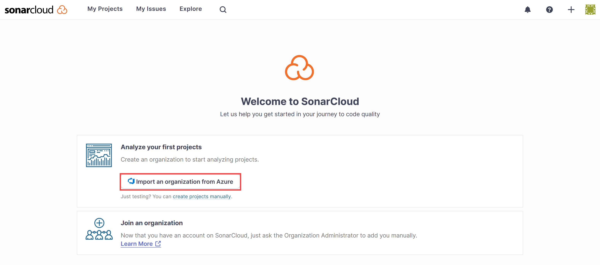
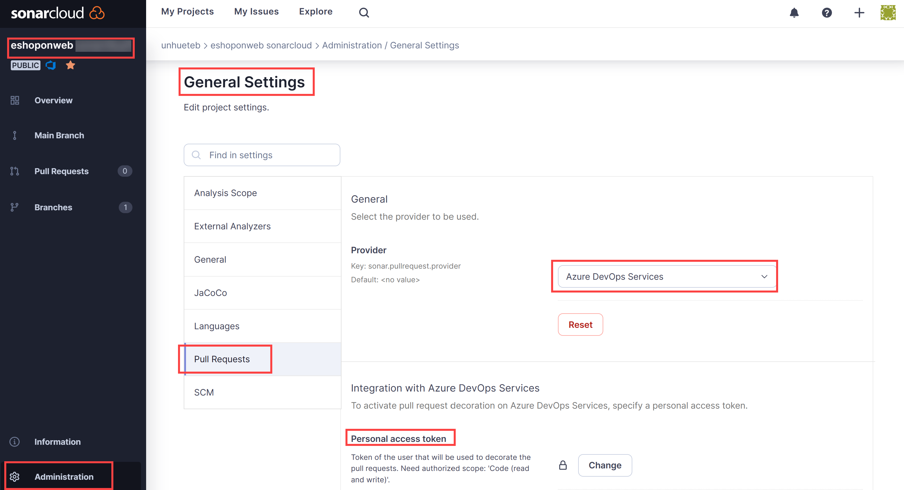

---
lab:
  title: 'Lab: Verwalten technischer Schulden mit Azure DevOps und SonarCloud'
  module: 'Module 07: Implement security and validate code bases for compliance'
---

# Lab: Verwalten technischer Schulden mit Azure DevOps und SonarCloud

## Lab-Handbuch für Kursteilnehmer

## Labanforderungen

- Für dieses Lab ist **Microsoft Edge** oder ein [von Azure DevOps unterstützter Browser](https://docs.microsoft.com/azure/devops/server/compatibility) erforderlich.

- **Einrichten einer Azure DevOps-Organisation**: Wenn Sie nicht bereits eine Azure DevOps-Organisation haben, die Sie für dieses Lab verwenden können, müssen Sie diese erstellen, indem Sie die unter [Erstellen einer Organisation oder Projektsammlung](https://docs.microsoft.com/azure/devops/organizations/accounts/create-organization) beschriebenen Anweisungen befolgen.

## Übersicht über das Labor

Im Zusammenhang mit Azure DevOps stellt der Begriff **technische Schulden** suboptimale Mittel zum Erreichen taktischer Ziele dar, die sich negativ auf die Fähigkeit auswirken, strategische Ziele in der Softwareentwicklung und -bereitstellung zu erreichen. Technische Schulden wirken sich auf die Produktivität aus, weil Code schwer zu verstehen, fehleranfällig, zeitaufwendig zu ändern und schwer zu überprüfen ist. Ohne ordnungsgemäße Aufsicht und Verwaltung können technische Schulden sich im Laufe der Zeit aufstauen und langfristig erheblich auf die Gesamtqualität der Software und die Produktivität von Entwicklungsteams auswirken.

SonarCloud ist ein cloudbasierter Codequalitäts- und Sicherheitsdienst. Zu den wichtigsten Funktionen von SonarCloud gehören:

- Unterstützung für 23 Programmier- und Skriptsprachen einschließlich Java, JS, C#, C++, Objective-C, TypeScript, Python, ABAP, PLSQL und T-SQL.
- Es gibt Tausende von Regeln, um schwer zu findende Fehler und Qualitätsprobleme basierend auf leistungsstarken statischen Codeanalysen nachzuverfolgen.
- Cloudbasierte Integrationen in beliebte CI-Dienste einschließlich Travis, Azure DevOps, BitBucket und AppVeyor.
- Gründliche Codeanalyse für die Untersuchung aller Quelldateien in Branches und Pull Requests, die dazu beiträgt, ein grünes Quality Gate zu erreichen und den Build aufzuwerten.
- Geschwindigkeit und Skalierbarkeit.

In diesem Lab erfahren Sie, wie Sie Azure DevOps in SonarCloud integrieren.

> Bevor Sie dieses Lab ausführen, stellen Sie sicher, dass Sie Azure Pipelines ausführen können. Aufgrund der Änderung der öffentlichen Projekte im Februar 2021 muss der Zugang zu Pipelines angefordert werden: <https://devblogs.microsoft.com/devops/change-in-azure-pipelines-grant-for-public-projects/>

## Ziele

In diesem Lab lernen Sie Folgendes:

- Richten Sie ein Azure DevOps-Projekt und einen CI-Build ein, um sie in SonarCloud zu integrieren.
- Analysieren Sie SonarCloud-Berichte.
- Integrieren Sie statische Analysen in den Pull-Request-Prozess von Azure DevOps.

## Geschätzte Zeit: 60 Minuten

## Anweisungen

### Übung 0: Konfigurieren der Voraussetzungen für das Lab.

In dieser Übung richten Sie die Voraussetzungen für das Labor ein, das aus einem neuen Azure DevOps-Projekt mit einem Repository basierend auf dem [eShopOnWeb](https://github.com/MicrosoftLearning/eShopOnWeb) besteht.

#### Aufgabe 1: (überspringen, wenn fertig) Erstellen und Konfigurieren des Teamprojekts

In dieser Aufgabe erstellen Sie ein **eShopOnWeb** Azure DevOps-Projekt, das von mehreren Laboren verwendet werden soll.

1. Öffnen Sie auf Ihrem Laborcomputer in einem Browserfenster Ihre Azure DevOps-Organisation. Klicken auf „Neues Projekt“ Geben Sie Ihrem Projekt den Namen **"eShopOnWeb** ", und wählen Sie **"Scrum** " in der **Dropdownliste "Arbeitsaufgabe"** aus. Klicken Sie auf **Erstellen**.

    

#### Aufgabe 2: (überspringen, wenn erledigt) Importieren von eShopOnWeb Git Repository

Bei dieser Aufgabe importieren Sie das eShopOnWeb Git-Repository, das von mehreren Labs verwendet wird.

1. Öffnen Sie auf Ihrem Laborcomputer in einem Browserfenster Ihre Azure DevOps-Organisation und das zuvor erstellte **eShopOnWeb-Projekt** . Klicken Sie auf **Repos>Files** , **Import**. Fügen Sie im **Fenster "Git Repository** importieren" die folgende URL https://github.com/MicrosoftLearning/eShopOnWeb.git  ein, und klicken Sie auf " **Importieren**":

    

2. Das Repository ist wie folgt organisiert:
    - Der Ordner „.ado“ enthält Azure DevOps-YAML-Pipelines.
    - Der Ordner „.devcontainer“ enthält ein Containersetup für die Entwicklung mithilfe von Containern (entweder lokal in VS Code oder über GitHub Codespaces).
    - **Azure-Ordner** enthält Bicep&ARM-Infrastruktur als Codevorlagen, die in einigen Lab-Szenarien verwendet werden.
    - **GITHUB-Ordnercontainer-YAML-GitHub-Workflowdefinitionen** .
    - Der Ordner „src“ enthält die .NET 6-Website, die in den Labszenarien verwendet wird.

### Übung 1: Konfigurieren des Sonarcloud-Setups

#### Aufgabe 1: Ändern Ihres Azure DevOps-Projekts in "Öffentlich"

Bei dieser Aufgabe ändern Sie die Sichtbarkeit Ihres Azure DevOps-Projekts auf öffentliche, da Sonarcloud für öffentliche ADO-Projekte kostenlos ist.

1. Öffnen Sie auf dem Laborcomputer im Webbrowserfenster, in dem das Azure DevOps-Portal angezeigt wird, Ihr **eShopOnWeb-Projekt**, und klicken Sie auf **Project Einstellungen** (untere linke Ecke). Ändern der **Sichtbarkeit** in **"Öffentlich**". Klicken Sie unten auf der Seite auf **Speichern**.


#### Aufgabe 2: Generieren eines persönlichen Azure DevOps-Zugriffstokens

In dieser Aufgabe generieren Sie ein persönliches Azure DevOps-Zugriffstoken, das zur Authentifizierung über die Postman-App verwendet wird, die Sie in der nächsten Aufgabe dieser Übung installieren.

1. Klicken Sie auf dem Laborcomputer im Webbrowserfenster mit dem Azure DevOps-Portal in der oberen rechten Ecke der Azure DevOps-Seite auf das Symbol "Benutzereinstellungen **", klicken Sie im Dropdownmenü auf "Persönliche Zugriffstoken"**, klicken Sie **im **Bereich "Persönliche Zugriffstoken" auf "Persönliche Zugriffstoken**", und klicken Sie auf **+Neues Token**.**

    

2. Klicken Sie im **Bereich "Neuen persönlichen Zugriffstoken** erstellen" auf den **Link "Alle Bereiche anzeigen", und geben Sie die folgenden Einstellungen an, und klicken Sie auf "**Erstellen**" (alle anderen Personen mit ihren Standardwerten**):

     | Einstellung | Wert |
     | --- | --- |
     | Name | Lab: Verwalten technischer Schulden mit Azure DevOps und SonarCloud |
     | Bereiche | Benutzerdefiniert |
     | `Scope` | **Code** |
     | Berechtigungen | **Vollständig** |

3. Kopieren Sie im **Bereich "Erfolg** " den Wert des persönlichen Zugriffstokens in die Zwischenablage.

     > **Hinweis**: Stellen Sie sicher, dass Sie den Wert des Tokens aufzeichnen. Nachdem Sie diesen Bereich geschlossen haben, können Sie ihn nicht mehr abrufen.

4. Klicken Sie im **Bereich "Erfolg** " auf " **Schließen"**.

#### Aufgabe 3: Installieren und Konfigurieren der SonarCloud Azure DevOps-Erweiterung

In dieser Aufgabe installieren und konfigurieren Sie die SonarCloud Azure DevOps-Erweiterung in Ihrem Azure DevOps-Projekt.

1. Starten Sie auf Ihrem Laborcomputer einen Webbrowser, navigieren Sie zur [SonarCloud-Erweiterungsseite](https://marketplace.visualstudio.com/items?itemName=SonarSource.sonarcloud) auf dem Visual Studio Marketplace, klicken Sie auf " **Kostenlos** abrufen", stellen Sie sicher, dass der Name Ihrer Azure DevOps-Organisation in der **Dropdownliste "Auswählen einer Azure Devops-Organisation** " angezeigt wird, und klicken Sie auf " **Installieren"**.
2. Klicken Sie nach Abschluss der Installation auf **"Weiter zur Organisation**". Dadurch wird der Browser an das Azure DevOps-Portal umgeleitet, in dem die Startseite Ihrer Organisation angezeigt wird.

    > **Hinweis**: Wenn Sie nicht über die entsprechenden Berechtigungen zum Installieren einer Erweiterung vom Marketplace verfügen, wird eine Anforderung an den Kontoadministrator gesendet, um sie aufzufordern, die Installation zu genehmigen.

    > **Hinweis**: Die SonarCloud-Erweiterung enthält Buildaufgaben, Buildvorlagen und ein benutzerdefiniertes Dashboard-Widget.

3. Navigieren Sie im Webbrowserfenster zur Startseite von **SonarCloud[**](https://sonarcloud.io/)https://sonarcloud.io/.
4. Klicken Sie auf der Startseite von SonarCloud auf **"Anmelden"**.
5. Klicken Sie auf der **Option "Anmelden" oder "Bei SonarCloud** anmelden" auf **"Azure DevOps** ".
6. Wenn Sie gefragt werden, ob diese App auf Ihre Informationen zugreifen darf **?**, klicken Sie auf **"Ja**". Wählen Sie die Option **Zustimmung im Namen Ihrer Organisation** und dann **Annehmen** aus.

    > **Hinweis**: In SonarCloud erstellen Sie eine Organisation und darin ein neues Projekt. Die Organisation und das Projekt, die Sie in SonarCloud eingerichtet haben, Spiegel die Organisation und das Projekt, die Sie in Azure DevOps eingerichtet haben.

7. Klicken Sie auf " **Organisation aus Azure** importieren".

    

8. Geben Sie auf der **Seite "Organisation erstellen** " im **Textfeld "Name** der Azure DevOps-Organisation" den Namen Ihrer Azure DevOps-Organisation in das **Textfeld "Persönliches Zugriffstoken" ein, fügen Sie den Wert des Azure DevOps-Tokens** ein, das Sie in der vorherigen Aufgabe aufgezeichnet haben, und klicken Sie auf " **Weiter"**. **Dieses Token wird von Sonarcloud verwendet, um Ihren in Azure DevOps gehosteten Code zu analysieren.**

9. **Geben Sie im Abschnitt "Organisationsdetails** importieren" im **Textfeld "Schlüssel**" eine Zeichenfolge mit Zeichen ein, die Ihre Sonarcloud-Organisation festlegen soll, geben Sie ihm denselben Namen wie Ihre Azure DevOps-Organisation, und klicken Sie auf "**Weiter"**.

    > **Hinweis**: Der Schlüssel muss innerhalb des SonarCloud-Systems eindeutig sein. Stellen Sie sicher, dass das grüne Häkchen rechts neben dem **Textfeld "Schlüssel** " angezeigt wird. Dies gibt an, dass der Schlüssel die Eindeutigkeitsvoraussetzungen erfüllt.

10. Wählen Sie im **Abschnitt "Plan** auswählen" den Plan aus, den Sie für diese Übung verwenden möchten (**kostenlos** vorgeschlagen), und klicken Sie auf " **Organisation** erstellen".

    > **Hinweis**: Sie haben jetzt die SonarCloud-Organisation erstellt, die Ihre Azure DevOps-Organisation Spiegel.

    > **Hinweis**: Als Nächstes erstellen Sie in der neu erstellten Organisation ein SonarCloud-Projekt, das das Azure DevOps-Projekt **SonarExamples** Spiegel.

11. Aktivieren Sie auf der **Seite "Projekte analysieren – Repositorys** auswählen" in der Liste der Azure DevOps-Projekte das Kontrollkästchen neben dem Eintrag **eshoponweb / eshoponweb ** und klicken Sie auf **"Einrichten**".
12. Klicken Sie auf der Seite "Analysemethode** auswählen" auf **die **Kachel "Mit Azure DevOps-Pipelines**".

    

    > **Hinweis**: Sie können die Erstellung der Erweiterung überspringen, wenn Sie sie bereits installiert haben.

13. Führen Sie auf der **Seite "Analysieren eines Projekts mit Azure Pipelines**" im **Add a new Sonarcloud Service Endpoint** die Schritte aus, die in Ihrem Azure DevOps-Projekt** Erwähnung wurden**, weisen Sie der Dienstverbindung den Namen **SonarSC** zu, **aktivieren Sie** das Kontrollkästchen, um Zugriff auf alle Pipelines zu gewähren und auf "Überprüfen und speichern **" zu klicken**.

    

    > **Hinweis**: In diesem Schritt wird definiert, wie Ihre Azure-Pipeline mit Sonarcloud kommuniziert. Sonarcloud gibt Ihnen ein Token, das von Ihren Pipelines für die Kommunikation mit dem Dienst verwendet wird.

14. Navigieren Sie auf Ihrem Laborcomputer aus dem **eShopOnWeb** Azure DevOps-Projekt in der vertikalen Menüleiste auf der linken Seite zum **Abschnitt "Pipelines>Pipelines**", klicken Sie auf "Pipeline** erstellen" (oder **"** Neue Pipeline").**

15. Wählen Sie **im **Fenster "Wo befindet Sich Ihr Code?** " Azure Repos Git (YAML)** aus, und wählen Sie das **eShopOnWeb-Repository** aus.

16. Wählen Sie auf der Registerkarte **Konfigurieren** die Option aus, um eine **Vorhandene Azure Pipelines YAML-Datei** zu verwenden. Geben Sie den folgenden Pfad **/.ado/eshoponweb-sonar-ci.yml** an, und klicken Sie auf **'Weiter'**. Überprüfen Sie die Pipeline mit Details Erwähnung im nächsten Schritt **(einige Einstellungen sollten ersetzt werden)**

17. Zurück auf der Sonarcloud-Website klicken Sie auf der **Seite "Analysieren eines Projekts mit Azure Pipelines** " im **Abschnitt "Azure Pipelines** konfigurieren" auf **.NET**. Dadurch wird eine Abfolge von Schritten angezeigt, die zum **Vorbereiten der Analysekonfiguration**, **zum Ausführen der Codeanalyse** und **zum Veröffentlichen des Quality Gate-Ergebnisses** erforderlich sind. Sie benötigen diese Anweisungen, um **die Aufgabe "Analysekonfiguration vorbereiten" in der yaML-Pipeline zu ändern, die im vorherigen Schritt** angegeben wurde.

18. Nachdem die Pipeline geändert wurde, klicken Sie auf **"Ausführen"**.

    

19. Möglicherweise müssen Sie die Sichtbarkeit des Azure DevOps-Projekts **** wieder in **"Privat**" ändern, damit Agents die Pipeline ausführen können (Project Einstellungen > Overview)

20. In Azure DevOps  **Pipelines > Pipelines** und klicken Sie auf die kürzlich erstellte Pipeline, und benennen Sie sie in **eshoponweb-sonar-ci** um.

    

#### Aufgabe 3: Überprüfen der Pipelineergebnisse

In dieser Aufgabe überprüfen Sie die Pipelineergebnisse.

1. Warten Sie, bis die Pipelineausführung abgeschlossen ist, überprüfen Sie den Inhalt der **Registerkarte "Zusammenfassung** ", und klicken Sie dann auf die **Registerkartenüberschrift "Erweiterungen** ".

    > **Hinweis**: Sie haben keine Quality Gate-Informationen (Keine), da wir es noch nicht in Sonarcloud eingerichtet haben.

2. Klicken Sie auf der **Registerkarte "Erweiterungen** " auf den **Bericht "Detailliertes SonarCloud"**. Dadurch wird automatisch eine neue Browserregisterkarte geöffnet, auf der der Bericht auf Ihrer SonarCloud-Projektseite angezeigt wird.

    > **Hinweis**: Alternativ können Sie zu Dem SonarCloud-Projekt navigieren.

3. Stellen Sie sicher, dass der Bericht die Ergebnisse des Quality Gate nicht enthält, und notieren Sie sich den Grund für die Abwesenheit.

    > **Hinweis**: Um das Qualitätsgate-Ergebnis sehen zu können, müssen wir nach der Ausführung des ersten Berichts neue Codedefinition** festlegen**. Auf diese Weise umfassen nachfolgende Pipelineläufe Quality Gate-Ergebnisse. **Das Standardqualitätsgate wird sicherstellen, dass es keine neue Sicherheitsanfälligkeit/einen neuen Fehler im Code gibt, wobei zuvor vorhandene ignoriert werden. Sie können eigene benutzerdefinierte Qualitätstore erstellen.**

4. Klicken Sie auf **"Neue Codedefinition** festlegen", und wählen Sie "Vorherige Version **" aus**.

    

5. Wechseln Sie zum Webbrowser im **Azure DevOps-Portal** mit der neuesten Buildausführung, klicken Sie auf **"Neu** ausführen", und klicken Sie im **Pipelinebereich "Ausführen" auf **"Ausführen**"**.
6. Überprüfen Sie im Bereich "Buildausführung" den Inhalt der **Registerkarte "Zusammenfassung** ", und klicken Sie dann auf die **Registerkartenüberschrift "Erweiterungen** ".
7. Klicken Sie auf der **Registerkarte "Erweiterungen** " auf den **Bericht "Detailliertes SonarCloud"**. Dadurch wird automatisch eine neue Browserregisterkarte geöffnet, auf der der Bericht auf Ihrer SonarCloud-Projektseite angezeigt wird.
8. Überprüfen Sie, ob der Bericht und die Azure DevOps-Erweiterungsregisterkarte **** jetzt **das Quality Gate-Ergebnis** enthält.

    

### Übung 2: Analysieren von SonarCloud-Berichten.

In dieser Übung analysieren Sie SonarCloud-Berichte.

#### Analysieren Sie SonarCloud-Berichte.

In dieser Aufgabe analysieren Sie SonarCloud-Berichte.

1. Auf der **Registerkarte "Übersicht"** des SonarCloud-Projekts sehen wir eine Zusammenfassung für den Bericht über die **Standard Branch Evolution**. Wenn Sie auf das Hauptzweigsymbol** (linke Spalte) klicken **und "Gesamtcode **" auswählen**, wird ein detaillierterer Bericht angezeigt.

    

    > **Hinweis**: Die Seite enthält Metriken wie **Code Geruch,**** Abdeckung**, **Duplizierung** und **Größe** (Codezeilen). In der folgenden Tabelle werden die einzelnen Begriffe kurz erläutert.

    | Begriffe | Beschreibung |
    | --- | --- |
    | **Fehler** | Ein Problem, das einen Fehler im Code darstellt. Wenn dies noch nicht gebrochen ist, wird es wahrscheinlich zum schlimmsten Zeitpunkt kommen. Dies muss behoben werden. |
    | **Sicherheitsrisiken** | Ein sicherheitsbezogenes Problem, das eine potenzielle Hintertür für Angreifer darstellt |
    | Code Smells | Ein Standard haltbarkeitsbezogenes Problem im Code. Dies bedeutet, dass Standard tainer am besten eine schwierigere Zeit haben, als sie bei nachfolgenden Änderungen sollten. Im schlimmsten Fall werden sie durch den Status des Codes so verwirrt sein, dass sie zusätzliche Fehler verursachen, wenn sie Änderungen vornehmen. |
    | **Coverage** | Ein Hinweis auf den Prozentsatz des Codes, der von Tests wie Komponententests überprüft wird. Um sich effektiv vor Fehlern zu schützen, sollten Sie die Tests für den Großteil Ihres Codes ausführen. |
    | Duplications | Die Duplizierung zeigt, welche Teile des Quellcodes dupliziert werden |
    | **Sicherheits-Hotspots** | Sicherheitsrelevanter Code, der eine manuelle Überprüfung erfordert, um zu beurteilen, ob eine Sicherheitsanfälligkeit vorhanden ist oder nicht. |

2. Klicken Sie auf die Anzahl der **Fehler**. Dadurch wird automatisch der Inhalt der **Registerkarte "Probleme** " angezeigt.
3. Klicken Sie auf der rechten Seite der **Registerkarte "Probleme** ", um die Fehler zu öffnen. Lesen Sie die Beschreibung und Informationen, die zum Analysieren und Beheben des Fehlers angegeben werden.

4. Zeigen Sie mit dem Mauszeiger über vertikale rote Linien zwischen dem Code und den Zeilennummern, um Lücken in der Codeabdeckung zu identifizieren.

    > **Hinweis**: Unser Beispielprojekt ist sehr klein und hat keine historischen Daten. Es gibt jedoch Tausende öffentlicher [Projekte auf SonarCloud](https://sonarcloud.io/explore/projects) , die interessantere und realistischere Ergebnisse haben.

### Übung 3: Implementieren der Azure DevOps-Pull-Request-Integration in SonarCloud.

In dieser Übung richten Sie die Pull-Anforderungsintegration zwischen Azure DevOps und SonarCloud ein.

> **Hinweis**: Zum Konfigurieren der SonarCloud-Analyse zur Analyse von Code, der in einer Azure DevOps-Pullanforderung enthalten ist, müssen Sie die folgenden Aufgaben ausführen:

- Fügen Sie einem SonarCloud-Projekt ein persönliches Azure DevOps-Zugriffstoken hinzu, das den Zugriff auf Pullanforderungen autorisiert (bereits in dieser Übung erstellt).
- Konfigurieren einer Azure DevOps-Verzweigungsrichtlinie, die einen durch Pull-Anforderung ausgelösten Build steuert

#### Aufgabe 1: Konfigurieren der Integration von Pull-Anforderungen in SonarCloud

In dieser Aufgabe konfigurieren Sie die Pull-Anforderungsintegration in SonarCloud, indem Sie Ihrem SonarCloud-Projekt ein persönliches Azure DevOps-Zugriffstoken zuweisen.

1. Wechseln Sie zum Webbrowserfenster, in dem das **eShopOnWeb-Projekt** in  **SonarCloud** angezeigt wird.
2. Klicken Sie auf der Dashboardseite des Projekts auf das Symbol für die **Registerkarte "Verwaltung**", und klicken Sie im Dropdownmenü auf "**Allgemein" Einstellungen**.
3. Klicken Sie auf der **Seite "Allgemeine Einstellungen**" auf **"Pullanforderungen"**.
4. Wählen Sie im **Abschnitt "Allgemein**" der Einstellungen für **Pullanforderungen** in der **Dropdownliste "Anbieter**" die Option "Azure DevOps Services **" aus**, und klicken Sie auf "Speichern **"**.
5. Fügen Sie im **Abschnitt "Integration mit Azure DevOps Services** " der Einstellungen für **Pullanforderungen** im **Textfeld für persönliche Zugriffstoken das zuvor generierte persönliche Azure DevOps-Zugriffstoken** ein, und klicken Sie auf " **Speichern".**

    

#### Aufgabe 2: Konfigurieren einer Zweigrichtlinie für die Integration in SonarCloud

In dieser Aufgabe konfigurieren Sie eine Azure DevOps Branch-Richtlinie für die Integration in SonarCloud.

1. Wechseln Sie zum Webbrowserfenster, in dem das Azure-Portal angezeigt wird.
2. Klicken Sie in der vertikalen Menüleiste ganz links im Azure DevOps-Portal auf **"Neu verfassen** ", und klicken Sie im **Abschnitt "Repos** " auf **"Verzweigungen"**.
3. Zeigen Sie im **Bereich "Verzweigungen" in der Liste der Verzweigungen** mit dem Mauszeiger über den rechten Rand des **Standard** Verzweigungseintrags, um die vertikalen Auslassungspunkte anzuzeigen, die das **Menü "Weitere Optionen**" kennzeichnen, klicken Sie darauf, und klicken Sie im Popupmenü auf **"Verzweigungsrichtlinien"**.
4. Klicken Sie im Bereich Standard rechts neben dem **Abschnitt "Buildüberprüfung**" auf**+** .** **
5. **Wählen Sie im Bereich "Buildrichtlinie** hinzufügen" in der Dropdownliste "Pipeline erstellen" die **** Pipeline aus, die Sie zuvor in dieser Übung erstellt haben, geben Sie im **Textfeld "Anzeigename**" die SonarCloud-Analyse** ein, **und klicken Sie auf "Speichern"****.

    > **Hinweis**: Azure DevOps ist jetzt so konfiguriert, dass eine SonarCloud-Analyse ausgelöst wird, wenn eine Pullanforderung für die **Standard** Branch erstellt wird.

#### Aufgabe 4: Überprüfen der Integration von Pullanforderungen

In dieser Aufgabe überprüfen Sie die Pull-Anforderungsintegration zwischen Azure DevOps und SonarCloud, indem Sie eine Pull-Anforderung erstellen und das resultierende Ergebnis überprüfen.

> **Hinweis**: Sie nehmen eine Änderung an einer Datei im Repository vor und erstellen eine Anforderung zum Auslösen der SonarCloud-Analyse.

1. Klicken Sie im Azure DevOps-Portal in der vertikalen Menüleiste auf der linken Seite auf **"Neu verfassen"**. Dadurch wird der **Bereich "Dateien** " angezeigt.
2. Navigieren Sie im zentralen Bereich in der Ordnerhierarchie im Ordnerordner im Ordner "src/Web/Services/BasketViewModelService.cs" zur Datei **"Program.cs****", und klicken Sie auf "**Bearbeiten"**.**
3. Fügen Sie im **Bereich "BasketViewModelService.cs** " die folgende leere Methode direkt vor dem letzten "}" zum Code hinzu:

    ```csharp
    public void Unused(){

    }
    ```

4. Klicken Sie im **Bereich "Program.cs** " auf **"Commit"**.
5. **Geben **Sie im Bereich "Commit"** im **Textfeld "Verzweigungsname**" "Branch1**" das **Kontrollkästchen "Pullanforderung** erstellen" ein, und klicken Sie auf **"Commit ausführen"**.

    

6. Wählen Sie auf dem Bildschirm **Neuer Pull Request** die Option **Erstellen** aus.
7. Überwachen Sie auf der **Registerkarte "Übersicht** " des **Bereichs "Aktualisierte Programme.cs** " den Fortschritt des Buildprozesses bis zum Abschluss.
8. Die Pipeline ist erfolgreich, aber 1 optionale Überprüfung schlägt fehl.
9. Sonarcloud wird Ihre PR auch mit Kommentaren für Ihre jüngsten nicht empfohlenen Praktiken dekorieren. Sie können auch den vollständigen Bericht in Sonarcloud auf Details überprüfen.

     

#### Aufgabe 4: Blockieren von Pullanforderungen als Reaktion auf fehlerhafte Codequalitätsprüfungen

In dieser Aufgabe konfigurieren Sie die Blockierung von Pullanforderungen als Reaktion auf fehlerhafte Codequalitätsprüfungen.

> **Hinweis**: An diesem Punkt ist es weiterhin möglich, die Pullanforderung abzuschließen und die entsprechenden Änderungen zu übernehmen, auch wenn Codequalitätsprüfungen fehlschlagen. Sie ändern die Azure DevOps-Konfiguration, um den Commit zu blockieren, es sei denn, die relevanten Codequalitätsprüfungen bestehen.

1. Klicken Sie im Azure DevOps-Portal in der unteren linken Ecke auf **Project Einstellungen**.
2. Klicken Sie im **vertikalen Menü "Projekt Einstellungen**" im **Abschnitt "Repositorys**" auf **"Repositorys**".
3. Klicken Sie im **Bereich "Alle Repositorys** " auf **"eShopOnWeb**".
4. Klicken Sie im **Bereich "eShopOnWeb** " auf die **Registerkartenüberschrift "Richtlinien** ".
5. Scrollen Sie in der Auflistung von **Richtlinien** nach unten zur Liste der Verzweigungen, und klicken Sie auf den Eintrag, der die **Standard** Verzweigung darstellt.
6. Scrollen Sie im bereich Standard** nach unten zum **Abschnitt "Statusüberprüfungen**", und klicken Sie auf****+ .**
7. Wählen Sie im **Bereich "Statusrichtlinie** hinzufügen" in der **Dropdownliste "Status"** den **Eintrag "SonarCloud/Quality Gate** " aus, stellen Sie sicher, dass die **Option "Richtlinienanforderung** " auf **"Erforderlich**" festgelegt ist, und klicken Sie auf " **Speichern".**

    > **Hinweis**: An diesem Punkt können Benutzer **die Pullanforderung erst zusammenführen, wenn die Codequalitätsprüfung erfolgreich** ist. Dies wiederum erfordert, dass alle von SonarCloud identifizierten Probleme entweder behoben oder als **bestätigt** oder im entsprechenden SonarCloud-Projekt behoben** wurden**.

## Überprüfung

In diesem Lab erfahren Sie, wie Sie Azure DevOps in SonarCloud integrieren.
